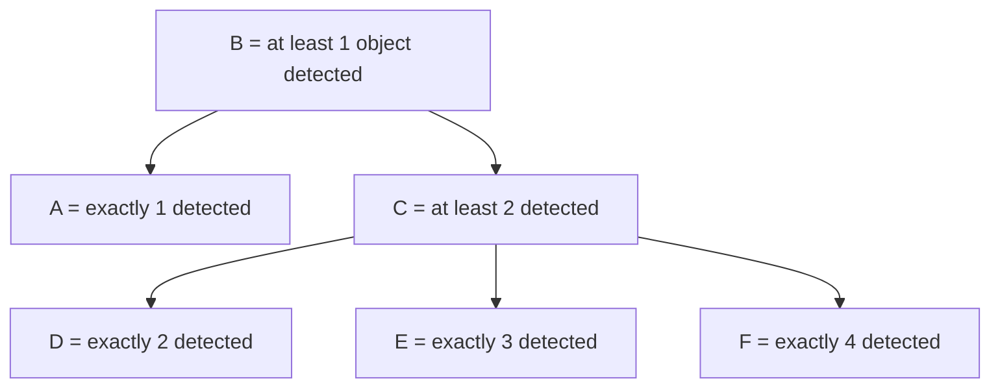
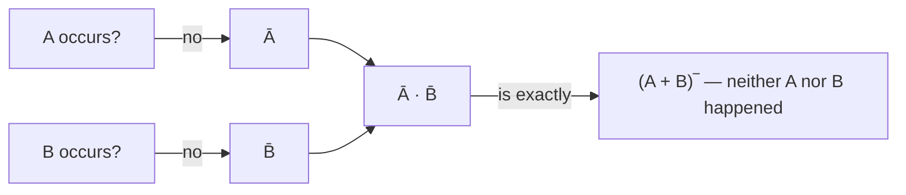

# The algebra of events

Chapter 1 calculated probabilities **directly** — count favourable cases, divide by total. Most real problems can't be counted that way. Instead, the book's strategy for the rest of the book is:

> "It is necessary, first of all, to know how to express an event in terms of other events using the so-called algebra of events." — *Ch. 2, §2.0*

Once a complicated event is rewritten as a sum or product of simpler events, two rules (addition and multiplication, next lesson) turn those simple pieces back into a probability. This lesson is entirely about that rewriting step.

## Sum and product of events

Events are sets of elementary outcomes, so combining events is set algebra:

- **Sum `A + B`** (union): "at least one of `A`, `B` occurs" — the event consisting in the occurrence of at least one of those events.
- **Product `AB`** (intersection): "both `A` and `B` occur" — a simultaneous realization of the two events.

Both generalise to any number of events, even infinitely (countably) many: `A₁ + A₂ + ... + Aₙ` means "at least one of the `Aᵢ` occurs"; `A₁A₂...Aₙ` means "all of the `Aᵢ` occur".

## The "absorbing" identities

Because `A` and `B` are sets, a handful of identities fall out immediately and get used constantly:

```
A + A = A          AA = A
A + ∅ = A          A∅ = ∅
A + Ω = Ω          AΩ = A
```

The one you'll reach for most often: **if `B ⊆ A`** (every outcome of `B` is also an outcome of `A` — `B` is a "special case" of `A`), **then**

```
A + B = A          AB = B
```

The bigger event swallows the sum; the smaller event survives the product. Nothing here requires probabilities yet — it's pure containment.



Read the arrows as `⊆` ("is a special case of"). Because `C ⊆ B`, the rule above says `B + C = B` and `BC = C` instantly — no case-counting needed. Because `F ⊆ C ⊆ B`, `F` also satisfies `BF = CF = F`. And `D + E + F` is exactly the definition of `C` — three special cases, summed, recover the more general event.

## Ordinary algebra rules still apply

```
Commutativity:    A + B = B + A,        AB = BA
Associativity:    (A + B) + C = A + (B + C),   (AB)C = A(BC)
Distributivity:   A(B + C) = AB + AC
```

All three follow from `A`, `B`, `C` being sets — there is nothing new to memorise beyond ordinary set algebra wearing probability notation.

## The complementary event

`Ā` ("not `A`") is the event that `A` did **not** occur. Two events are complementary if exactly one of them must happen:

```
A + Ā = Ω        AĀ = ∅        (Ā)‾ = A
```

The complement of a sum/product swaps the operation (De Morgan's laws):

```
(A + B)‾ = Ā B̄        (AB)‾ = Ā + B̄
```



**Why this matters for problem-solving:** "at least one" events are often awkward to compute directly, but their complement — "none" — is a simple product of complements. Compute `P(Ā B̄)`, then subtract from 1. You'll use this trick dozens of times in this chapter.

## Equivalent events

Two events are **equivalent** (`A = B`) if `A ⊆ B` *and* `B ⊆ A` — every outcome of one is an outcome of the other. Equivalent events have `A + B = A = B = AB`: their sum, product, and either event individually all coincide. This is the *only* way a sum of two events can equal their product.

*(Wentzel & Ovcharov, Ch. 2, §2.0 and problems 2.1, 2.4–2.8.)*
