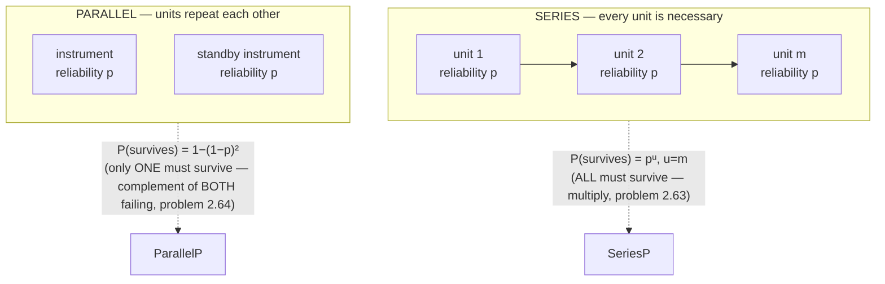
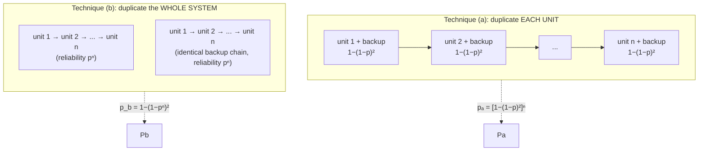

# System reliability: series, parallel & redundancy

"Reliability" is just a probability with a name: `P(no failure during time t)`. This lesson is almost entirely **composition** — you already have every formula you need (problems 2.35, 2.44, the "1−qⁿ" pattern); the new content is *how engineers draw and combine them*.

## The two basic topologies

> "Elements without which a system cannot operate are represented as links connected in series; elements which repeat each other are connected in parallel." — *Ch. 2, problem 2.63, Remark*



Series reliability **multiplies** the individual probabilities (problem 2.63: `P = pᵘ`, `u=m`) — exactly the "all independent events occur" pattern. Parallel reliability is the **complement of all-fail** (problem 2.64: `P = 1−(1−p)²`) — exactly the "1−qⁿ" pattern, with `n=2` instances repeating each other.

If the switching device that activates a standby isn't perfectly reliable (probability `pₚ`), the standby's "successfully takes over" probability becomes the **composite** `pₚ·p` (last lesson's trick) — plug that into the parallel formula in place of plain `p`.

## Composing topologies in the order of the diagram

A real instrument nests these topologies. Problem 2.70: unit I (necessary) is in series with a parallel pair (units II, III which repeat each other):

```
P(unit I)   = p^(n₁)                                    — series, problem 2.63
P(II or III) = 1 − (1−p^(n₂))(1−p^(n₃))                  — parallel, problem 2.64
P(instrument) = p^(n₁) · [1 − (1−p^(n₂))(1−p^(n₃))]      — series of the two blocks
```

Read the diagram outward-in: compute each block's reliability with the matching formula, then combine the blocks with the OUTER topology's formula. No new arithmetic — just bookkeeping about which formula applies to which block.

## Which redundancy strategy wins? (problem 2.68\*)

Take an `n`-unit series system (every unit reliability `p`, system fails if ANY unit fails). Two ways to add one redundant copy of everything:



The book proves `pₐ > p_b` for *any* `n > 1` and `0 < p < 1`, using the binomial theorem to show `(1+q)ⁿ + (1−q)ⁿ > 2` where `q = (1−p)/p`. The **intuition**: technique (b)'s backup is all-or-nothing — if the primary chain fails because of just *one* weak unit, the *entire* backup chain must work perfectly (probability `pⁿ`, a high bar) to save the system. Technique (a) gives **each** unit its own independent backup — a failure in any one unit is caught locally, without needing every other unit's backup to also be ready. **More, smaller, independent redundancies beat one big redundant copy.**

## Generalizing once more: the survival function

Problems 2.71–2.73 push the "1−qⁿ" idea to its most general form. A device can only fail at the moment it's switched on; given it survived switches `1, ..., k−1`, let `Qₖ` be the *conditional* probability it fails on switch `k` (so `Qₖ` can be *different for every k* — components wear out, so `Qₖ` typically grows). By the chained multiplication rule (Lesson 2):

```
P(survives at least n switch-ons) = ∏ₖ₌₁ⁿ (1 − Qₖ)
```

Every "1−qⁿ"-shaped formula you've used all chapter — `(1−p)ⁿ`, `∏(1−pᵢ)`, `[1−(1−p)ⁿ]ˡ` — has been a **special case** of this product, where all the `(1−Qₖ)` happen to be equal (or follow a simple sub-pattern). When a multi-unit instrument's per-switch failure probability `Qₖ` is itself built from series/parallel sub-formulas (problem 2.72) — or from a *binomial* "at most 1 fault so far" probability (problem 2.73) — you're simply nesting formulas you already know inside this product.

*(Wentzel & Ovcharov, Ch. 2, problems 2.63–2.73.)*
