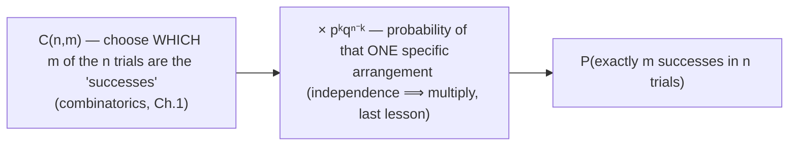
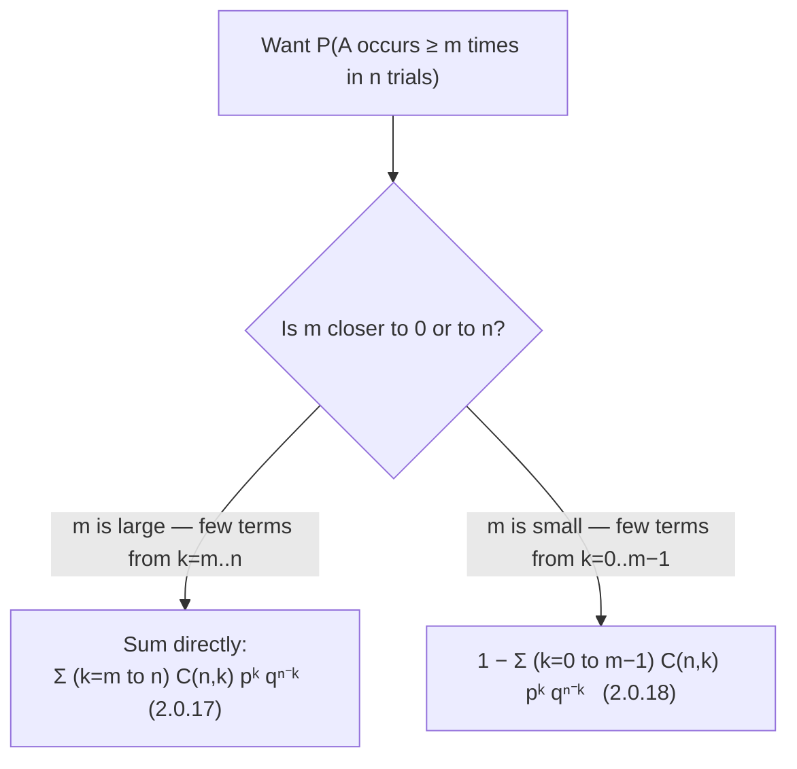

# Repeated independent trials — the binomial formula

A huge share of applied problems boil down to the same shape: *do the same thing n times, independently, and ask how many times something happens.* Radar sweeps, missile salvos, repeated inspections, repeated message transmissions — all of them.

> "Several trials are said to be independent if the probability of the outcome of each of them does not depend on the outcomes of the other trials." — *Ch. 2, §2.0*

Suppose event `A` occurs with probability `p` on each trial (and `q = 1 − p` is the probability it doesn't). Run `n` independent trials. What's the probability `A` happens *exactly* `m` times?

## Building the formula from rules you already have

The addition and multiplication rules from the last lesson, plus the combinatorics from Chapter 1, combine into one formula:



```
P_{m,n} = C(n,m) · pᵘ · q⁽ⁿ⁻ᵘ⁾        (2.0.15 / 2.0.16, with u = m)
```

Each of the `C(n,m)` specific arrangements (which `m` trials succeed) has the *same* probability `pᵘqⁿ⁻ᵘ` — independence lets you multiply straight down a sequence regardless of order. The arrangements are mutually exclusive, so the addition rule lets you just count them and multiply by one.

## "At least m" — sum over the tail

For "`A` occurs **not less than** `m` times", sum the mutually-exclusive "exactly `k`" probabilities for every `k` from `m` to `n`:

```
P(≥m, n) = Σₖ₌ₘⁿ C(n,k) pᵏ qⁿ⁻ᵏ            (2.0.17)
```

Or take the complement — "fewer than `m`" — and subtract from 1:

```
P(≥m, n) = 1 − Σₖ₌₀^(m−1) C(n,k) pᵏ qⁿ⁻ᵏ    (2.0.18)
```

Both formulas are exactly equal; they're just two different partitions of the same sample space (the addition rule applied to the complementary halves). Pick whichever has fewer terms to add up:



## The "no failures at all" special case

A very common pattern: `P(A occurs at least once in n trials) = 1 − qⁿ`. This is just `2.0.18` with `m = 1`: the only term in the "fewer than 1" sum is `k = 0`, i.e. `C(n,0)p⁰qⁿ = qⁿ`. You'll see this shape constantly — radar that needs *one* successful detection cycle, a system that fails if *any* one of its units fails, a lottery where you need *one* winning ticket. Whenever a problem asks for "at least one success" or "all `n` must fail to avoid the event", reach for `1 − qⁿ` (or its generalisation, `1 −` a product of *different* `qᵢ` when the trials aren't identical).

*(Wentzel & Ovcharov, Ch. 2, §2.0 [formulas 2.0.15–2.0.18] and problems 2.25–2.36.)*
