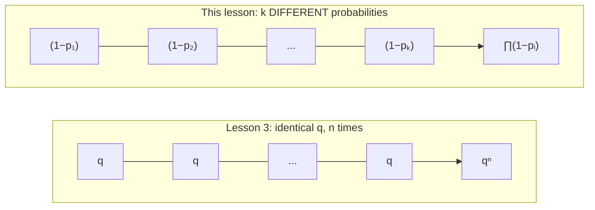
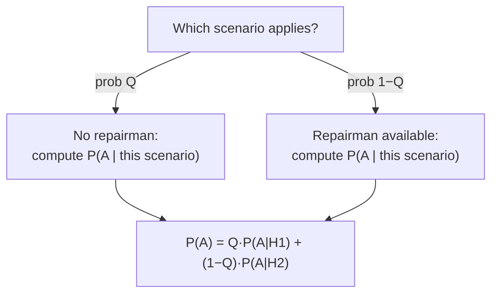

# Generalizing the patterns: different probabilities, weighted branches

So far, every "1 − qⁿ" you've met has used the *same* q, n times — the same radar unit, the same symbol, the same missile. Real systems mix **different** components with **different** probabilities. This lesson generalizes the patterns you already know, then introduces one genuinely new move: **weighted branches**.

## Generalizing "1 − qⁿ" to "1 − ∏ qᵢ"

A radar unit tracks `k` *different* targets; target `i` is independently lost with probability `pᵢ` (not all equal). `A = {none of the k targets is lost}`:



```
P(A) = ∏(1 − pᵢ)        P(at least one lost) = 1 − ∏(1 − pᵢ)
```

Same complement-then-multiply logic — independence doesn't require the factors to be *equal*, just *independent*. For "**no more than one** target is lost", split by **which** target (if any) is the one lost — the same "split by which one, add the mutually-exclusive cases" strategy from problem 2.44:

```
P(no more than 1 lost) = P(none lost) + Σᵢ [ pᵢ · ∏_{j≠i}(1 − pⱼ) ]
```

## Composite per-trial probabilities

Sometimes the `p` (or `q`) you plug into one of these patterns is itself a **product of two independent factors**. An instrument's unit `i` becomes faulty during time `t` with probability `qᵢ`; afterwards a repairman *catches* an existing fault with probability `p` (misses it with probability `1−p`). "Unit `i` **remains faulty**" needs both — *became faulty* **and** *the repairman missed it*:

```
P(unit i remains faulty) = qᵢ · (1 − p)
```

Plug *that* composite probability into the familiar `1 − ∏(...)` pattern for "at least one unit remains faulty". Nothing new in the rules — just two independent multiplications nested inside each other.

## Weighted branches — a preview of the Total Probability Formula

Now the new idea. Suppose a repairman is summoned, but **with probability `Q` no repairman is available at all** — the instrument is used *without* inspection (where "unit `i` remains faulty" is just `qᵢ`, not `qᵢ(1−p)`). The book's answer combines *both* scenarios:

```
P(A) = Q · [1 − ∏(1−qᵢ)]   +   (1−Q) · [1 − ∏(1−qᵢ(1−p))]
        \___ no repairman ___/      \____ repairman available ____/
```



The two scenarios are mutually exclusive and exhaustive; weight each branch's *within-branch* probability by how likely that branch is, then add (addition rule). You'll see exactly this skeleton again — with the scenarios formally called **hypotheses `Hᵢ`** — in the very next chapter:

> "If n mutually exclusive hypotheses H₁, H₂, ..., Hₙ can be made concerning the staging of an experiment, and if an event A can occur only together with one of these hypotheses, then P(A) = Σ P(Hᵢ)·P(A|Hᵢ)." — *Ch. 3, §3.0, the Total Probability Formula*

You've already been *using* this idea — Chapter 3 just gives it a name.

## Complements via "incompatible pairs"

For "do two randomly-chosen people share a common language", computing "share **at least one** of 3 languages" directly means juggling overlapping cases. The complement — "**share no language at all**" — only requires identifying which *pairs* of sub-groups are mutually incompatible (share zero languages), which is a short, mutually-exclusive list. Sum those pairwise-selection probabilities (addition rule) and subtract from 1. The same "complement turns 'at least one' into a clean enumeration" idea from Lesson 1, now applied to *pairs* of categories instead of single events.

*(Wentzel & Ovcharov, Ch. 2, problems 2.50–2.54, 2.59–2.62; Ch. 3, §3.0.)*
