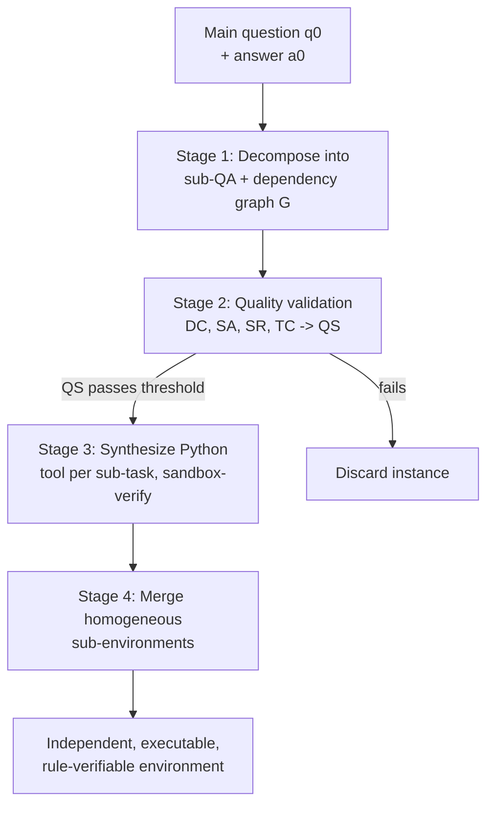

## Verifiable doesn't mean "one fixed path"

Module 2's trajectory pipeline is great for *breadth* — broad tool-use competence, fast to generate. But it has a ceiling: it teaches the model to follow one specific tool chain. Real RL needs something that can check *many different valid solutions*, not just match a golden sequence. That's what environment synthesis builds.

> "Unlike static path-supervised tool chains, we model multi-turn tool use as navigation over a latent semantic topology, verify only sub-tasks attainment, and optimize a composite reward... rather than prescribing a fixed tool chain." — *Section 2.2.1*

The pipeline runs four stages, converting a single question into a fully independent, executable Python environment.

**Stage 1 — Q–A instance synthesis as semantic topology extraction.** A main question `q0` and answer `a0` get decomposed into intermediate sub-questions and sub-answers `S = {(q_i, a_i)}`, each linked by a dependency structure `G` (a chain or a DAG). The final answer is modeled as an aggregation: `a0 = Φ({a_i}, G)`. This decomposition can run two ways: *question-conditional* (given `q0`, derive `S`) or *unconditional* (generate a question from a knowledge source `K` and a target hop count `H`, then decompose it).

**Stage 2 — Quality validation.** Not every generated decomposition is trustworthy. ASTRA scores four dimensions, each a 0/1 judgment per sub-question, averaged into a per-instance score:

| Dimension | Checks |
|---|---|
| **Dependency Consistency (DC)** | Are the listed dependencies for each sub-question actually necessary? |
| **Sub-Question Atomicity (SA)** | Is each sub-question truly indivisible, not secretly two steps? |
| **Sequential Rationality (SR)** | Is the execution order implied by the dependencies logically valid (no steps satisfied out of order, none superfluous)? |
| **Task Completeness (TC)** | Do the sub-questions, together, actually suffice to answer the main question? |

```
QS(τ) = (DC(τ) + SA(τ) + SR(τ) + TC(τ)) / 4
```

> **Wait — why does atomicity matter if dependency and completeness already passed?** Because a non-atomic sub-question hides two reasoning hops inside one node, which breaks per-step credit assignment during RL — the agent gets rewarded for one "step" that actually required two correct decisions, diluting the training signal.

**Stage 3 — Environment synthesis.** For each surviving instance, ASTRA skips leaf nodes (final linguistic aggregation steps need no tool) and synthesizes a *Python tool implementation* for every remaining sub-task — a real tool spec, a real invocation statement, real code, executed in a sandbox. If the sandbox's output doesn't contain the target answer `a_i`, it restarts that sub-task's generation and retries.

**Stage 4 — Sub-environment merging.** Many sub-questions across an instance turn out to be functionally identical with different parameters ("weather in Paris" / "weather in Tokyo"). Left alone, these would inflate the action space with near-duplicate tools. ASTRA groups homogeneous sub-questions, picks one as a base implementation, and folds the rest in by extending its data structures — one tool, multiple valid invocations, verified to still answer every original sub-question correctly.



The output of this whole pipeline is a deterministic, sandboxed environment per question — exactly the kind of ground truth Module 1 said was missing. Module 4 shows how RL actually trains against it.
