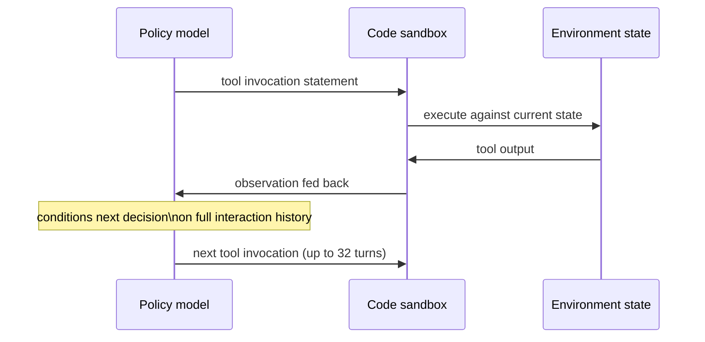

## Two failure modes that only show up once you turn on RL

SFT on the trajectory pipeline gives you a stronger starting policy. Then ASTRA turns on online, multi-turn RL over the synthesized environments from Module 3 — and immediately runs into two problems that don't exist in single-turn RL.

**Problem 1: GRPO needs reward *variance* within a group, and it doesn't always get it.** ASTRA optimizes a GRPO objective (Eq. 23) — the same prompt is sampled `G` times, and the advantage for each sample is relative to the group's reward distribution. But:

> "If all samples within a group `G` receive identical rewards, the resulting advantage estimates collapse to zero, yielding no gradient signal." — *Section 3.1*

If every rollout for a question gets the same reward (all succeed, or all fail), there's nothing to learn from *that batch* — it's a wasted forward pass. ASTRA's fix is **Adaptive Batch Filling**: maintain a buffer of "valid" rollouts (ones with non-degenerate reward variance, `Std(R) > δ`), keep generating until the buffer plus new rollouts contains a full batch of `n` valid samples, and carry leftover valid samples forward into the buffer rather than discarding them. Every optimization step gets a full batch of *informative* gradient signal — none of it is wasted on zero-variance groups.

**Problem 2: an agent only ever shown its required tools doesn't learn to say no.** If every training instance exposes exactly the tools needed to solve it, the policy never practices *rejecting* a plausible-but-wrong tool — there's no negative signal for over-calling. ASTRA's fix is **irrelevant-tool mixing**: embed every tool's documentation with a text embedding model, compute pairwise cosine similarity, and for each instance inject a controlled number of *distractor* tools sampled across three similarity bands relative to the real ones needed:

```
high-similarity:  cosine > 0.85   (near-duplicate, hardest to reject)
medium-similarity: 0.4–0.85       (plausible but distinct)
low-similarity:   < 0.4           (easy to reject)
```

Sampling across all three bands — not just easy distractors — forces the policy to learn real discrimination, not just "ignore anything unfamiliar."



**Training configuration in brief:** SFT trains Qwen3-14B and Qwen3-32B for 2 epochs, batch size 32, cosine LR schedule, with context parallelism (CP=2 / CP=4) to handle 20k-token sequences. RL runs with batch and mini-batch size 256, max prompt length 25,600 tokens, max response length 49,152 tokens, up to 32 turns per trajectory — long-context settings sized for genuinely long-horizon multi-turn interaction, not toy episodes.

> **Wait — why strictly online RL, with no replay buffer of past samples?** Because the environments are deterministic and freshly generated per instance; replaying stale rollouts against an environment the policy has since outgrown would feed it stale advantage estimates. Strictly online keeps every gradient step grounded in the policy's *current* behavior.
