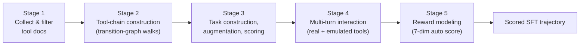

## From a pile of API docs to a graded training trajectory

You've got thousands of scraped MCP (Model Context Protocol) tool documents — some great, most unusable. How do you turn that mess into multi-turn training data an SFT run can actually learn from, with *no human annotation*? ASTRA's trajectory synthesis pipeline runs five stages, each fixing a specific way synthetic data goes wrong.

**Stage 1 — Tool collection & filtering.** Pull tool docs from MCP registries (Smithery, RapidAPI), internal specs, and public datasets; normalize every tool into one OpenAI-style calling schema; group by originating service ("MCP server"). Then filter hard:

> "We discard MCP servers with fewer than three tools or functions, as they rarely support meaningful multi-turn workflows." — *Section 2.1.1*

After filtering: **1,585 MCP servers, 19,036 tool documents, 41 domains** survive from the raw scrape.

**Stage 2 — Tool-chain construction.** For each server, an LLM proposes plausible chains of tool calls. These chains get aggregated into a **directed transition graph** — one node per tool, an edge wherever two tools appeared consecutively in any synthesized chain. Then ASTRA samples *new* candidate chains by doing length-bounded random walks over that graph, and verifies each walk's dependency structure is well-formed before keeping it. This is the "static topology" from Module 2 — discovered once per server, reused to generate many chains.

**Stage 3 — Task construction, augmentation, scoring.** Two complementary task sources: chain-conditioned (a task written to fit a validated tool chain — biases toward executability) and server-only (a task written from just the server spec — biases toward topical coverage). Each task then gets augmented along three axes — diversity (paraphrase), complexity (added constraints), persona (novice vs. expert phrasing) — and scored on question quality, scenario realism, and tool-use necessity. Anything below threshold on any axis is discarded.

**Stage 4 — Multi-turn interaction.** A real agent framework (Qwen-Agent) actually runs the tool-calling loop. Deployed MCP servers get called for real; doc-only servers get a **stateful emulator** that fabricates plausible outputs — and ASTRA deliberately injects a **20% failure rate** into emulated calls, so the agent practices on the kind of flaky tool behavior it'll see in production, not a sanitized happy path.

**Stage 5 — Reward modeling.** Seven automated, LLM-judged quality scores per trajectory — query understanding, plan quality, tool-response understanding, tool-response-conditioned planning, tool call success rate, tool-call conciseness, and final-answer quality — averaged into one scalar reward. No human ever looks at a trajectory.

> **Wait — why inject failures into emulated tools on purpose?** Because an agent that's only ever seen tool calls succeed has no practiced recovery behavior. A 20% synthetic failure rate (timeouts, unreachable calls) means the SFT data teaches the model what to do *when* — not just *if* — a call fails.
