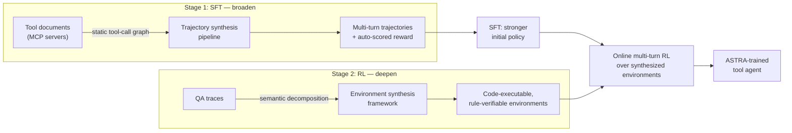

## Two different kinds of "topology"

Here's the trick in ASTRA's design: it doesn't try to fix data quality with one bigger pipeline. It splits the problem into two *different kinds of structure*, and matches each to the training stage that needs it most.

> "ASTRA integrates two complementary components. First, a pipeline that leverages the **static topology of tool-call graphs** synthesizes diverse, structurally grounded trajectories... Second, an environment synthesis framework that captures the **rich, compositional topology of human semantic reasoning** converts decomposed question–answer traces into independent, code-executable, and rule-verifiable environments." — *Abstract*

**Static topology of tool-call graphs** means: look at a set of tools (say, an MCP server's API surface), and notice that some calls naturally precede others — you "get_user_id" before you "get_user_orders". That structure is fixed and discoverable just from documentation, before any task even exists. ASTRA mines it to generate *plausible chains of tool calls* — broad coverage of "how do tools fit together" — and uses it for **supervised fine-tuning (SFT)**.

**Compositional topology of human semantic reasoning** means something else: given a real question, how does a human actually decompose it into sub-questions, dependencies, and an aggregation step? This structure is richer and instance-specific — it can't be read off a tool list, it has to be extracted per question. ASTRA uses it to build **verifiable, code-executable environments** — and trains on them with online **reinforcement learning (RL)**.

> **Wait — why not just use RL for everything, since RL is "better"?** Because RL is only as good as the policy it starts from. Section 4.3 shows this directly: SFT first gives the model "structured tool invocation, multi-turn state tracking, and adherence to interaction conventions" — RL on top of that cold start then explores a much larger space of valid solutions than RL alone could discover from scratch.

> "This two-stage method first **broadens** an agent's tool-use competence over a static tool topology, then **deepens** its capability by learning within a complex semantic topology." — *Introduction*

The next two modules walk through each pipeline in turn: trajectory synthesis (Module 2) feeds the SFT cold start, and environment synthesis (Module 3) feeds the RL stage. Module 4 covers how the two stages are actually trained together, evaluated, and what the ablations reveal about why each design choice matters.
