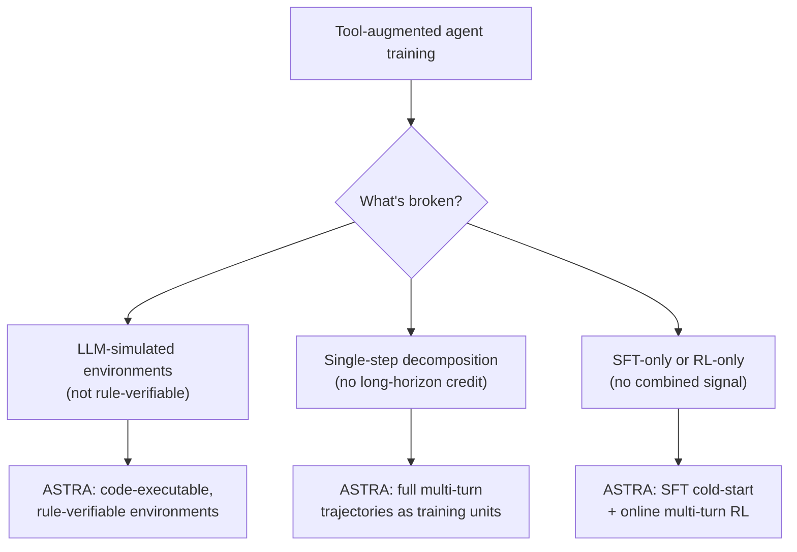

## The agent that can't tell if it actually worked

Say you're training an LLM to act as a tool-using agent — looking up a flight, querying a database, chaining three API calls to answer one question. You generate a million practice trajectories with another LLM playing "the environment." Training looks great. Then you deploy, and the agent falls apart on anything more than two turns deep.

What went wrong? The practice was fake in a way that didn't show up in the loss curve.

> **ASTRA** (Beike Language and Intelligence) names the problem precisely:

> "Many of these approaches rely on **LLM-simulated environments**, where tool executions, state transitions, and feedback are generated through language-model rather than explicit rules or executable backends. That is, their reinforcement learning (RL) setups are **not rule-verifiable**." — *Introduction*

If the "tool" that returns data to your agent during training is itself just another LLM improvising a plausible-sounding response, there's no ground truth checking whether the agent's *action* was actually correct — only whether it *sounded* plausible to a grader model. Reward signals built on vibes don't survive contact with real long-horizon tasks.

That's one failure mode. The paper identifies three, and they compound:

| Failure mode | What breaks |
|---|---|
| **Non-verifiable environments** | Tool responses are LLM-improvised, not executed — no deterministic ground truth for RL rewards |
| **Single-step decomposition** | Multi-turn trajectories get chopped into isolated single-step training examples — the agent never learns to plan *across* turns |
| **One training regime only** | SFT-only agents never get an online learning signal from interacting with an environment; RL-only agents are capped by how good the starting policy already was |

> **Wait — isn't more synthetic data just more synthetic data?** No: the issue isn't volume, it's *verifiability*. A trajectory dataset can be enormous and still be useless for RL if nothing in it can be checked against ground truth. ASTRA's fix is to make the environment itself executable — actual Python code that runs and returns a real answer — not another model's guess at one.

Each of ASTRA's two pipelines targets a specific failure mode above — and the next lesson shows how they fit together.
