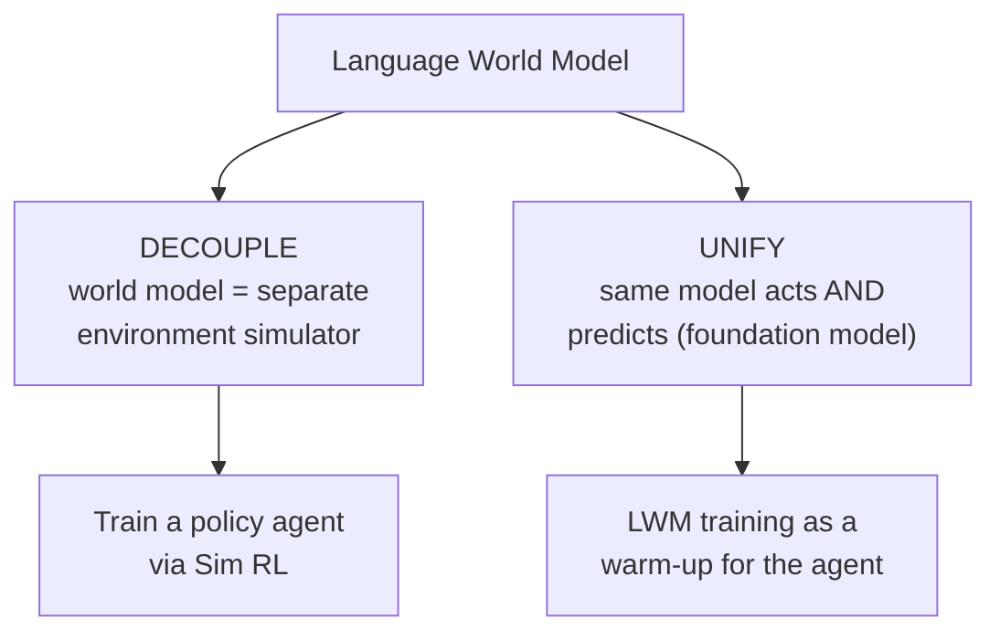
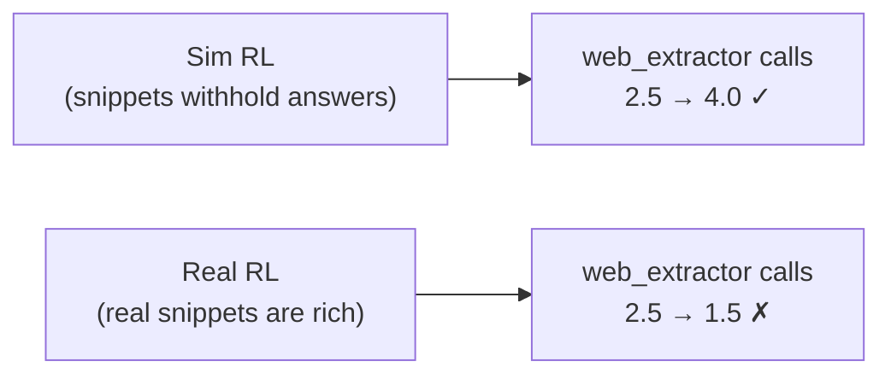

# Decouple or Unify: Two Ways to Use a World Model

You have a high-fidelity environment simulator. Now what? The paper explores two
fundamentally different ways world modeling makes agents better — and they sit at
opposite ends of a design axis:

## Application I — Decouple: the world model as a simulator

Here the policy agent and the world model are **two separate models**. The world
model just plays the role of "the environment" during RL. It offers two things a
real environment can't.

### Scalability — simulate environments you never trained on

Because of the broad world knowledge injected during CPT, the LWM can simulate
realistic environments far outside its seven training domains. The paper tests this
on **OpenClaw**, a real-world agent platform, entirely out of distribution.

From a *small pool* of real trajectories, they distill **seed scenarios** (each
capturing an initial state + a user query) and synthesize **4,000** simulated
training environments. Training a policy via **Sim RL** on these:

| Benchmark | Base | Sim RL (w/ Qwen-AgentWorld) | Gain |
|-----------|------|------------------------------|------|
| Claw-Eval | 65.4 | 69.7 | **+4.3** |
| QwenClawBench | 47.9 | 55.0 | **+7.1** |

And the simulator's *quality* matters: using a weaker model (Qwen3.6-Plus) as the
simulator yields only marginal gains. The dedicated LWM pipeline is what makes the
simulator good enough to train against.

### Controllability — break the environment on purpose

This is the part real environments simply cannot do. You can *instruct* the LWM to
inject specific adversarial conditions — and training against them builds
capabilities a passive real environment never would.

**MCP (Environment Adaptation).** Inject intermittent API errors, paginated
responses, partial failures. The result is dramatic:

| Setting | Tool Decathlon | MCPMark |
|---------|----------------|---------|
| Base (SFT) | 32.4 | 21.5 |
| Sim RL, **no** control | 31.5 (↓!) | 24.6 |
| Sim RL, **controlled** | 36.1 (+3.7) | 33.8 (**+12.3**) |

Look at the middle row: uncontrolled Sim RL *dropped* Tool Decathlon below
baseline. The paper's blunt conclusion:

> "Controllability is not merely a factor in the magnitude of improvement but a
> prerequisite for Sim RL to work at all in this domain: without grounded simulation
> instructions, the training signal is too noisy to yield any gain." — *Section 6.1.2*

**Search (Fictional-World Construction).** Here's the wild one. They instruct the
LWM to simulate a **completely fictional but self-consistent world** — e.g. "in
2030, 430 people have migrated to Mars" — then generate consistent news, records,
and search results grounded in that premise. Two structural advantages:

1. The answers exist *only* in the fiction, so the agent **can't cheat** by
   answering from parametric memory — it's forced to actually search.
2. Because every fact is invented, the agent **can't confuse** training-time search
   results with real-world knowledge. (Simulating a *real* search engine risks
   injecting fabricated-but-plausible "facts" the agent later trusts.)

Agents trained entirely in these fictional worlds **transfer to real search tasks**:
WideSearch F1-by-Item jumps **+16.29** at 35B (34.02 → 50.31), and still **+3.87**
at 397B where the base was already strong (70.11).

### Surpassing the real environment

The most provocative result: controllable Sim RL *beats* Real RL trained against a
**live search engine** (50.3% vs 45.6% F1-by-Item on WideSearch). Why? Look at
*behavior*, not just score:

The simulated snippets *deliberately* withhold detail, so the Sim-RL agent learns
it must extract full pages. The Real-RL agent finds real snippets already
sufficient, so it learns to *skip* extraction — a worse habit. Controllable
simulation shaped a better behavior than reality did.

> **The catch — state is the bottleneck.** None of this works without a detailed
> initial state. *"Sim RL effectiveness depends on providing the world model with a
> sufficiently detailed initial state; without it, simulation fidelity degrades and
> downstream gains diminish."* A vague initial state means a vague, useless
> simulation.

## Application II — Unify: the world model as a foundation

Now the radical version: **the same model both acts and predicts.** Instead of a
separate simulator, you use **LWM RL as a warm-up** for the agent itself, then drop
it into real agentic tasks.

The setup is almost unbelievable:

> "Single-turn, non-agentic LWM RL warm-up with no tool calls transfers to
> multi-turn, tool-calling agentic tasks across seven benchmarks of five domains."
> — *Section 6.2*

Read that again. You train the model on **single-turn next-state prediction — no
tool calls, no multi-turn interaction** — and then, *with no further fine-tuning*,
it's better at multi-turn, tool-using agentic work. Gains across all seven
benchmarks:

| Benchmark | Gain | In/Out of domain |
|-----------|------|------------------|
| WideSearch (F1 Item) | +12.79 | in |
| Terminal-Bench 2.0 | +6.30 | in |
| SWE-Bench Pro | +5.24 | in |
| **Claw-Eval** | **+11.28** | **out** |
| **QwenClawBench** | **+9.67** | **out** |
| **BFCL v4** | **+9.00** | **out** |

The out-of-domain gains are the kicker: the LWM pipeline contains **no Claw or
function-calling data whatsoever**, yet those domains improve ~+9 to +11. That's
transferable capability, not a domain-specific shortcut.

### Why does this work? Predict before you act.

The mechanism is the meta-reasoning pattern from lesson 1, now *internalized*:

> "LWM training enables the agent to mentally simulate the consequences of a
> candidate action before committing, effectively using world modeling as an
> internal planning step." — *Section 6.2*

The paper measures it directly: on Terminal-Bench 2.0, the model's **environment
prediction accuracy inside its own thinking trace rose 69.9% → 78.3% (+8.4%)** after
LWM RL. A better internal world model → better predictions → better actions. That's
the entire causal story of the paper in one number.
