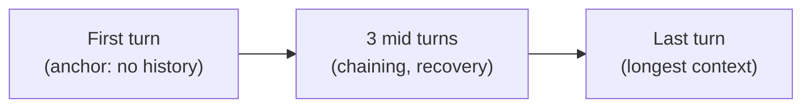

# Grading a World Model: AgentWorldBench

You've trained a model to simulate seven environments. Now the awkward question:
**how do you know if its simulations are any good?**

You can't just check "is the output plausible?" — a wrong file's contents can look
perfectly plausible. You need to compare against what the *real* environment
actually did. That's the entire design idea behind **AgentWorldBench**.

## Built from real frontier-agent runs

AgentWorldBench is constructed from agentic trajectories of frontier models on
established benchmarks, converted to environment trajectories with **ground-truth
observations from real execution**. Four construction principles:

1. **Widely-used queries** — drawn from established benchmarks (Tool Decathlon,
   Terminal-Bench 1.0 & 2.0, OSWorld-Verified...), not self-constructed tasks.
2. **Frontier-agent trajectories** — generated by strong models (e.g. Claude Opus
   4.6), so the action sequences are complex enough to stress the simulator.
3. **Real observations** — every trajectory is paired with the real environment's
   actual output as reference.
4. **Out-of-distribution** — training data and benchmark queries are partitioned at
   the *data-source* level, so the benchmark "probes generalization rather than
   memorization."

The result: **2,170 turn-level evaluation samples** across 7 domains, 9 source
benchmarks, 5 frontier models.

### Why first-and-last turns?

For text domains, each trajectory contributes **5 evaluation turns**: the first,
the last, and 3 uniformly-sampled intermediate turns. The choice is deliberate:

> "The first turn tests initial simulation without interaction history. Errors at
> this turn propagate recursively through the state chain... The last turn has the
> longest context and the strongest dependence on accumulated prior state. It is
> the primary probe for long-context simulation fidelity." — *Section 4.1*

This is why AgentWorldBench is "a naturally grounded long-context benchmark": as a
trajectory grows, predicting the next observation means comprehending the *entire*
accumulated history.

## The five dimensions

Each predicted observation is scored 1–5 on five dimensions, then the mean is
normalized to [0, 100]:

| Dimension | Asks |
|-----------|------|
| **Format** | Does it obey the domain's structure? (JSON schema for MCP, shell-prompt patterns for Terminal) |
| **Factuality** | Are the stated facts correct? (file contents, search results, return values) |
| **Consistency** | Is it internally coherent *and* coherent with prior turns? |
| **Realism** | Does it match how the real environment behaves? (response patterns, value plausibility) |
| **Quality** | Completeness and conciseness vs. the reference — nothing critical omitted, nothing padded |

## The trick that makes judging reliable: reference-grounding

A naive LLM judge has to *imagine* what a correct terminal output looks like — and
imagination hallucinates. AgentWorldBench hands the judge the **real observation**
next to the predicted one:

> "This reference-grounded design converts the evaluation from an open-ended quality
> judgment into a factual comparison ... the judge does not need to independently
> reason about what a correct environment response should look like, because the
> real output serves as an unambiguous reference." — *Section 4.2*

The payoff is *cross-judge agreement*: three different frontier judges (Gemini 3
Flash, Claude Sonnet 4.5, GPT-5.2) assigned different absolute scores but their
**model rankings agreed with Spearman ρ = 0.92–0.99**. When you grade against a
concrete reference instead of abstract "quality," judges converge.

### Don't match everything exactly

A subtle but important rule. Forcing exact matches everywhere produces false
negatives — a simulated process ID will never equal the real one. So content is
split three ways:

| Content type | Match requirement | Example |
|--------------|-------------------|---------|
| **Deterministic** | exact match | `cat` output, file reads, computation results |
| **Pre-existing environment** | format + plausibility only | exact `gcc` patch version |
| **Runtime metadata** | format + range only | a PID of 42731 is as valid as the real 18204 |

> **Why bother with this split?** Because without it, a *correct* simulation gets
> punished for inventing a different-but-valid timestamp. The split lets the judge
> reward correct structure and semantics without nitpicking irreproducible noise.

## The headline result

On the five-dimensional mean, **Qwen-AgentWorld-397B-A17B wins overall (58.71)**,
edging out GPT-5.4 (58.25) and every other frontier model. A few numbers worth
internalizing:

| Model | Overall | Terminal | SWE | Search |
|-------|---------|----------|-----|--------|
| **Qwen-AgentWorld-397B-A17B** | **58.71** | **57.73** | **68.49** | **37.82** |
| GPT-5.4 | 58.25 | 53.69 | 66.29 | 37.26 |
| Claude Opus 4.8 | 56.59 | 59.18 | 64.10 | 35.14 |
| Qwen3.5-397B-A17B (base, no LWM) | 54.74 | 55.30 | 64.44 | 30.81 |

Two things jump out:

1. **The win is biggest on Terminal and SWE** — the domains needing accurate
   modeling of code-execution state and tool-API behavior. Exactly where a learned
   world model should shine.

2. **LWM training is what does it.** Compare each Qwen-AgentWorld model to its base
   checkpoint: at 397B, the overall mean rises **54.74 → 58.71**; at 35B, it jumps
   **+8.66** (47.73 → 56.39), lifting the small model *above* Claude Sonnet 4.6. The
   Qwen3.6 checkpoints *without* LWM training score far lower despite the same
   architecture — so the gain is the training, not raw model capacity.

> **One honest weakness:** on the GUI domains (Android, Web, OS), Claude Opus models
> lead and Qwen-AgentWorld ranks fifth. The paper attributes this to "an advantage
> from multimodal pre-training that text-only world modeling does not fully
> capture." And **Search is the hardest domain for everyone** — the best score
> (37.82) is barely half the best SWE score, because simulating a live, evolving web
> is brutally hard.

## Does it generalize, or memorize?

The most convincing experiment: run Stage-3 RL on **Terminal data alone**, then
watch the *other* text domains:

| Domain | Gain from Terminal-only RL |
|--------|----------------------------|
| Terminal (in-domain) | **+14.2** |
| SWE (held out) | +11.5 |
| Search (held out) | +11.8 |
| MCP (held out) | +5.0 |

Terminal commands and MCP tool calls differ in syntax, state, and response format —
yet training on one lifts all four, with gains appearing in the first 10 RL steps.

> "RL reinforces generalizable world knowledge, how environments respond to
> actions, how errors propagate, how state transitions compose across turns, rather
> than domain-specific output formats." — *Section 5.3*

That's the result that turns "we trained a good terminal simulator" into "we
trained something that understands environments."
