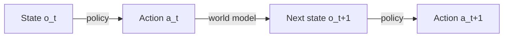
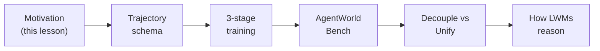

# Why a World Model for Language Agents?

You've been training LLM agents for a while. You collect trajectories, you do RL
against a live terminal or a real search engine, the agent gets better. So here's
a question worth sitting with for a second:

**Your agent learns to *act*. But does it ever learn to *predict what its actions
will do*?**

Almost certainly not. And the Qwen-AgentWorld paper argues that this missing half
is exactly what's holding general agents back.

## Two halves of the interaction loop

Every agent lives inside a loop. The paper splits that loop into two distinct
jobs:

| Component | Maps | Question it answers |
|-----------|------|---------------------|
| **Policy** | states → actions | "What should I do next?" |
| **World model** | (states, actions) → next states | "What happens if I do this?" |

> "current research on LLM agents has focused almost exclusively on the policy
> side. We argue that world modeling is a crucial missing piece in the path to
> general agents." — *Section 1*

The policy side has gotten almost all the attention. The world model — the thing
that says "if you `rm -rf /tmp/build`, here is the exact terminal output you'll get
back" — has been left to the *real environment* to provide. Run the command, see
what happens.

That works. So why build a model to fake it?

> **Wait — isn't simulating the environment just a cost-saving trick?** The paper
> explicitly says no: *"Not for Cost Reduction, but as a Complementary Axis for
> Pushing the Frontier"* (§1). A world model can do two things a real environment
> *fundamentally cannot*, and those two things are the whole point.

## Why fake the environment when the real one exists?

The paper gives two reasons, and they map onto its two big applications:

1. **Scalability (decoupling).** A world model produces environment responses with
   no sandbox, no GUI virtual machine, no live API. So you can scale to *thousands*
   of environments — including ones where real execution is infeasible: irreversible
   operations, proprietary deployments, domains with no public implementation.

2. **Controllability (decoupling).** You can *instruct* a world model to misbehave
   on purpose — return partial results, inject an API error, paginate a response —
   to deliberately expose your agent's weak points. Real environments rarely produce
   these edge cases on demand. Training against them lets the agent "surpass agents
   trained solely in real environments" (§1).

And there's a third, deeper reason — **unifying** the two halves into one model:

> "an agent capable of predicting environment feedback prior to committing to an
> action can in principle perform no worse than its counterpart lacking such
> capacity." — *Section 1 (paraphrasing Richens et al., 2025)*

If the same model that picks actions can also predict their consequences, it can
mentally simulate "what happens if I do X?" *before* committing — a thinking
pattern the paper compares to **reflection, but pointed at the future** instead of
the past.

## The necessity argument

This isn't just "world models are nice to have." The paper leans on a stronger
claim from Richens et al. (2025):

> "any agent capable of generalizing across a sufficiently broad range of tasks
> must have learned a world model, establishing world models not merely as useful
> but as necessary for general-purpose agents." — *Section 1*

Read that carefully: it says generalization *implies* a world model. If your agent
truly generalizes, it has already learned one implicitly. So you may as well learn
it *on purpose*, well, and reuse it.

## What they actually built

The paper introduces **Qwen-AgentWorld**, the first **Language World Model (LWM)**
— a model trained to predict environment observations across **seven domains**
through long chain-of-thought reasoning: MCP, Search, Terminal, Software
Engineering (SWE), Android, Web, and OS. Two model sizes ship: a 35B-A3B and a
397B-A17B mixture-of-experts.

The rest of this module follows the paper's own arc:

Keep one phrase in your back pocket as you go: **predict before you act.** Every
result in this paper is, at bottom, a payoff of that one idea.
