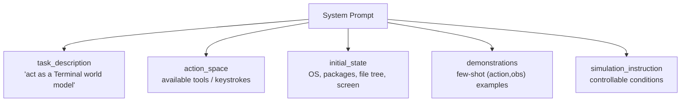

# One Schema for Seven Worlds

Here's a problem. You want **one** model to simulate a Linux terminal, an Android
phone, a web browser, an MCP tool server, and a search engine. A terminal's state
is a file-system snapshot. An Android screen's state is a UI view hierarchy. A
search result is just... text in a conversation. These could not look more
different.

How do you feed all of them to a single model without writing seven separate
training pipelines?

The paper's answer: **force every domain into one shared textual schema.** Once
everything is "(action, observation) pairs wrapped in a system prompt," the world
model never has to care which domain it's in.

## The formal object: what an LWM actually computes

First, the precise definition. A Language World Model is a conditional text
generator:

> A language world model (LWM) is a conditional text generator that predicts the
> next environment observation given the interaction history and the agent's
> current action. — *Section 2.3*

> ô_(t+1) = f_θ( c, o_(≤t), a_(≤t) )

Read the symbols:

- **c** — the system prompt (the simulation context).
- **o_(≤t)** — every observation so far (the history).
- **a_(≤t)** — every action so far, including the current one.
- **ô_(t+1)** — the *predicted* next observation. The training target is the real
  one, o_(t+1).

That's the whole job: given everything that happened plus what the agent just did,
predict what the environment hands back.

## Trajectory ≠ agentic trajectory

The paper is careful about two words that sound the same. Don't mix them up — the
whole training pipeline depends on the distinction:

| Term | What it is |
|------|-----------|
| **Environment trajectory** | A sequence of `(action, observation)` pairs — a multi-turn dialogue between agent and environment. **This is what the LWM models.** |
| **Agentic trajectory** | The agent's full completion: its internal *thinking* + action selection, interleaved with observations. |

You get an environment trajectory *from* an agentic one by **stripping the agent's
reasoning and keeping only the (action, observation) pairs**. The world model
doesn't care *why* the agent ran a command — only what the environment did in
response.

## The unified schema

Every domain, every training stage, uses this exact structure:

> system_prompt := task_description ⊕ action_space ⊕ initial_state ⊕ demonstrations ⊕ simulation_instruction
>
> turn_t := (action_t, observation_t)
>
> trajectory := system_prompt ⊕ [turn_1, ..., turn_T]
>
> — *Section 2.2*

The system prompt has **five components**. This is the anatomy worth memorizing:

- **task_description** — "you are a Terminal World Model; predict the exact next
  state." Defines the simulation objective.
- **action_space** — the tools/operations available and how they're called.
- **initial_state** — the starting configuration: installed packages, file-system
  layout, the current UI screen. *Together with the history and current action, a
  detailed initial state substantially constrains the expected observation.*
- **demonstrations** — optional few-shot (action, observation) examples.
- **simulation_instruction** — optional controllable conditions, e.g. "hide the
  answer from the `web_search` responses." This component is the seed of the whole
  controllability story you'll meet in the applications lesson.

> **Why does `initial_state` matter so much?** Because the LWM has no real machine
> behind it. The only way it can predict that `pip install torch` fails with
> `[Errno 28] No space left on device` is if the initial state *told* it the disk
> was nearly full. State is the LWM's entire grip on reality — remember that phrase;
> the paper later calls state "the bottleneck."

## Stateful vs stateless domains

One subtlety: not all domains carry explicit state.

- **Stateless** (e.g. Search): state is carried implicitly in the conversation
  history. There's no hidden machine — the previous queries and results *are* the
  state.
- **Stateful** (e.g. Terminal, OS): there's an explicit internal state — a
  file-system, a working directory, environment variables — that evolves with each
  action.

Either way, the LWM operates over the same observation sequence. The schema hides
the difference.

## The seven domains

Here's the full cast. Notice the last column — each domain stresses a *different*
core capability, which is exactly why training one model on all of them produces a
generally capable predictor:

| Domain | Action | Observation | Core capability |
|--------|--------|-------------|-----------------|
| **MCP** | JSON tool call | tool response (file, DB, ...) | factual world knowledge |
| **Search** | web search / extract | query + results | factual world knowledge |
| **SWE** | read / edit / bash | file content + diffs | code-execution reasoning |
| **Terminal** | bash / keystrokes | stdout + shell prompt | long-context causal reasoning |
| **Android** | touch / swipe / type | UI view hierarchy | visual state reasoning |
| **Web** | click / type / navigate | accessibility tree | visual state reasoning |
| **OS** | mouse / keyboard | accessibility tree + window state | visual state reasoning |

For the three GUI domains (Android, Web, OS), the screen is represented as a
**textual accessibility tree or UI view hierarchy — not pixels**. That's the trick
that lets a text model "see" a phone screen: it predicts the next screen as HTML or
a view hierarchy, which can then be rendered.

> "a single world-modeling objective simultaneously exercises reasoning, knowledge,
> and long-context understanding." — *Section 2.3*

That single sentence is the bet of the whole paper: train one predictor across
seven worlds, and the skill it develops — anticipating how an environment responds
— turns out to be foundational to being a good agent, too.
