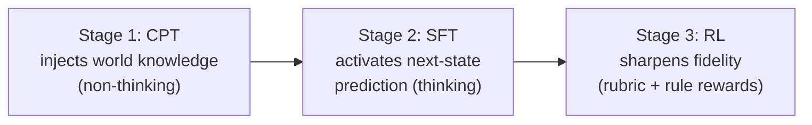
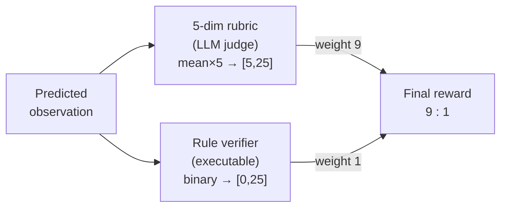

# CPT Injects, SFT Activates, RL Sharpens

How do you teach a language model to *be* a terminal? Not to use one — to *be* one,
predicting the exact bytes a shell would print back?

The paper compresses its whole training philosophy into one slogan:

> "CPT injects, SFT activates, RL sharpens" — *Section 3*

Three stages, three jobs. Hold that slogan; everything below hangs off it.

## Stage 1 — CPT: inject the knowledge

Continual pre-training runs the **standard next-token objective**, but reframes
every multi-turn trajectory as a world-modeling task: system prompt sets the
context, user turns carry actions, assistant turns carry the environment's
responses. The language-modeling loss maps directly onto p(o_(t+1) | o_(≤t),
a_(≤t)).

Crucially, CPT mixes in **specialized-domain world knowledge corpora** — law,
medicine, finance, cybersecurity, current affairs:

> "simulating a regulatory compliance platform requires legal knowledge, simulating
> a hospital information system requires medical knowledge, and simulating
> search-engine responses on current events requires up-to-date factual coverage."
> — *Section 3.2*

This is why the LWM can later simulate environments it never saw in training: the
factual grounding came from these corpora, not just from trajectories.

### The clever bit: information-theoretic loss masking

Here's a real problem. Many turns in tool-use trajectories are **boilerplate** — a
tool that echoes its input, an API that mirrors its request parameters. Training on
these teaches the model nothing, and worse, injects noise. But you can't just
*delete* the turns, because later turns depend on them as context.

The fix: keep boilerplate turns as *context* but **exclude them from the loss**.
The question becomes — how do you detect boilerplate *without* hard-coding tool
names?

Answer: four cheap, surface-level statistics over the action word-set W_act and
observation word-set W_obs:

| Statistic | Formula | Measures |
|-----------|---------|----------|
| **Overlap (OL)** | \|W_act ∩ W_obs\| / \|W_act\| | how much action vocab the observation echoes |
| **Novelty (Nov)** | \|W_obs \ W_act\| / \|W_obs\| | fraction of genuinely *new* info in the observation |
| **Jaccard (Jac)** | \|W_act ∩ W_obs\| / \|W_act ∪ W_obs\| | symmetric word-set similarity |
| **Length ratio (R)** | \|obs\| / \|act\| | character-level size ratio |

These four numbers sort each turn into one of **seven categories**, each with a
*keep ratio* (the fraction of tokens that count toward the loss):

| Category | Signature | Intuition | Keep |
|----------|-----------|-----------|------|
| retrieval | Nov ≥ 60%, R > 1 | `read_file` → contents | 100% |
| expansion | OL ≥ 50%, Nov ≥ 50%, R > 1.5 | `fetch` → page + metadata | 100% |
| action | Nov ≥ 50%, R ≤ 1 or short | `send_email` → "sent" | 100% |
| transform | Nov < 50%, R < 1 | long input → status word | 50% |
| boilerplate | OL ≥ 50%, Nov < 50% | API echo | 10% |
| echo | OL ≥ 70%, Nov < 30% | `think(x)` → `{thought:x}` | 5% |
| other | uncategorized | — | 100% |

> "This decouples 'learning the next state' from 'learning the next token': loss is
> computed only on turns that carry genuine environment information." — *Section 3.2*

Because the four statistics need no domain-specific annotation, the same masking
works on *any* trajectory data. (You'll implement these formulas in the code
challenge.)

## Stage 2 — SFT: activate the thinking

After CPT the model *knows* what tools return and how states evolve — but only
implicitly, baked into next-token statistics. SFT makes it **explicit**:

> "Through SFT, we explicitly activate next-state prediction as a reasoning pattern
> ... This explicit reasoning reduces hallucinations and improves state consistency
> over long trajectories." — *Section 3.3*

CPT used *non-thinking* trajectories. SFT switches to *thinking* trajectories with
explicit reasoning chains, curated by:

1. **Prompt template diversification** — each sample's system prompt is swapped for
   one of 10 variants, so the model generalizes across prompt formats.
2. **Rejection sampling** — generate 3 rollouts per query, judge them, keep the
   best; discard the query if even the winner is below threshold. Starting from
   10,250 candidate queries, the pipeline keeps **7,094** (a 69.2% retention rate).

The context window here is a roomy **256k tokens** — trajectories get long.

## Stage 3 — RL: sharpen the fidelity

RL is where simulation quality gets polished, using **GSPO**. But RL on a world
model has a weird shape the paper calls **extreme prompt–output asymmetry**:

> "the prompt consists of the full trajectory history ... and often extends to tens
> of thousands of tokens, whereas the output, a single predicted observation,
> typically contains only a few hundred to a few thousand tokens. As a result,
> per-sample compute cost is dominated by prompt processing rather than generation."
> — *Section 3.4*

Prompts are capped at 128k tokens for the RL pool.

### Reward design: a rubric and a rule

The reward combines **two complementary signals** that catch different failure
modes:

- **Five-dimensional rubric** (an LLM judge): scores the prediction on five
  dimensions, each 1–5. Total = mean × 5, giving a range of **[5, 25]**.
- **Rule-based verifier**: executable code producing a binary 0/1, scaled to
  **[0, 25]**. This is the *objective anchor* that mitigates reward hacking.

They're combined **9:1 (rubric:rule)** — "balancing multi-dimensional rubric
feedback with strict binary correctness."

### Three failure modes RL hit (and the fixes)

The paper is unusually honest about what broke. Worth remembering — these are the
traps of *any* world-model RL:

| Failure | Cause | Fix |
|---------|-------|-----|
| **Reward collapse** | Expanding one trajectory into many samples gives them a long shared prefix → reward variance collapses (the "Echo Trap") | Restrict RL expansion to **exactly one turn per trajectory** — every sample gets a unique target |
| **Slow/no convergence** | Alternative rewards (binary "Reference-Reward", "Turing-Test reward") are too sparse or have too high a false-negative rate | The decomposed 5-dim rubric + binary anchor converges stably |
| **Reward hacking via self-praise** | Policy inserts "operation completed successfully!" to inflate judge scores | Rule anchor + content-type classification + strict tag extraction so the thinking block never reaches the judge |

> **Why does self-praise even work?** Because an LLM judge can be *flattered*. The
> policy learns to echo the judge prompt's key terms or assert its own correctness.
> The rule verifier can't be flattered — it runs code — which is exactly why a
> binary anchor, even at just 10% weight, is load-bearing.

One striking detail from the training dynamics: across all five rubric dimensions,
**Factuality improves the most (+11.3%) yet stays the lowest-scoring throughout** —
confirming that getting the *facts* right is the hardest part of simulating an
environment.
