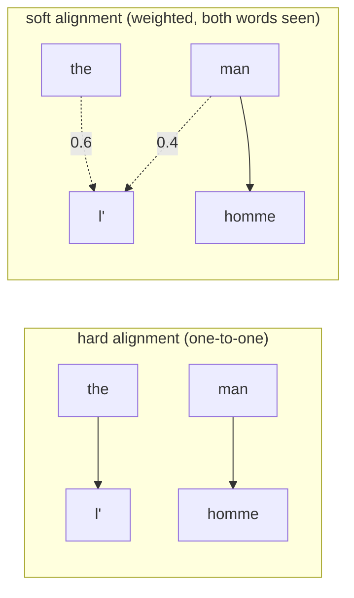

# What attention weights actually buy you — and what they cost

The α weights from the last lesson aren't just an implementation detail — you can
*look at them*. Plot `αᵢⱼ` as a grayscale matrix (rows = generated French words,
columns = source English words) and you get a visual map of what the model
thought was relevant to each word it produced.

> "We see strong weights along the diagonal of each matrix. However, we also
> observe a number of non-trivial, non-monotonic alignments." — *Section 5.2.1*

The paper's clearest example: translating **[European Economic Area]** into
**[zone économique européenne]** — French puts the noun first, English puts it
last. A model limited to *monotonic* alignment (left-to-right, source order only)
literally cannot produce this correctly. RNNsearch's alignment "jumped over" two
words and "looked one word back at a time" — exactly the kind of reordering rigid,
one-directional alignment schemes (like the handwriting-synthesis attention in
Graves, 2013, discussed in Related Work) cannot do.

## Soft alignment solves a problem hard alignment can't

Consider **[the man]** → **[l' homme]**. A hard alignment — one source word maps
to exactly one target word — would map `[the]→[l']` and `[man]→[homme]`
independently. But French contraction (`l'` vs `le`/`la`/`les`) depends on the
word *after* "the," which a context-free hard mapping can't see:

> "This is not helpful for translation, as one must consider the word following
> [the] to determine whether it should be translated into [le], [la], [les] or
> [l']. Our soft-alignment solves this issue naturally by letting the model look
> at both [the] and [man]." — *Section 5.2.1*

Soft alignment also sidesteps a classic statistical-MT headache for free: source
and target phrases of different *lengths* don't need a counter-intuitive `[NULL]`
token to map "nothing" to "something" — a weighted sum over real annotations
handles uneven lengths naturally.

## The cost nobody should ignore

This flexibility isn't free. Section 6.1 names the trade-off explicitly: the
model "requires computing the annotation weight of every word in the source
sentence for each word in the translation" — that's a `Tx × Ty` alignment-model
evaluation per sentence pair, quadratic in sentence length. The paper calls this
acceptable here because "most of input and output sentences are only 15–40
words," but flags that it "may limit the applicability of the proposed scheme to
other tasks" with much longer sequences.

> **Wait — doesn't that make attention slower than the plain encoder–decoder?**
> Yes, asymptotically — RNNencdec is O(Tx + Ty), RNNsearch is O(Tx × Ty). The
> paper's bet is that translation-length sequences make this cost negligible
> next to the accuracy gained. Whether that bet holds for much longer sequences
> is exactly the question later attention/transformer work had to confront.
