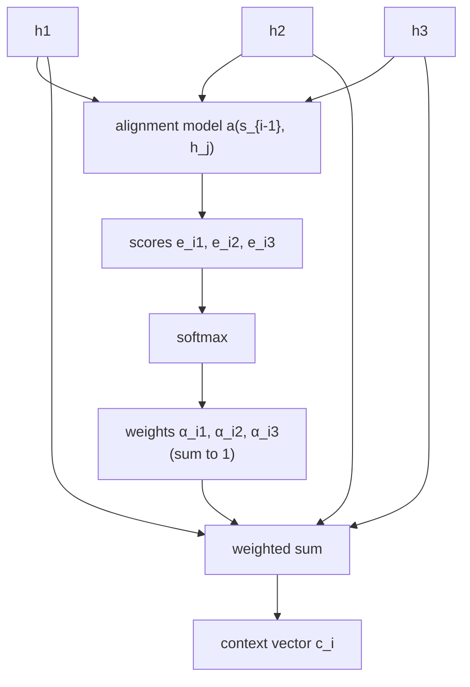
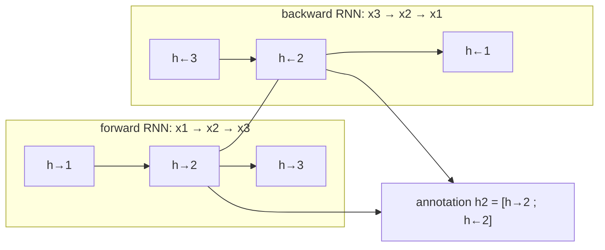
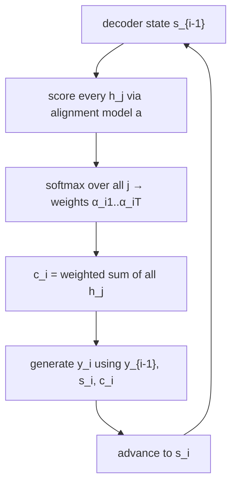

# A different context vector for every word you generate

Last lesson's diagram had one weakness baked into it: vector `c` got computed once
and reused for every decoding step. What if, instead, the decoder got to compute a
**fresh context vector at every step** — one that's free to look at different
parts of the source sentence depending on which target word it's about to produce?

That's the entire idea. Each conditional probability becomes:

> p(yᵢ | y₁, ..., yᵢ₋₁, x) = g(yᵢ₋₁, sᵢ, cᵢ) — *Eq. 4*

Notice the subscript: `cᵢ`, not `c`. A new context vector for word `i`.

## Where cᵢ comes from: a weighted vote over the source

The encoder no longer collapses the sentence into one vector. It produces one
**annotation** `hⱼ` per source word — a vector that "contains information about
the whole input sequence with a strong focus on the parts surrounding the j-th
word." The context vector for target step `i` is just a weighted sum of all of
them:

> cᵢ = Σⱼ αᵢⱼ hⱼ — *Eq. 5*

The weights `αᵢⱼ` are a softmax over **alignment scores** `eᵢⱼ`, each produced by
a small feedforward network `a` that scores "how well the inputs around position
j and the output at position i match":

> αᵢⱼ = exp(eᵢⱼ) / Σₖ exp(eᵢₖ),  where eᵢⱼ = a(sᵢ₋₁, hⱼ) — *Eq. 6*

> **Wait — isn't this just a lookup table?** No: the weights aren't fixed or
> hand-coded, and there's no hard cutoff that picks "the" source word. `αᵢⱼ` is a
> *probability* — the paper's own framing is that `cᵢ` is "the expected annotation
> over all the annotations," i.e. a soft vote, not a hard pointer. The whole
> alignment network `a` is trained jointly with everything else, by ordinary
> backpropagation — nothing about it is hand-designed or pre-computed.

The paper names this directly: "this implements a mechanism of **attention** in
the decoder. The decoder decides parts of the source sentence to pay attention
to." This sentence, from Section 3.1, is the origin of the word "attention" in
every transformer paper that follows.

## Where the annotations hⱼ come from: read both directions

A plain RNN only sees what came *before* word `j` — it has no idea what's coming
next. But "the annotation of each word [should] summarize not only the preceding
words, but also the following words." The fix: run **two** RNNs over the
sentence, one forward and one backward, and glue their states together per word:

> "We obtain an annotation for each word xⱼ by concatenating the forward hidden
> state h→ⱼ and the backward one h←ⱼ." — *Section 3.2*

Each annotation `hⱼ` is "focused on the words around xⱼ" but carries context from
both directions — which is exactly the input the alignment model needs to judge
relevance accurately, regardless of whether the relevant clue sits before or after
position `j` in the sentence.

## Putting it together: Figure 1's loop

Every decoding step now does three things in order: (1) score every source
annotation against the decoder's previous state, (2) softmax those scores into
weights, (3) take the weighted sum as this step's context vector — then generate
the next word and repeat.

The model "(soft-)searches for a set of positions in a source sentence where the
most relevant information is concentrated" *fresh, every step* — which is exactly
what last lesson's frozen single `c` couldn't do.
