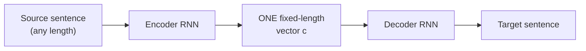

# Why does translation quality collapse on long sentences?

Picture a 2014 neural translation system. It reads an entire English sentence,
squeezes everything it understood into **one fixed-size vector**, and hands that
single vector to a second network that has to reconstruct a French sentence from
it alone — no peeking back at the original words.

That works fine for "The cat sat." It works less fine for a 50-word legal sentence.
Why would squeezing get *harder* as the sentence gets longer, when the vector size
never changes?

That's exactly the bottleneck this paper attacks. Neural machine translation in
2014 had converged on an **encoder–decoder** design:

> "An encoder neural network reads and encodes a source sentence into a
> fixed-length vector. A decoder then outputs a translation from the encoded
> vector." — *Section 1*

And the paper names the flaw outright:

> "We conjecture that the use of a fixed-length vector is a bottleneck in
> improving the performance of this basic encoder–decoder architecture." — *Abstract*

Every word of the source has to get crammed through that single narrow vector `c`,
no matter whether the sentence has 5 words or 50. Cho et al. (2014) had already
shown this empirically: translation quality "deteriorates rapidly as the length of
an input sentence increases." The vector isn't elastic — it has a fixed number of
dimensions, and a 50-word sentence has to fight for the same space a 5-word
sentence gets.

> **Wait — why not just make the vector bigger?** A bigger vector helps a little,
> but it doesn't fix the *structural* problem: the decoder still only ever sees
> one summary, generated once, before it has produced a single output word. It
> can't ask "what mattered for the word I'm generating *right now*?" — it only
> gets to ask that question once, for the whole sentence, in advance.

## The fix, in one sentence

Instead of compressing the whole sentence into one vector and discarding the rest,
keep a vector **per source word**, and let the decoder pick which ones matter,
fresh, at every single output step:

> "It does not attempt to encode a whole input sentence into a single fixed-length
> vector. Instead, it encodes the input sentence into a sequence of vectors and
> chooses a subset of these vectors adaptively while decoding the translation."
> — *Section 1*

This is the move that later becomes famous as **attention** — though the paper
itself calls it "jointly learning to align and translate." The next lessons build
it piece by piece: first the baseline it's replacing (Background), then the
mechanism itself (Learning to Align and Translate).
