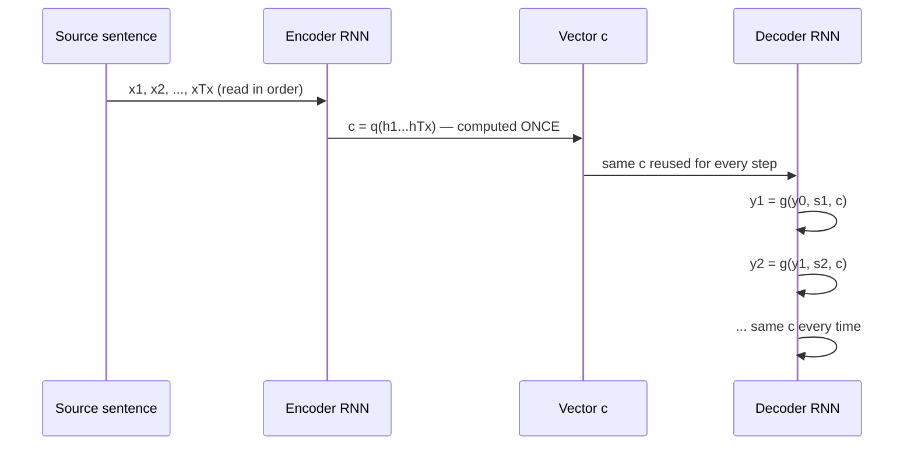

# The baseline you need before the fix makes sense

Before you can appreciate what this paper changes, you need to know exactly what
it's changing it *from*. The framework is called **RNN Encoder–Decoder**, proposed
by Cho et al. (2014a) and Sutskever et al. (2014) — and the paper builds directly
on top of it in Section 3.

Translation, stated probabilistically, is just: find the target sentence `y` that
maximizes `p(y | x)` for a given source sentence `x`. The Encoder–Decoder
framework learns this conditional distribution with two RNNs glued together by one
vector.

**Encoder.** Reads the source sentence one word at a time, updating a hidden state:

> ℎₜ = f(xₜ, ℎₜ₋₁)

After the last word, it produces a single summary vector:

> c = q({ℎ₁, ⋯, ℎ_Tₓ})

In the simplest version, `q` just returns the *last* hidden state — `c = h_Tx`.
Everything the encoder learned about the sentence has to be packed into that one
handoff.

**Decoder.** Generates the target sentence one word at a time, conditioning on `c`
and everything it has produced so far. The joint probability of the whole
translation factors into a chain of per-word conditionals:

> p(y) = ∏ₜ p(yₜ | {y₁, ⋯, yₜ₋₁}, c)

and each term in that chain is computed by another RNN:

> p(yₜ | {y₁, ⋯, yₜ₋₁}, c) = g(yₜ₋₁, sₜ, c)

Notice the diagram's repeated arrow back into `Dec`: `c` never changes across
decoding steps. It's computed once, frozen, and reused for every output word —
which is exactly the rigidity the next lesson's mechanism removes. Hold onto two
pieces of vocabulary from here: the **context vector** `c`, and the decoder's own
hidden state `s` (distinct from the encoder's hidden state `h`) — both get reused,
with a twist, in the proposed architecture.
