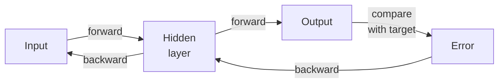

# The Generalized Delta Rule: Forward and Backward Passes

The credit assignment problem—how to adjust hidden units when only output errors are visible—has an elegant solution hidden in calculus: the **chain rule**.

Backpropagation is just gradient descent (find the weight changes that reduce error) applied through multiple layers using the chain rule to compute how each weight contributes to the final error.

## Two Phases of Learning

**Forward Pass:** Present an input and compute outputs layer by layer.

**Backward Pass:** Starting from the output error, compute an "error signal" for each layer by working backward. The error signal tells each unit "how much did you contribute to the final mistake?" 



## Computing the Output Error

For an output unit, the error signal is straightforward:

$$\delta_j = (t_j - o_j) \cdot f'(\text{net}_j)$$

where:
- $t_j$ = target output for unit $j$
- $o_j$ = actual output of unit $j$  
- $f'(\text{net}_j)$ = derivative of the activation function

The first part, $(t_j - o_j)$, is the "who am I mismatched with?" The second part, $f'(\text{net}_j)$, is "how sensitive am I?" Units near their midrange output (where the derivative is largest) change weights most; committed units (output near 0 or 1) change less.

## Backpropagating to Hidden Units

Here's where the chain rule creates the cascade. For a hidden unit with no explicit target, the error comes from the units it feeds into:

$$\delta_i = f'(\text{net}_i) \sum_j w_{ij} \delta_j$$

The hidden unit's error is a weighted sum of the errors it caused downstream. The weights $w_{ij}$ determine how much responsibility it bears for each downstream error—units connected with large weights to high-error outputs carry more of the blame.

This recursion works layer by layer backward through the network. Each layer's error signals depend on the layer ahead, creating a cascade of responsibility assignment.

## Weight Updates

Once you have error signals, the weight change is simple:

$$\Delta w_{ij} = \eta \cdot \delta_j \cdot o_i$$

where $\eta$ is the learning rate. Weights change proportionally to:
- **The error they caused** ($\delta_j$)  
- **The signal they transmitted** ($o_i$)  
- **The learning rate** ($\eta$)

Weights on connections that carry strong signals to high-error units change most. Weak or noisy connections barely change.

## Why Backpropagation is Efficient

Computing gradients by finite differences (perturbing each weight slightly and checking error change) requires $O(n)$ forward passes for $n$ weights. **Backpropagation computes all gradients in one backward pass with the same computational cost as the forward pass.** This is why it scales to networks with millions of weights.

The backward pass is a mirror of the forward pass:
- **Forward:** signals propagate left-to-right, each unit receives input and computes output
- **Backward:** errors propagate right-to-left, each unit receives error and computes local gradient

Both have the same complexity—the only difference is direction and what quantity we're propagating.

## A Worked Example

Consider a three-layer network on XOR:

```
Input (0,1) → Hidden layer → Output unit → compare with target 1
```

1. **Forward:** Input (0,1) produces hidden activations [0.2, 0.7], then output 0.3.
2. **Error:** Target is 1, output is 0.3, so output unit error signal $\delta_{\text{out}} = (1 - 0.3) \times f'(\text{net}) = 0.7 \times 0.21 = 0.147$ (assuming logistic, $f'(0.3) = 0.3 \times 0.7 = 0.21$).
3. **Backprop to hidden:** Hidden unit 1 gets $\delta_1 = f'(\text{net}_1) \times w_{1,\text{out}} \times \delta_{\text{out}} = 0.16 \times 2.5 \times 0.147 \approx 0.059$.
4. **Update weights:** Weight from hidden unit 1 to output changes by $\eta \times 0.147 \times 0.7 \approx 0.1 \times 0.103 = 0.0103$ per example.

Repeated thousands of times across many examples, these small adjustments accumulate into a network that solves the problem.
