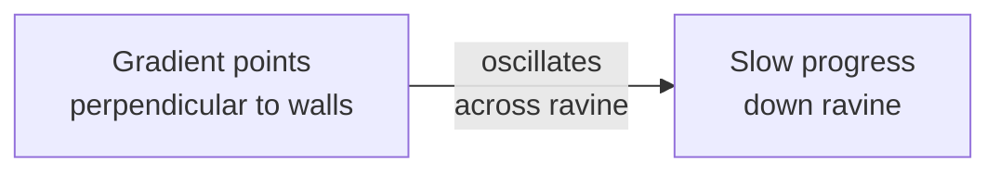

# Making Learning Stable and Fast

Backpropagation is elegant in theory but fragile in practice. Three design choices determine whether a network trains smoothly or gets stuck.

## Choice 1: The Activation Function

The perceptron uses a linear threshold: output is 0 or 1 depending on whether the weighted input exceeds a threshold. This function is **discontinuous**—it jumps instantly from 0 to 1. Backpropagation needs the derivative of the activation function to compute error signals. The threshold function has zero derivative everywhere except at the discontinuity, where it's undefined.

> **Why not just use linear units?** Linear units have a constant derivative, but stacking linear layers just multiplies matrices—it's equivalent to a single linear layer. Hidden units provide no benefit.

The **logistic function** solves both problems:

$$o = \frac{1}{1 + e^{-x}}$$

It's smooth and nonlinear. Its derivative is elegant:

$$\frac{do}{dx} = o(1 - o)$$

This derivative has a beautiful property: it's largest when $o = 0.5$ (the unit is undecided) and smallest when $o \approx 0$ or $o \approx 1$ (the unit is committed). This means:

- **Undecided units adapt quickly.** A unit outputting 0.5 has the steepest error gradient. Weight changes are largest for flexible units.
- **Committed units adapt slowly.** A unit nearly "on" (output ~0.99) has derivative ~0.01, so weight changes are tiny. Committed decisions are stable.

This asymmetry is crucial for learning stability—the network doesn't constantly flip the decisions of units that have already converged to useful values.

One practical detail: logistic units never quite reach exactly 0 or 1 (they'd need infinite weights). So instead of targeting {0, 1}, the paper uses targets {0.1, 0.9}. The network can actually achieve these.

## Choice 2: The Learning Rate

The learning rule says: **change weights proportional to the gradient**. But proportional by how much? This is the **learning rate** $\eta$.

Large $\eta$ → weights change rapidly → learns fast but might overshoot and oscillate.  
Small $\eta$ → weights change slowly → stable but tedious.

The error surface in weight space often has long, narrow ravines—shallow gradient along the ravine, steep walls across it. Gradient descent bounces back and forth across the walls:

The paper recommends choosing $\eta$ as large as possible without causing oscillation. But this is hard to tune by hand, which brings us to the third choice.

## Choice 3: Momentum

The momentum term keeps a running average of past weight changes:

$$\Delta w_i(t+1) = \eta \cdot \text{gradient}_i + \alpha \cdot \Delta w_i(t)$$

where $\alpha \approx 0.9$ (usually).

Think of a heavy ball rolling downhill: it doesn't instantly change direction with each small bump (gradient). Instead, its *momentum* carries it forward, dampening oscillations.

Mathematically, momentum acts as a **high-frequency filter**. The steep oscillations across the ravine walls are high-frequency noise; the gentle progress down the ravine is low-frequency signal. Momentum filters out the noise and amplifies the signal.

The result: **with momentum, you can use a larger learning rate without diverging, so learning speeds up**. The paper found that:

- With momentum $\alpha = 0$ and small $\eta$: convergence is stable but slow
- With momentum $\alpha = 0.9$ and larger $\eta$: convergence is stable and *much* faster

The momentum term doesn't guarantee faster convergence; it enables using larger steps in stable directions.

## Putting It Together

| Factor | Choice | Effect |
|--------|--------|--------|
| **Activation** | Logistic | Smooth, nonlinear, stabilizes learned decisions |
| **Learning rate** | Large as possible without oscillation (~0.5) | Balances speed and stability |
| **Momentum** | ~0.9 | Filters oscillations, enables larger steps |

These three design choices turned a brittle algorithm into something that works reliably across diverse problems. They're not magic—they're engineering, informed by understanding the geometry of the error surface.
