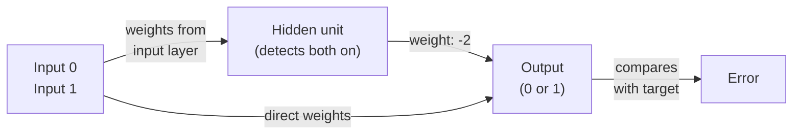

# Why Neural Networks Need Hidden Units

For decades, researchers could train simple two-layer networks easily: input patterns directly mapped to outputs through learned weights. These networks worked well because they respected a fundamental constraint—*similar inputs produce similar outputs*.

But this constraint is also their prison. Consider the **exclusive-or (XOR) problem**:

| Input | Output |
|-------|--------|
| (0,0) | 0      |
| (0,1) | 1      |
| (1,0) | 1      |
| (1,1) | 0      |

The patterns that look most similar—(0,0) and (1,1) are both uniform—are supposed to produce *opposite* outputs. Patterns that differ in only one bit—(0,1) and (1,0) are very similar—should produce the *same* output. The network's bias toward preserving similarity becomes a liability.

Minsky and Papert (1969) proved this rigorously: *no two-layer network, no matter how many weights, can solve XOR*.

## The Solution: Hidden Units and Internal Representations

What if the network could recode the inputs before computing the output?

Imagine inserting a hidden layer of intermediate units between input and output. These hidden units don't receive targets from the outside world—they develop their own codes for the input patterns. From the output unit's perspective, the hidden units become just another set of inputs. The same logic that prevented two-layer networks from solving XOR now applies to the *hidden-to-output* connections, but with a crucial difference: the hidden layer has flexibility in its own internal representation.

Here's the key insight: **if there are enough hidden units, any recoding of the input is possible**. And with the right recoding, even a simple two-layer mapping (hidden → output) can solve any problem.

For XOR, a single hidden unit suffices. It learns to detect when *both* inputs are on. From the output unit's view, there are now three inputs: the original two, plus this hidden unit's "both on" signal. With this intermediate feature, the output mapping becomes linearly separable.

The power of hidden units is that they *learn* what features to detect. The network doesn't come pre-programmed with a "both inputs on" feature—it discovers it through training. This is the promise of learning hidden representations: the same general algorithm can solve a vast family of problems by finding the right internal encoding for each one.

But there's a problem: **how do you train hidden units when no external teacher tells them what to do?** This is the *credit assignment problem*—errors at the output don't come with labels for what the hidden units should become. For decades, no one had a practical answer. That is, until backpropagation.
