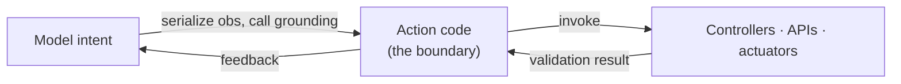

# Code for Acting

Reasoning checks itself by running. **Acting** is harder: code now leaves the
sandbox and produces "real executable effects" — tool calls, robot policies, GUI
actions, software commands (§2.2). The model's job description changes from *medium
for computation* to *action interface* that converts intent into grounded
operations.

The central challenge is **grounding**: the harness "must map abstract language
outputs into executable behaviors that respect the constraints of the target
environment" — embodiment limits, APIs, dynamics, safety (§2.2). And unlike
reasoning, "action execution occurs in partially observed and dynamically evolving
environments, where failures may emerge through invalid state transitions, delayed
feedback, or silent execution errors" (§2.2). A robot may "attempt to grasp an
object outside its reachable workspace without producing an explicit runtime
exception" (§2.2) — no stack trace, just a quiet failure.

So action code is "an interface to these components, not a replacement for them"
(§2.2). It sits *between* the model and perception, affordance models, controllers,
APIs, and safety layers.

## Three approaches, three trade-offs

The survey splits code-for-acting into three paradigms (§2.2) — they differ in
*where the action logic lives* and *how it adapts*.

| Approach | Section | Where action logic lives | Best when |
|---|---|---|---|
| **Grounded skill selection** | §2.2.1 | A library of reusable skills the agent *selects & composes* | Skills exist; need feasibility-aware choice under constraints |
| **Programmatic policy generation** | §2.2.2 | Code the agent *writes* as the policy (branching, loops, API calls) | No fitting skill exists; behavior needs custom control logic |
| **Lifelong code-based agents** | §2.2.3 | A skill library that *grows and persists* across tasks | Long-horizon / open-ended; capabilities must accumulate |

## Grounded skill selection (§2.2.1)

Treat the environment as "a collection of executable capabilities that the agent
harness can invoke, compose, and refine" (§2.2.1). SayCan selects actions "based
not only on semantic relevance but also embodiment feasibility" (§2.2.1); KnowNo
adds conformal prediction "to detect ambiguous states and trigger clarification
before unsafe execution" (§2.2.1). The action space is bounded by what the library
already contains.

## Programmatic policy generation (§2.2.2)

Here "code itself [is] the control interface" — the harness "directly materializes
executable policies as programs that specify control logic, perception-conditioned
branching, feedback loops, and API interaction" (§2.2.2). Code-as-Policies frames
"LLM-generated Python programs as executable robot policies" (§2.2.2). Maximum
flexibility, but you trust freshly-written control code.

## Lifelong code-based agents (§2.2.3)

Code becomes "a persistent memory substrate through which the harness stores
reusable behaviors" (§2.2.3). Voyager runs an "automatic curriculum and continually
expanding executable skill library" (§2.2.3); LYRA converts human corrections "into
reusable executable skills" (§2.2.3). The action space *expands itself* over time —
at the cost of managing growth and catastrophic forgetting.
