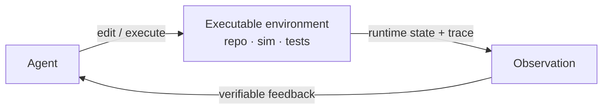

# Code for Environment

An agent that reasons and acts still needs to know *where it is*. Without an
explicit representation, "the environment is exposed to the agent only indirectly
through textual observations, API returns, or sparse feedback" — so state "remains
implicit, transient, and difficult to verify" (§2.3). You can't track a transition,
score an outcome, or reuse history that was never written down.

**Code-for-environment** makes executable programs "the environment interface
itself" (§2.3): simulators, repositories, tests, traces, logs, and state-transition
programs the agent can "store, inspect, execute, and modify" (§2.3). Two payoffs
(§2.3):

1. **Verifiable transitions** — outcomes are judged "through execution rather than
   ambiguous natural-language judgment."
2. **Persistent & modifiable state** — agents can "query, simulate, edit, and
   refine" the world during interaction.

## Four paradigms

The survey organizes this role into four paradigms (§2.3).

| Paradigm | Section | What code represents | Representative work |
|---|---|---|---|
| **Structured world representations** | §2.3.1 | World state, objects, layouts as explicit programmatic structures | ViStruct, FactoredScenes, Code2World |
| **Execution-trace world modeling** | §2.3.2 | Dynamics learned from runtime traces; agent *writes* world models | SemCoder, CWM, WorldCoder |
| **Code-grounded evaluation environments** | §2.3.3 | The yardstick: runtime state + tests as the measure of behavior | InterCode, SWE-bench, AgentBench |
| **Verifiable environment construction** | §2.3.4 | The environment *itself* as a synthesized, validated artifact | SWE-smith, EnvScaler |

## Structured world representations (§2.3.1)

Encode "world state, object relations, spatial layouts, and interaction dynamics as
structured computational artifacts" instead of latent embeddings (§2.3.1).
FactoredScenes models rooms as compositional "room programs"; Code2World "reframes
GUI state prediction as renderable HTML generation" (§2.3.1) — the state *is* code
you can render.

## Execution-trace world modeling (§2.3.2)

Model "runtime transitions themselves as the primary representation of environment
behavior" (§2.3.2). CWM "learns predictive world models directly from program
traces"; WorldCoder has the agent "explicitly [write] and update executable world
models represented as Python programs" (§2.3.2) — editable, not buried in weights.

## Code-grounded evaluation environments (§2.3.3)

Use "executable systems as the interface for measuring agent behavior" (§2.3.3).
InterCode treats "code [as] actions, execution feedback [as] observations" in a
sandbox; SWE-bench grades against "repository-level unit-test execution rather than
textual correctness alone" (§2.3.3). The test suite is the objective world state.

## Verifiable environment construction (§2.3.4)

The newest turn: environments as "harness artifacts that can be synthesized,
scaled, and validated programmatically" (§2.3.4). A long-horizon harness must
supply "not only a task prompt, but also a runnable state, transition dynamics,
feedback channels, and verification oracles" (§2.3.4). SWE-smith turns repos into
"reproducible program worlds"; EnvScaler synthesizes environments "together with
scenarios and rule-based trajectory validators" (§2.3.4).
