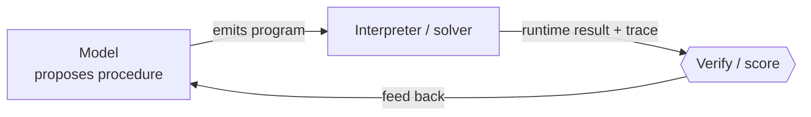
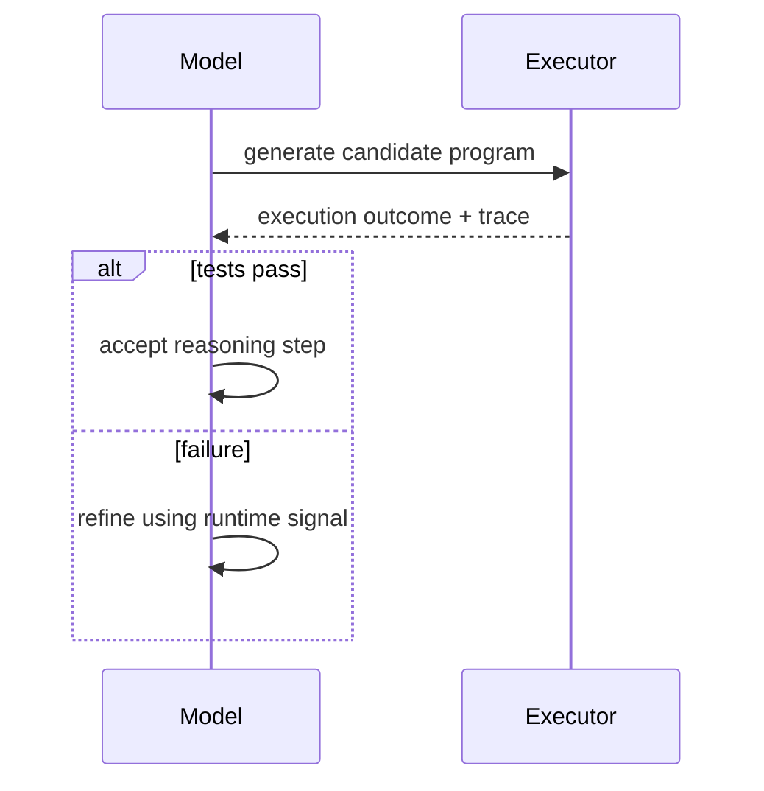

# Code for Reasoning

Ask a model to compute `48271 * 16807 mod 2^31-1` in pure chain-of-thought and it
will *narrate* an arithmetic it can't reliably *perform*. Language models "are
often effective at proposing reasoning steps, [but] remain unreliable at faithfully
carrying out symbolic, logical, or arithmetic computation" (§2.1). Worse, purely
textual reasoning gives the harness "little ability to verify intermediate states,
inspect execution behavior, or persist computational progress across steps" (§2.1).

The fix is to make code the **execution interface** between the model and the
harness: the model *proposes* procedures, an external runtime *executes* them, and
results flow back into the next reasoning step. This "separates high-level
reasoning from low-level computation" (§2.1) — the model decomposes, the interpreter
computes and verifies.

## Three paradigms

The survey organizes this role into three paradigms (§2.1).

| Paradigm | Section | Core idea | Representative work |
|---|---|---|---|
| **Program-delegated reasoning** | §2.1.1 | Model writes code; an interpreter executes it for "formally grounded outputs" | PoT, PAL, CodeI/O |
| **Formal verification & symbolic interfaces** | §2.1.2 | Symbolic solvers and proof assistants act as "machine-checkable reasoning backends" | SATLM, Lean/Isabelle/Coq provers |
| **Iterative code-grounded reasoning** | §2.1.3 | Closed generate–execute–verify–refine loops grounded in runtime state | NExT, CodePRM, R1-Code-Interpreter |

## Program-delegated reasoning (§2.1.1)

Delegating computation to programs "substantially improves reliability by moving
intermediate reasoning into structured, verifiable execution traces" (§2.1.1).
Program-of-Thoughts decomposes reasoning into executable programs; PAL "decouples
logic from computation" (Table 1). The interpreter is the calculator the model
isn't.

## Formal verification & symbolic interfaces (§2.1.2)

Here code and symbolic artifacts are "persistent intermediate representations
rather than... mere generated text" (§2.1.2). Proof assistants like Lean, Isabelle,
and Coq let "each derivation step [be] checked by a verifier" (§2.1.2). From the
harness view, formal languages become "executable contracts that constrain,
certify, and audit agent behavior" (§2.1.2).

## Iterative code-grounded reasoning (§2.1.3)

Reasoning becomes "an iterative computational trajectory grounded in executable
state transitions," not a single pass (§2.1.3). Systems add explicit
generate–execute–verify–refine loops; RL methods treat "execution feedback as an
optimization signal over reasoning trajectories" (§2.1.3), with unit tests as the
reward.

The thread across all three: code lets the harness **verify what the model
intended**, and turn a failed run into the next prompt.
