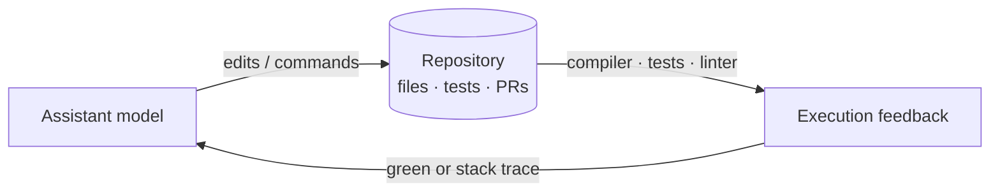
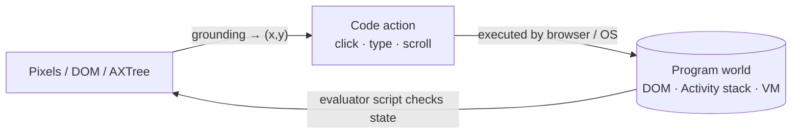

# Emerging Fields I: Code Assistants & GUI/OS Agents

The survey now leaves the taxonomy and asks: where does code-as-harness
actually show up? Two domains are the clearest production instances — coding
assistants over repositories, and agents that drive graphical interfaces.

## Code assistants: the repository becomes the substrate

Early assistants did "localized completion or single-turn code generation."
Modern ones "operate across repository-level workflows, where editing, tool use,
validation, and pull-request interaction form a closed-loop agent process"
(§5.1.1). The assistant is "no longer a standalone code generator" — it lives
inside a development environment where repo state, tools, and validation supply
"the operational context for action and feedback."

Two harness ideas carry the domain:

- **Executable development harness** — "the runtime and control plane of code
  assistants." Rather than a flat tool list, the model is "wrapped in a managed
  development loop that controls repository access, file edits, command
  execution, approval boundaries, context isolation, logging, and validation"
  (§5.1.1). Claude Code, Codex, and Copilot coding agents all package this loop.
- **Execution feedback as grounded verification** — "compiler diagnostics, test
  outcomes, linter warnings, and runtime traces." Execution "converts each
  candidate edit from a textual hypothesis into a verifiable transformation of
  the program world" (§5.1.1).

A subtlety: a patch must pass tests **and** match the repo's architecture and
style — what recent work calls **organicity** (§5.1.1). So coding is "a partially
observable program world": files and tool outputs are observable, but "design
rationales, implicit constraints, and team conventions must be inferred." The
harness is even becoming a **distillation surface** — production traces train the
next model, blurring "the boundary between 'the agent' and 'the harness'" (§5.1.1).

## GUI/OS agents: a program world in the literal sense

GUIs and operating systems are "a program world in the most literal sense: every
observation an agent receives is the rendered output of executable code ... and
every action it takes is a call into another piece of code" (§5.1.2). The survey
models them as a partially observable MDP where the transition function "is not
learned but **executed**" — the browser engine or OS produces the next state.

Code is the bridge on all three sides:

| Side | What code does | Examples (§5.1.2) |
|---|---|---|
| **Perception** | grounding = "function from pixels to executable coordinates" | SeeClick, UI-TARS emit `(x,y)`/bbox tokens |
| **Action** | emit Python/JS snippets, not JSON tool calls (CodeAct) | `click(x,y)`, `type(text)`, Playwright |
| **Evaluation** | "an evaluator is itself a piece of code that interrogates the program world" | OSWorld Python checkers, `adb` state |

The punchline: "code generates the environment, code is the agent's action, and
code adjudicates the result" (§5.1.2). Sandboxes like WebArena and OSWorld are
"forkable, diffable, version-controlled, and reproducible in ways that no learned
simulator can match" — which is exactly why the jump from simulation to
production (Claude Computer Use, Operator, Project Mariner) was so fast: the I/O
contract, screenshots in and code out, is identical in both.
