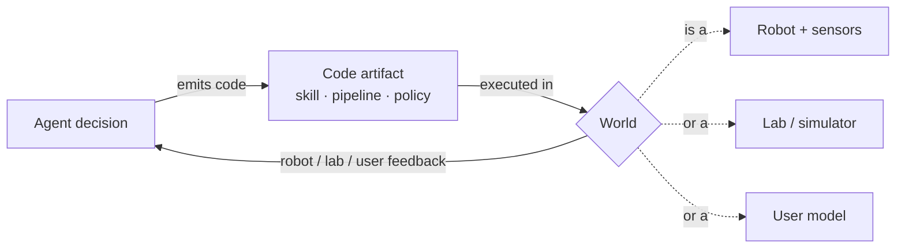
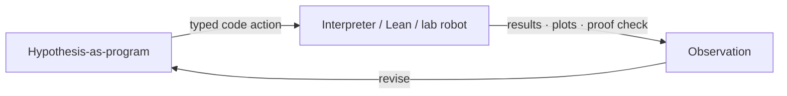

# Emerging Fields II: Embodied, Scientific, and Personalization Agents

Three more domains, one thread. In each, **code is the medium that connects an
agent's decisions to a world it cannot fully see** — a physical robot, a
simulated lab, or a human user. The world differs; the harness pattern repeats:
the agent emits code, the world executes it, and feedback flows back as state.

## Embodied agents: code as the control boundary

Physical constraints "may fail silently when violated: a robot may attempt to
grasp an object outside its workspace without producing any explicit failure
signal" (§5.1.3). That shifts correctness "from runtime to action-generation
time." Code serves two roles at once: a **grounding interface** that "translates
high-level intent ... into embodiment-respecting commands," and a **safety
boundary** that "constrains admissible actions at execution time" (§5.1.3).

Embodied memory has a distinctive twist. Because the same executable form that
makes an action verifiable also makes it storable, memory becomes a **skill
library** — and "a skill is not merely something the agent reads, but something
the agent re-executes" (§5.1.3). Voyager pioneered this in Minecraft; the open
problem is no longer generating skills but "governing the library: handling
forgetting, abstraction, and grounding alignment."

## Scientific discovery: the lab as runtime

"The scientific method is itself a closed loop of *hypothesize → design →
execute → observe → revise*, in which each transition is mediated by an artifact
that is, increasingly, a program" (§5.1.4). Hypotheses become differential
equations, protocols become XDL scripts, instruments are driven through Python,
analyses live in Jupyter cells "whose cells form a verifiable trace."

The result collapses ideation, experiment, analysis, and writing "into a single
executable pipeline." AlphaProof "expresses each reasoning step as a Lean tactic
that the proof assistant verifies before transitioning the state" (§5.1.4). In a
self-driving lab the loop crosses into reality: "the agent's policy **is** the
code, the lab **is** the runtime, and the publication record **is** the log"
(§5.1.4) — Berkeley's A-Lab synthesized 41 novel compounds in 17 days unattended.

## Personalization: the user as a partially observed world

Here "the environment ... is not only a software system but also a human user
whose intent, satisfaction, and long-term goals are only partially observed"
(§5.1.5). Recommendation shifts "from one-shot scoring to an adaptive process."

The key move is the **preference state as an editable artifact**. Because user
preferences are "latent, contextual, and often unstable," agents "need explicit
preference states that can absorb noisy behavioral signals while remaining
interpretable and correctable" (§5.1.5). Compared with "opaque embedding-only
memory, structured preference memory is easier to inspect, revise, and reuse" —
"a user can correct a stored preference in natural language."

The hard wall, though: personalization "lacks a reliable oracle for true user
satisfaction." Clicks and engagement "can be misleading or even harmful when
optimized too aggressively" (§5.1.5) — a problem the next lesson generalizes.

| Domain | The unseen world | Code artifact | Feedback channel |
|---|---|---|---|
| Embodied | physics + reachability | skill / control policy | sensors, force, vision |
| Scientific | nature / proof space | hypothesis-as-program, pipeline | results, plots, verifier |
| Personalization | latent user intent | editable preference state | clicks, dwell, corrections |
