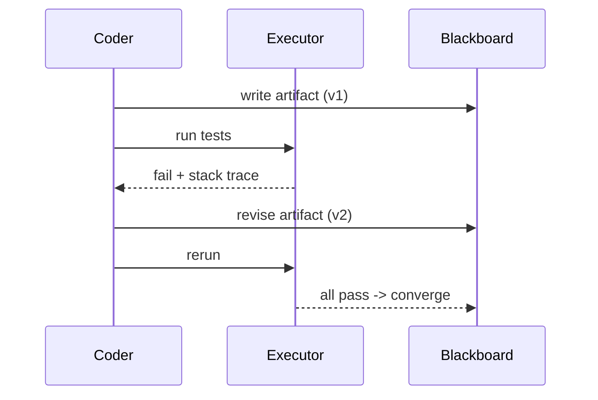

# Execution feedback & shared-harness synchronization

This is the dimension that makes code-centric MAS different from every other kind:
"the shared harness is uniquely executable and produces objective oracle signals"
(§4.2). Two questions follow — *what* feedback agents extract from running code, and
*how* they keep a consistent shared view of program state.

## What feedback agents extract (§4.2.1)

| Feedback type | What it tells you | Used by |
|---|---|---|
| **Compiler / syntax** | structural errors before runtime | L2MAC (blocking, after every file write) |
| **Test pass/fail** | the most common signal | AgentCoder (whole loop centers on it) |
| **Fuzzer crash traces** | a concrete failing *input*, not pass/fail | AutoSafeCoder (type-aware mutation) |
| **Static analysis** | security properties, no execution | AutoSafeCoder (CWE-mapped) |
| **Performance profiling** | time, memory, FLOPS | MACRO (correctness is secondary) |
| **Fine-grained simulation** | signal values per clock edge | MAGE (waveform around first failure) |

A provocative wrinkle: QualityFlow's **Imagined Execution** has "an LLM [simulate]
the Python interpreter step-by-step and [predict] test outcomes without actually
running the code, achieving 98%+ precision and recall on MBPP" (§4.2.1). With
Self-Collaboration's simulated tester nearly matching its real-compiler ablation,
the survey asks: "when is actual execution necessary, and when can linguistic
simulation of execution suffice?"

## How shared state synchronizes (§4.2.2)

The default is **sequential handoff**: "each agent receives the output of its
predecessor and passes its own output to its successor. The program state exists
only in the form of the most recent artifact" (§4.2.2). Fine for a linear pipeline —
but it "creates invisible state divergence" when agents edit in parallel.

Richer mechanisms address divergence directly:

- **Shared blackboard** — a globally readable/writable store. L2MAC's file store is
  "never overwritten but extended and revised," with a Control Unit governing every
  read/write. MAGIS keeps a key-value repository evolution memory.
- **Parallel branches with merge** — MAGIS runs "one Developer per candidate file";
  HyperAgent runs Navigators/Editors "in parallel via Redis queues," merged at the
  Planner.
- **Structured context scheduling** — L2MAC's Control Unit "resets the context
  window between instruction steps," handing each invocation a targeted summary
  rather than full history. It "solves the context-window problem not by expanding
  the window but by carefully controlling its contents."
- **Hierarchical memory** — ChatDev/Cogito split short-term working state from
  long-term accumulated knowledge.
- **Agent pool scaling** — SoA partitions state across agents; "the limitation is
  that global consistency is sacrificed."
- **Revert** — QualityFlow keeps the initial artifact so it can "roll back ... if
  the debugging trajectory degrades quality" — the only system managing state
  *history* instead of always moving forward.

## The honest caveat

Code is a richer channel, but it "does not remove these distributed-systems
constraints": "channels have finite bandwidth, summaries introduce compression loss,
logs become noisy, cached views go stale, and parallel branches raise unresolved
questions of authority and consistency" (§4.2.2). Executable artifacts buy you an
oracle — they don't repeal information theory.
