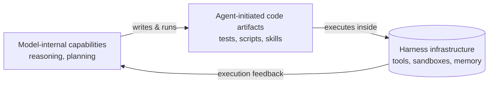
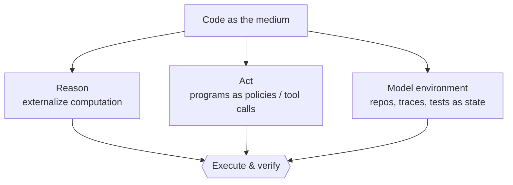

# From code as output to code as harness

Ask an LLM for a sorting function and you get a sorting function back — task done,
code discarded. That's *code as output*. Now watch an agent work inside a repo: it
writes a failing test, runs it, reads the stack trace, edits a file, reruns the
test, and stops only when the suite is green. The code didn't just answer a
question — it became the **mechanism** the agent used to think, act, and check its
own work.

This survey calls that shift **code as agent harness**: code as "an executable,
inspectable, and stateful medium through which agents reason, act, observe
feedback, and verify progress" (Section 1).

## What "harness" means here

An **agent harness** is the software layer around an LLM — tools, APIs, sandboxes,
memory, validators, permission boundaries, execution loops, and feedback channels
— "turning a stateless model into a functional agent capable of long-running task
execution" (Section 1). Strip the harness away and an LLM is a pure function:
input in, text out, no memory of what just happened.

## Three coupled elements

The survey untangles three things usually lumped together as "the agent":

| Element | What it is | Example |
|---|---|---|
| **Model-internal capabilities** | The model's own reasoning, planning, perception, evaluation | Chain-of-thought, self-critique |
| **System-provided harness infrastructure** | Predefined tools, sandboxes, memory, validators, telemetry — what "harness engineering" builds | A sandboxed shell tool, a vector-store memory module |
| **Agent-initiated code artifacts** | Code the *agent itself* creates, runs, revises, and shares mid-task | A regression test it writes, a one-off script, a reusable skill |

The first two are well studied. The third — **agent-initiated code artifacts** — is
this survey's focus: code the agent produces *as part of doing the task*, not as
the final deliverable.

## Code as the medium for reasoning, acting, and modeling

Once code sits inside this loop, it does three jobs at once:

Program-aided reasoning externalizes intermediate computation so an interpreter can
check it; embodied agents generate programs as executable policies; software
agents treat codebases, traces, and test results as the *representation* of
environment state. Same substrate, three roles — and all three are checkable by
running the code.
