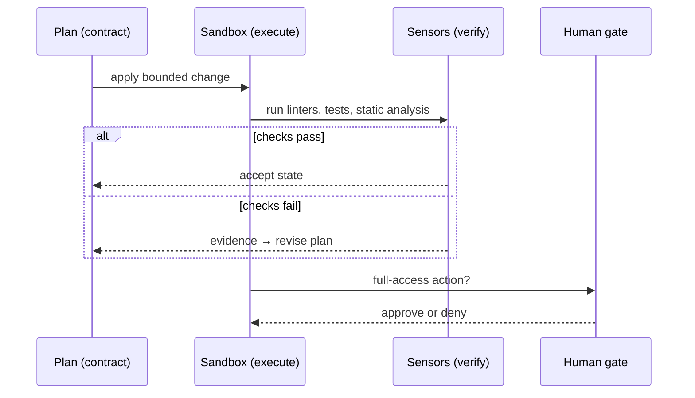
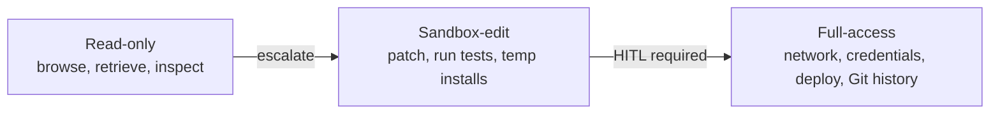

# Harness Control: the Plan, Execute, Verify Loop

Planning decides what to do, memory decides what to keep, tools take the actions —
but something has to *bind these into a closed loop* and decide, after each action,
whether the state is acceptable. The survey calls that loop **Plan–Execute–Verify
(PEV)**: the harness "first externalizes an intended change and its validation
criteria, then executes the change inside a sandboxed and permissioned environment,
and finally verifies the resulting state through deterministic sensors and
human-review gates" (§3.4).

## From debugging to harness-level control

The old framing treats debugging as "a post hoc correction stage." The survey
reframes it as "control over executable program state" (§3.4.1). The harness becomes
"a cybernetic governor: a control layer that observes the effects of agent actions
and regulates subsequent state transitions." Rather than "merely forwarding error
messages to the model," it observes the environment "through deterministic sensors"
and "can then decide whether to continue execution, revise a patch, request more
context, route the task to another module, reduce permissions, or escalate to a human
reviewer."

## Planning as contract formation

The plan "turns a user request into an explicit contract over the next state
transition" (§3.4.2). A robust plan "identifies relevant files, expected invariants,
validation commands, rollback points, and risky operations" — making it "a harness
artifact rather than an unobserved reasoning trace." `AGENTS.md`-style guidance,
typed tool schemas, and MCP registries "make the available actions inspectable before
execution rather than discovered opportunistically." Crucially: "failed verification
updates the plan, while the plan determines which verification evidence is
meaningful" — Plan and Verify are coupled, not separate stages.

## Sandboxed execution and permissioned state transition

Execution "realizes the plan as a bounded and observable state transition" (§3.4.3).
The sandbox provides "an isolated filesystem, dependency state, shell, language
runtime… and resource boundary" so actions "can be run without directly compromising
the host system." It also aids reproducibility — replay "the same patch, command,
seed, dependency lockfile." Without it, "failures may reflect environment drift rather
than program defects."

Execution must be **permissioned** via a multi-tier model:

The full-access tier — "network access, credentials, deployment, package publishing,
destructive filesystem operations" — "should be guarded by mandatory human-in-the-loop
gates because their consequences can extend beyond the sandbox."

## Verification through deterministic sensors

Verification "closes and, when necessary, reopens the loop by comparing the new state
against explicit constraints" (§3.4.4), in cheap-to-expensive order: static analysis
(parser, type, lint) → runtime signals (exceptions, timeouts) → test-based feedback
(unit, integration, regression). These sensors "are deterministic or at least
reproducible enough to serve as control signals." Natural-language critique stays
useful "when failure evidence is sparse," but in a governed loop critiques "should
interpret sensor outputs rather than replace them."

Two consequences fall out of Verify, not separate stages:

- **Repair** uses "the same sensor evidence" to decide whether to "diagnose the
  failure, retrieve missing context, regenerate a localized patch, route to a
  testing/security agent, or abandon the current branch." Reflection is "reliable only
  when it remains grounded in executable evidence."
- **Termination** "should likewise be governed by verification rather than by model
  confidence" — stop "when required checks pass, when additional attempts no longer
  improve the state, when the risk tier changes, or when human review is required."

**The throughline:** "reliability comes from governed state transitions, not simply
from better repair prompts" (§3.4). PEV unifies "static analysis, runtime errors,
tests, critique, self-reflection, and human review as components of a cybernetic
harness that regulates the agent's trajectory over executable program state."
