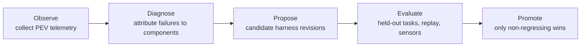
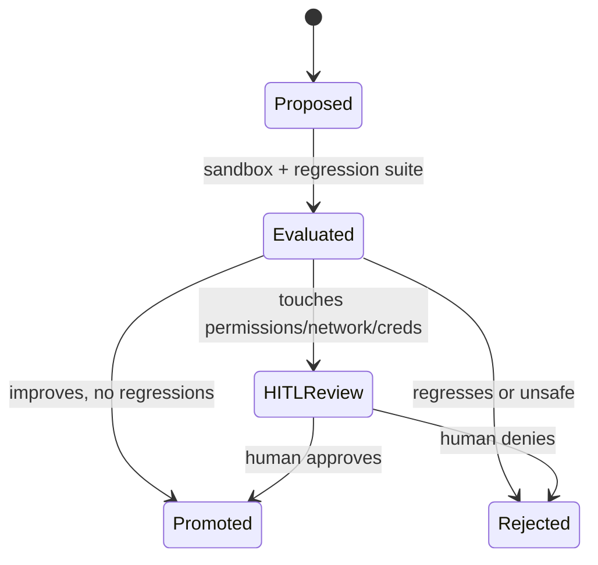

# Agentic Harness Engineering: Adaptive Optimization

Every previous mechanism — planning, memory, tools, the PEV loop — is *part of the
harness*. The last question of §3 is recursive: can the harness improve *itself*?
**Agentic Harness Engineering (AHE)** names that design problem — "how to measure and
revise the software substrate that turns a language model into a coding agent" (§3.5).

It's a different object than prompt or context engineering: "prompt engineering changes
instructions and context engineering changes what evidence is presented… AHE treats
the operating environment itself as the object of analysis" — tool schemas, planning
artifacts, memory policies, retrieval strategies, sandbox config, validators,
permission tiers, routing rules, workflows, and human-review gates. Why bother? Because
"many observed failures… arise from missing repository context, brittle tool
interfaces, weak validators, excessive token cost, poor retry policies, or mismatched
permission boundaries rather than from model generation" (§3.5). You can fix the
scaffold "without retraining the base model."

## Deep telemetry: the optimization substrate

You can't optimize what you can't see. AHE's substrate is **deep telemetry**:
"structured traces that connect model decisions, harness actions, environment states,
and outcomes" (§3.5.1). A shallow log records only the final pass/fail. Deep telemetry
records "prompts and retrieved context, token usage and cost, tool arguments,
permission requests, edited files, sandbox snapshots, command outputs, test results,
stack traces, branch decisions, rejected alternatives, human interventions, and final
outcome."

This "turns harness revision from anecdotal debugging into comparative diagnosis":
token-cost traces "reveal when retrieval or reflection consume budget without improving
verification"; decision-tree traces "show where the agent repeatedly chooses
unproductive tools"; failure traces "cluster recurring patterns" like hallucinated
APIs or flaky sandboxes. Because signals link to concrete artifacts, "they can be
replayed and compared across harness versions."

## The Evolution Agent

An **Evolution Agent** is "a meta-level agent that uses deep telemetry to propose,
evaluate, and promote revisions to harness components" (§3.5.2). The key distinction:
"Unlike a task agent, which edits the target repository, the Evolution Agent edits the
operating conditions under which later task agents work." Its output might be "a revised
prompt template, a retrieval policy, a more precise tool schema, an added validator, a
changed permission rule, a workflow-topology adjustment, or a new regression test."

Its loop has five stages:

This "keeps AHE within the same engineering discipline as the PEV loop: proposed
changes must be executed, verified, and made auditable before adoption."

## Governed harness mutation

The sharp warning: AHE "should not be confused with unconstrained self-modification"
(§3.5.3). Because the Evolution Agent "changes the harness that controls later task
agents, its actions require stronger governance than ordinary code repair." Candidate
changes "should be evaluated inside sandboxes, compared against fixed regression
suites, and recorded with auditable rationales." And the high-stakes carve-out:
changes that "alter permission boundaries, network access, credential handling,
deployment behavior, or human-review requirements should require HITL approval before
activation."

In other words, "the Evolution Agent is itself subject to the PEV loop: it plans a
harness mutation, executes it in an isolated evaluation environment, verifies the
result through telemetry and regression tests, and escalates risky changes to humans."

| Method | Category | Revision target |
|---|---|---|
| AutoHarness | Harness synthesis | Harness code and tests |
| Meta-Harness | Harness search | Prompts, tools, scripts |
| GEPA | Reflective prompt evolution | Prompts and instructions |
| EvoMAC | Workflow topology evolution | Agent roles and graph |
| Langfuse | Observability platform | Dashboards and replay |

**The throughline:** AHE "extends the code-as-harness view from operating agents to
analyzing the infrastructure that operates them" (§3.5) — turning harness design into
"an iterative and measurable engineering process governed by verification and human
approval."
