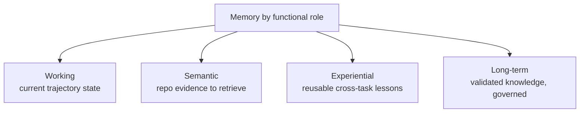
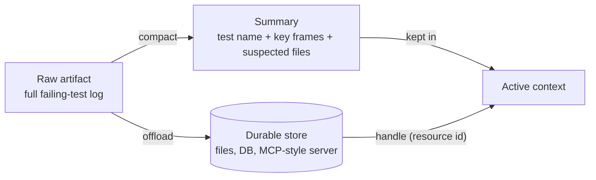

# Memory and Context Engineering

Real coding tasks are "inherently long-horizon and state-intensive" (§3.2). A single
issue can span requirement understanding, code localization, evidence retrieval,
multi-file editing, test execution, bug fixing, and regression verification — many
rounds, all interdependent. That creates "a fundamental tension between the limited
context window of the model and the continuously expanding intermediate state of the
task" (§3.2).

The reframe: memory "is not simply a larger context window or a vector database. It
is a state-management layer that decides which information should remain in the active
model context, which should be compacted into summaries, and which should be offloaded
to durable external storage" (§3.2). Without it, an agent will "lose critical clues,"
"repeat searches already completed," or "break local consistency" set up in earlier
steps.

The survey names five memory roles plus two cross-cutting context-engineering moves.

## What to remember: four roles by function

The four core types differ by *what job the stored state does in the loop*:

- **Working memory** maintains the current trajectory. Its concern is "not how much
  history to retain, but which pieces are most useful for the next action under a
  limited context budget" (§3.2.1) — file lists, failed-test records, key stack
  frames. It's "the active control surface between the model and the code
  environment."
- **Semantic memory** "provides task-relevant external evidence" (§3.2.2): class
  definitions, call relations, docs, issue descriptions. The lesson from AutoCodeRover
  / RepoCoder is that repo tasks benefit "not simply from retrieving more content, but
  from retrieving evidence aligned with program structure" — AST-aware chunking beats
  flat text.
- **Experiential memory** "captures reusable experience accumulated across tasks" —
  repair trajectories, failure cases, strategy patterns — for "cross-task transfer"
  (§3.2.3). MemGovern's warning: "the quality of stored experience matters more than
  its scale." Ungoverned records cause "semantic noise, error propagation, and false
  retrievals."
- **Long-term memory** shifts the focus "from memory capacity to memory governance" —
  not what to store but "when to write, when to compress, when to retrieve, and how to
  avoid contamination" (§3.2.4). It should "preserve validated and reusable experience
  in a compact form," or memory becomes "a burden that amplifies noise, staleness, and
  error."

## Sharing and shrinking memory

**Multi-agent memory** extends state from one agent to a shared harness. Memory
becomes "a medium for information sharing, intention passing, and consistency
maintenance across specialized roles" (§3.2.5) — closer to "a shared blackboard or
collaborative state graph" than individual storage. The new challenge: "controlling
the granularity of sharing, preventing information flooding."

**Context compaction and state offloading** are cross-cutting — "their goal is not to
define another memory category, but to control the boundary between active model
context and durable task state" (§3.2.6). Long tasks "continuously generate
high-volume artifacts" (build logs, diffs, test outputs); dumping them into the prompt
"overload[s] the context window" and "obscure[s] decision-relevant evidence."

Compaction "compresses long histories into structured, provenance-preserving
summaries"; offloading "preserves full-fidelity artifacts outside the active window,"
handing the agent "compact summaries and resource identifiers rather than raw logs."

| Role | Example | Harness operation |
|---|---|---|
| Working | SWE-agent | Structured state tracking |
| Semantic | CodeRAG | Multi-path retrieval, reranking |
| Experiential | MemGovern | Governed experience replay |
| Long-term | MemCoder | Structured memory, self-internalization |
| Multi-agent | ChatDev | Phase-level context passing |
| Compaction | LongCodeZip | Coarse-to-fine compression |

**The throughline:** memory is "a unified state-management layer" that decides "where
task-relevant state should reside and how it should be reused" (§3.2). The frontier
isn't bigger memory but "higher-quality write gates, structurally aligned retrieval
keys, provenance-preserving compaction," and evaluation that checks whether memory
actually keeps agents "grounded, consistent, and verifiable."
