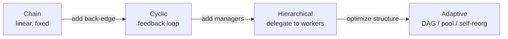

# Interaction modes & workflow topology

General multi-agent systems talk by passing messages. Code-centric ones don't have
to: their coordination is **artifact-mediated**. Agents "observe and modify shared
code artifacts, and their interaction is grounded in the objective state exposed by
those artifacts and their execution results" (§4.1.2). The channels are broader than
source code — "agents communicate through APIs, files, diffs, tests, logs, schemas,
blackboards, and explicit workflow states" (§4.1.2).

## Four interaction modes (§4.1.2)

| Mode | What happens | Tell-tale signal |
|---|---|---|
| **Collaborative synthesis** | two agents *co-build* one component, pair-programming style | PairCoder's Navigator–Driver pair (bidirectional) |
| **Critique and repair** | a verifier produces feedback; a synthesizer revises | the dominant mode — "virtually every surveyed system" |
| **Adversarial validation** | one agent tries to *break* the code | AutoSafeCoder's Fuzzing Agent emits crash traces |
| **Reasoning debate** | agents argue, then reach consensus | CANDOR's 3 Panelists + majority-vote Curator |

The critique-and-repair mode hinges on three choices: "(a) whether the critique is
LLM-simulated or execution-grounded; (b) the richness of the feedback signal
(ranging from binary pass/fail in SEW to structured execution logs ... in EvoMAC);
and (c) the number of repair iterations permitted before fallback" (§4.1.2).

Adversarial validation has "a fundamentally different character": the fuzzer "does
not explain what is wrong, but demonstrates a concrete execution failure, a
counterexample that the coding agent must address" (§4.1.2). A counterexample is
worth more than a complaint.

## Workflow topology — who talks to whom, in what order (§4.1.3)

Topology is "one of the most consequential design decisions" (§4.1.3), organized on
two axes: pre-defined heuristic vs. objective-driven adaptive.

**Pre-defined heuristic** topologies are "fixed at design time" and mirror the
software development life cycle:

- **Chain (waterfall):** strict linear flow, design → coding → testing (ChatDev,
  MetaGPT). L2MAC's twist: each step is "executed by a fresh-context agent ...
  sharing only the external file store."
- **Cyclic (agile):** back-edges let verification feedback trigger revision.
  AgentCoder loops programmer → executor → programmer, "bounded at 5 iterations."
- **Hierarchical:** managers over workers, decompose-and-delegate. MAGIS spawns one
  Developer per candidate file.
- **Star:** a hub fans out to parallel workers (CANDOR's panel; MetaGPT's pub-sub
  pool as a de facto hub).

**Objective-driven adaptive** topologies treat "the topology itself as a design
variable to be optimized toward a code quality signal" (§4.1.3):

- **Dynamic pool scaling** — agent *count* grows with complexity, type fixed (SoA):
  "each agent's context window remains bounded ... by growing the agent pool rather
  than growing individual context windows."
- **Feedback-driven DAG restructuring** — EvoMAC, "the only system ... where the
  harness topology is structurally modified in response to execution feedback."
- **Runtime self-reorganization** — SEW and FlowReasoner generate/mutate whole
  workflow specs; canonical topologies "emerge from optimization rather than being
  hand-designed."

The progression runs from rigid pipelines to topologies the system rewrites for
itself — and §4.4 will reveal that this complexity is often a *symptom* of missing
shared state, not a virtue.
