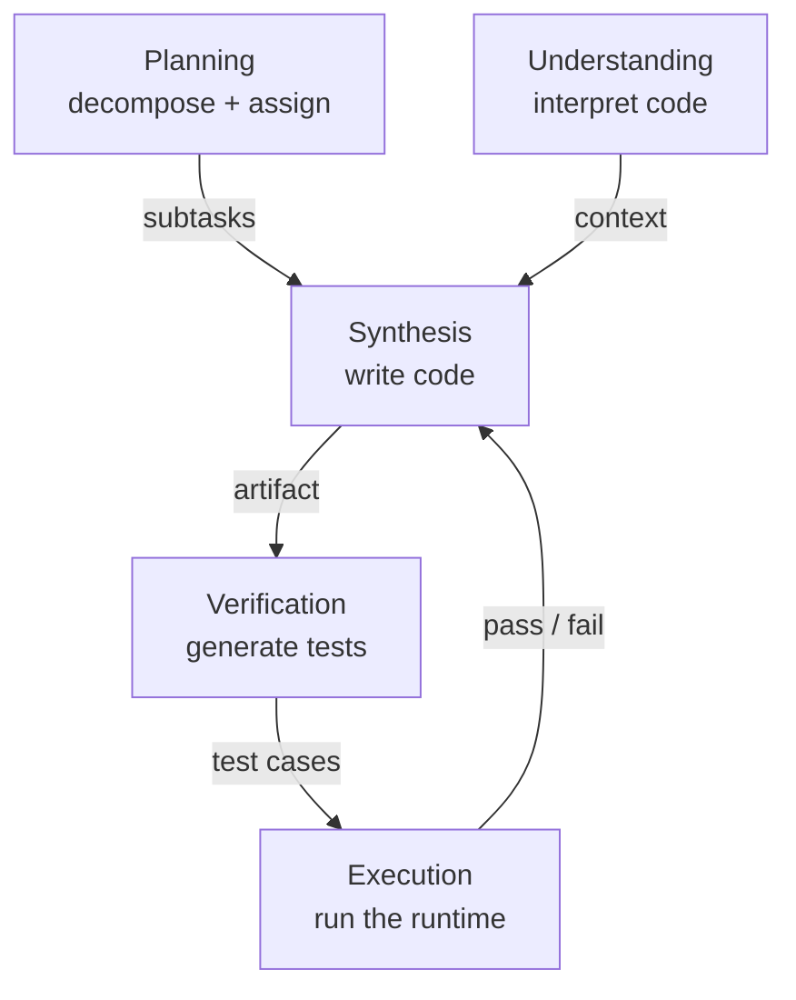

# Multi-agent roles & human-guided planning

One agent can edit a repo. But hand it a *system* to build and three limits bite at
once. The survey names them precisely: "(1) context window constraints prevent a
single agent from holding an entire codebase, long interaction history, and
execution trace in working memory; (2) specialization requirements make it
inefficient to use one generalist agent for planning, synthesis, testing, review,
and debugging simultaneously; and (3) the absence of independent coordination and
verification channels prevents the agent from reliably detecting and correcting its
own errors" (§4).

The fix is to split the harness across agents. Once responsibilities are
distributed, "the agent harness itself becomes more modular, inspectable, and
adaptable" (§4) — code stops being one agent's output and becomes "the shared
substrate through which the overall harness plans, acts, verifies, and improves
itself" (§4). ChatDev, MetaGPT, and AgentCoder pioneered this by mirroring a human
dev team: architect, programmer, tester, reviewer, executor.

## The functional role taxonomy (§4.1.1)

MAS "mirror this division of labor by assigning distinct functional roles," each
owning "a specific slice of the shared code harness" (§4.1.1). The boundaries are
fluid — many systems fold several roles into one agent.

| Role | Owns | Representative instances |
|---|---|---|
| **Program synthesis** | generates/transforms code from specs, plans, feedback | Coder (Self-Collaboration), Engineer (MetaGPT) |
| **Program understanding** | "what the code *means* rather than what it does" | Repository Custodian (MAGIS), Navigator (HyperAgent) |
| **Verification** | tests, static analysis, simulated execution | Test Designer (AgentCoder), Panelists (CANDOR) |
| **Execution** | interfaces directly with the runtime | Test Executor (AgentCoder), Executor (HyperAgent) |
| **Planning** | decomposes the task, assigns subtasks | Architect (MetaGPT), Manager (MAGIS), Mother (SoA) |

## Two design principles worth internalizing

**Decouple reasoning from execution.** AgentCoder's Test Executor is "a
deterministic Python script (not an LLM)," which "cleanly separates reasoning from
execution and grounds the feedback signal in objective program behavior" (§4.1.1).
The verdict isn't a model's opinion — it's what the code *did*.

**Avoid mode collapse.** AgentCoder's Test Designer "generates test cases
independently of the code to avoid circular reasoning, a design principle against
the mode-collapse problem where an agent's biased tests pass its own buggy code"
(§4.1.1). CANDOR's Panelists audit the spec, "deliberately avoiding contamination
by faulty implementations" (§4.1.1).

## Human-guided planning, and meta-roles

Planning agents decompose; some do it dynamically. SoA's Mother agents "dynamically
spawn Child agents at runtime based on the inferred complexity of each subfunction,
making planning and agent initialization interdependent" (§4.1.1).

EvoMAC goes one level up, adding "two novel meta-roles": a **Gradient Agent**,
"which reads execution logs to identify which agents caused failures," and an
**Updating Agent**, "which revises agent prompts and restructures the workflow DAG"
(§4.1.1). These "operate at the level of the MAS itself rather than the program" —
the harness rewiring itself in response to execution feedback.
