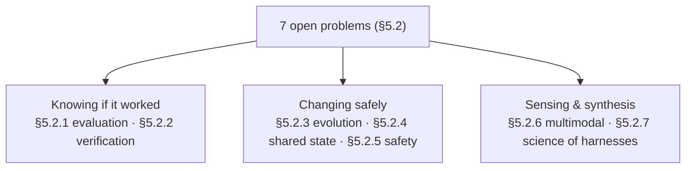

# Open Problems in Harness Engineering

Code-as-harness "shift[s] the central challenge of agentic AI from isolated model
generation to the reliability of the complete execution loop" (§5.2). Once agents
act through tools, memory, code execution, shared state, and feedback, failures
come from "weak verifiers, stale context, unsafe tool access, inconsistent
multi-agent state, insufficient multimodal grounding, or poorly governed
self-improvement" — and "these issues cannot be diagnosed by final task success
alone." The survey lists seven open problems. They cluster into three families.

## Family 1 — Knowing if it worked

**§5.2.1 Harness-level evaluation & oracle adequacy.** Once the model is embedded
in a harness, "performance is no longer determined by the base model alone, but
also by the surrounding runtime." End-task success "conflate[s] the capabilities
of the base model, the quality of the harness ... and the difficulty of the
environment." The fix: define **harness-level metrics** — trajectory efficiency,
verification strength, recovery ability, state consistency, safety compliance,
replayability. The bottleneck is **oracle adequacy**: "whether the evaluator
captures the intended task rather than only a narrow executable proxy" (§5.2.1).

**§5.2.2 Semantic verification beyond executable feedback.** Execution "can
create a false sense of correctness": "the agent sees a green test, but the green
test is not the full specification." The missing abstraction is "a verification
stack with explicit scope" — compose tests, fuzzers, static analyzers, type
checkers, human review, where "each artifact should declare what it verifies,
what it cannot verify, and what confidence it provides." Every accepted action
should carry an **evidence bundle**: checks run, assumptions preserved, untested
regions, remaining risks (§5.2.2). Verification becomes "an evolving, inspectable
contract," not a final gate.

## Family 2 — Changing safely

**§5.2.3 Self-evolving harnesses without regression.** Fixed harnesses may be
suboptimal across tasks, so the harness becomes "a programmable component." But
"'automated harness evolution' is not itself the open problem. The harder problem
is whether a harness can improve itself without overfitting, weakening safety,
increasing cost, hiding failures, or regressing on rare but important tasks." The
insight: treat a mutation "like a code change to a safety-critical runtime." Every
edit carries a **change contract** — what's modified, which failure it targets,
which invariants it preserves, which evaluation can falsify it, how to roll back —
backed by held-out regression suites and canary deployment (§5.2.3).

**§5.2.4 Transactional shared program state.** With many agents on one codebase,
existing mechanisms "synchronize artifacts but not assumptions." One agent plans
from an old snapshot while another tests a newer patch. The missing abstraction
is **transactional shared program state**: "each action should declare its read
set, write set, assumptions, version dependencies, verifier obligations, and
conflict policy." Conflicts must be detected "not only at the level of file diffs"
but across plans, tests, and beliefs, resolved by "semantic merge, rollback,
dependency-aware locking, belief-state reconciliation" — and a key question is
"when a conflict can be resolved automatically and when it requires external
judgment" (§5.2.4).

**§5.2.5 Human-in-the-loop safety as harness state.** "Safety cannot be delegated
to the base model or encoded only as a natural-language instruction." The harness
must be a **safety governor** with a **multi-tier permission model** that is
context-sensitive — "the same command may be safe in a disposable sandbox but
unsafe in a production repository." Crucially, human control "should become
durable harness state": each approval or rejection updates permission rules and
future memory, producing "executable accountability: a safety layer that filters,
vetoes, escalates, and records agent actions before they reach the real world"
(§5.2.5).

## Family 3 — Sensing and synthesis

**§5.2.6 Multimodal code-harness systems.** Most harnesses assume textual state,
but GUI, embodied, and scientific agents observe screenshots, frames, and plots.
The harness "must manage multimodal observations as persistent, queryable, and
verifiable state" — needing **multimodal context compression** that "preserve[s]
task-relevant visual evidence rather than merely reduce token cost," plus
**grounding contracts** so each action carries "a grounded reference to the
evidence it depends on" and the harness verifies "whether the intended grounded
state changed as expected" (§5.2.6).

**§5.2.7 Toward a science of harness engineering.** The central object is "no
longer only the model or the generated program, but the complete closed-loop
system." The best future systems combine four properties: **executable**,
**inspectable**, **stateful**, and **governed** (§5.2.7) — the same four words
that named this whole survey.
