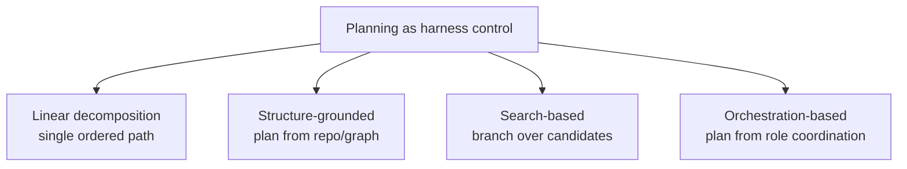

# Planning for Agent Harness

Real software tasks "rarely admit a direct one-shot mapping from natural language
intent to correct implementation" (§3.1). So before an agent writes a line of
production code, it has to decide *what to do next, in what order, which artifacts
to inspect, and how to revise when feedback reveals errors*. The survey's key move:
treat planning not as the model's private reasoning, but as **harness control** — a
control layer that "structures how the agent externalizes intent into executable
steps" and "regulates the trajectory of reasoning, execution, and revision over
time" (§3.1).

Without that control layer, an agent on a hard task tends to "commit too early to
brittle solution paths, overlook latent dependencies, or fail to coordinate
reasoning, retrieval, execution, and revision into a stable workflow" (§3.1).

The survey sorts planning methods by **where the harness control actually lives**
into four types:

## Linear decomposition: one ordered path

The agent "first produces a single explicit, executable sequence of steps, and then
carries out generation by following this decomposition" (§3.1.1). ReAct is the
lightweight precursor — interleaving thought, action, observation so "the trajectory
itself" becomes a stepwise harness. Self-Planning decomposes intent into numbered
steps, then codes step by step. The modern twist: lift the plan from an ephemeral
prompt into a **persistent harness object** — `PLAN.md`, status logs recording
"milestones, acceptance criteria, validation commands, and recovery rules" the agent
can reload across context resets (§3.1.1). Limitation: it "commit[s] to a single
decomposition trajectory" — when the first plan is wrong, there's limited exploration
beyond it.

## Structure-grounded: plan from the environment's shape

Here the agent "does not derive its action sequence solely from a free-form natural
language prompt, but instead grounds planning in an explicit structured
representation" — dependency graphs, repo graphs, circuit graphs, knowledge graphs
(§3.1.2). CodePlan builds a plan graph over edit obligations and propagates
change-impact. These structures "expose relevant entities, encode dependency
relations, and guide the order in which subtasks should be generated." It buys
"coherence, dependency awareness, and long-horizon consistency."

## Search-based: branch instead of commit

Search-based planning "allocates inference-time compute to systematically explore,
evaluate, and select among multiple candidate solution paths" (§3.1.3) — the
antidote to linear's single-path risk. It can search in *thought space* (branch over
strategies before coding), *trajectory space* (backtrack across debug/revise nodes,
e.g. SWE-Search's MCTS), or *code space* (mutate neighboring programs). The harness
catch: it's "a harness-level state management problem" — the runtime "must preserve
candidates, expose evidence, run validators, and decide which branch deserves further
computation" (§3.1.3).

## Orchestration-based: plan emerges from coordination

The planning function is "realized through a harness design for system-level
coordination" — roles, stages, feedback routing, verification triggers (§3.1.4). In
*feedback-centered* orchestration, "planning is not an up-front artifact, but an
emergent property of how failures are detected, interpreted, and routed." Anthropic's
long-running harnesses "separate planning, generation, and evaluation into distinct
roles"; the most general form writes harness logic (roles, contracts, failure
taxonomies) as editable natural language run by an Intelligent Harness Runtime.

| Method | Category | Core mechanism | Feedback |
|---|---|---|---|
| Self-Planning | Linear | Stepwise decomposition | None |
| CodePlan | Structure-grounded | Plan graph | Critique |
| ReThinkMCTS | Search-based | MCTS over reasoning paths | Critique, tests |
| MapCoder | Orchestration | Role orchestration | Critique, tests |

**The throughline:** planning answers one question — *what should the agent do
next?* — while keeping that decision "constrained, inspectable, and coherent across
long-horizon coding tasks" (§3.1). And it can't be judged apart from evaluation: if
"execution signals are weak" or benchmarks don't stress multi-step coordination,
"reported planning gains may not reflect genuine improvements" (§3.1).
