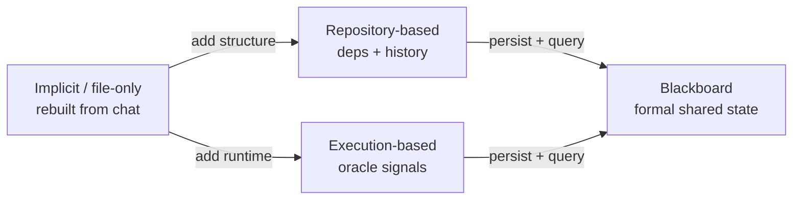

# Position: a shared code-centric harness substrate

The survey doesn't just catalog systems — it takes a stance. It proposes "a new
position for the next generation of multi-agent intelligence: the shared
code-centric harness substrate," motivated by "the lack of formal, persistent
representations of the shared code state that agents can query and update across
iterations" (§4.3). Building one is "both feasible and necessary for achieving
robust, scalable multi-agent intelligence."

## Four levels of harness representation (§4.3.1)

What substrate do the agents actually inhabit? Systems fall into four tiers of
formality:

| Representation | What the shared state *is* | Key limit / strength |
|---|---|---|
| **Implicit / file-only** | the current code file(s), rebuilt from chat history | most common; **state divergence is invisible** |
| **Repository-based** | a navigable file tree: dependencies, call graphs, version history | reason about *where* and *what depends* (MAGIS, HyperAgent) |
| **Execution-based** | what the code *does* when run: tests, crashes, profiles | objective oracle "that cannot hallucinate" (AgentCoder, MAGE) |
| **Blackboard / shared-state** | an explicit, globally queryable, persistent store | closest to a formal substrate (L2MAC, Self-Collaboration) |

**The central gap:** "the majority of the literature resides in the
implicit/file-only category, lacking any formal model of the shared harness
substrate" (§4.3.1). The program is unique among MAS domains — it *executes*, it
"produces objective, non-linguistic signals that could in principle anchor a formal
shared substrate. Yet most systems fail to exploit this property."

## Six convergence patterns (§4.3.2)

Convergence is "when a multi-agent coding harness should stop iterating." Because the
substrate executes, convergence "can be grounded in objective behavioral signals
rather than in conversational agreement alone."

| Pattern | Stops when | Example |
|---|---|---|
| **Correctness (test-gated)** | all tests pass | AgentCoder, L2MAC, CANDOR |
| **Security** | no CWE flags, no fuzzer crashes | AutoSafeCoder |
| **Performance** | runtime/memory thresholds met | MACRO |
| **Score-based** | quality score hits target / best-of-set | MAGE, CodeCoR, Trae Agent |
| **Consensus** | reviewer agents agree (majority vote) | CANDOR |
| **Implicit** | fixed iterations elapse — *no quality signal* | ChatDev, MetaGPT, EvoMAC |

Implicit convergence "is the most prevalent ... and represents the most significant
gap" — "a direct consequence of the lack of formal shared substrates" (§4.3.2).

## Patterns and trends — the synthesis (§4.4)

These choices "are not independent engineering choices; they interact" (§4.4). Six
trends close the section:

1. **The implicit-harness-state constraint** — relying on implicit state is "the
   technical root of system brittleness rather than a scalability convenience."
2. **Code-mediated channels don't eliminate bottlenecks** — the question isn't
   *whether* code is present, but "which artifacts are authoritative, how they are
   compressed, and how conflicts across channels are resolved."
3. **Execution feedback bridges linguistic and formal reasoning** — but its value
   "is not uniform"; a mature harness uses "linguistic reasoning as the fast path
   and ... execution as the verification oracle only for the failure modes that
   require it."
4. **Two complementary representations** — repository (structure) and execution
   (behavior); "none of the surveyed systems fully unifies both."
5. **Topology complexity inversely correlates with harness-state formality** — formal
   substrate (L2MAC) → simple chain; implicit substrate (EvoMAC, SEW) → elaborate
   adaptive topologies "as a structural workaround."
6. **Specialization raises the criticality of shared state** — more roles means a
   Planner working off a stale snapshot, an Executor testing the wrong version. Rich
   role repertoires "cannot function robustly without" a mature shared substrate.

The thesis lands: the proliferation of roles and topologies is "a forcing function
for developing more mature shared harnesses."
