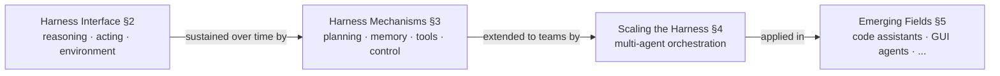

# Three layers, one survey

Once code is the harness, how do you organize *everything* written about it? This
survey picks a structure that follows code's own path through an agent's execution
loop — from a single generated snippet to a whole team of agents sharing a repo.

> "We organize the literature ... into three connected layers: Harness Interface
> ... Harness Mechanisms ... Scaling the Harness." — Survey Scope, Section 1

## Layer 1 — Harness Interface (§2)

The entry point: how does code connect a model's outputs to reasoning, action, and
the environment in the first place? Three sub-areas — **code for reasoning**
(externalizing computation so it can be checked), **code for acting** (programs as
policies, tool calls, behavior trees), and **code for environment** (repos,
traces, tests as the representation of state).

## Layer 2 — Harness Mechanisms (§3)

One generation step isn't enough for a long task. This layer covers what keeps a
code-harnessed agent reliable over *many* steps: **planning** (what to do next),
**memory** (what to keep), **tool use** (what to call), and **feedback-driven
control & optimization** (how failures become fixes).

## Layer 3 — Scaling the Harness (§4)

Now multiply by N agents. When several agents share a codebase, the harness must
also coordinate **roles** (manager, planner, coder, reviewer, tester),
**interaction modes** (collaboration, debate, red-teaming), and **workflow
topology** (centralized vs. distributed) — all grounded in the same repo, tests,
and execution traces.

## Where this lands

Beyond the taxonomy, the survey maps these layers onto five live application
domains — coding assistants, GUI/OS agents, embodied agents, scientific discovery,
and personalization — and closes with open problems: evaluation beyond task
success, verification under incomplete feedback, regression-free self-improvement,
shared state across agents, and human oversight. Each later lesson in this track
follows one of these layers in depth, in the same order.
