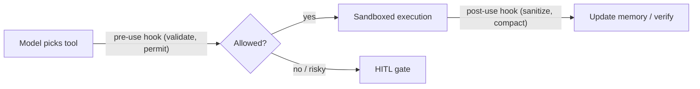
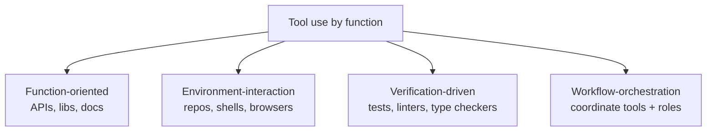

# Tool Use for Agent Harness

Tool usage is "the action and observation layer of the code-agent harness" (§3.3).
Once code sits in the loop, the model must "search repositories, edit code, execute
tests, call APIs, query documentation, and verify intermediate results." Tools
"expand the agent's action space while also exposing external feedback signals that
make the harness executable and inspectable."

But the survey's sharper claim: tool use "is not merely an auxiliary capability… It
is a governed interface between model intent and external systems" (§3.3). A reliable
harness decides "which tools are available, how their schemas are exposed, what
permissions each tool receives, where execution happens, how results are sanitized,
and when risky actions require human approval."

## Lifecycle hooks turn calls into monitored transitions

Before a tool runs, the harness can apply "permission checks, policy rules, argument
validation, or human-in-the-loop gates." After, it can "sanitize outputs, summarize
large logs, offload traces, update memory, or trigger verification" (§3.3). These
hooks "turn tool use from a raw model-selected action into a monitored transition."

## Four categories by harness function

The survey organizes tools by "the primary harness function that tools serve":

- **Function-oriented** tools "fill gaps in the model's programming knowledge" (§3.3.1).
  ToolCoder starts from a real bottleneck: "code models often hallucinate APIs, choose
  inappropriate functions, or fail on… libraries with sparse training coverage." It
  integrates API search and trains the model "when to query the tool and how to select
  APIs." Best when "the main bottleneck is that the model lacks reliable knowledge of
  which function, API, or library construct should be used" — but "retrieval alone is
  often insufficient when tasks require cross-file understanding."
- **Environment-interaction** tools "treat tools as the interface through which an
  agent acts inside the software engineering environment" (§3.3.2). CodeAgent shows
  repo-level work means "locate relevant files, understand dependencies, inspect
  documentation, implement modifications, and validate through testing." SWE-agent
  formalizes "the agent-computer interface," where "shell commands, file editing, and
  test execution become the primary interaction channel."
- **Verification-driven** tools "treat external tools as deterministic sensors for the
  harness" (§3.3.3) — tests, compiler errors, type checkers, static analyzers. Here
  "the central role of tools is verification rather than retrieval." They "make agent
  progress inspectable": failures and traces "become structured observations that
  update working memory and guide the next action." Key issue: route those
  observations back "since raw logs may be too long or noisy for the active context."
- **Workflow-orchestration** tools handle "how multiple tools, roles, and control
  policies are organized into a coherent agent workflow" (§3.3.4). The challenge is
  "not simply adding more tools, but deciding when each tool should be invoked, with
  what permissions, under which context." MapCoder assigns agents to recall, planning,
  generation, and debugging; OpenHands packages workspace, terminal, browser, and
  runtime into a reusable harness.

| Category | Example | Tool boundary | Primary use |
|---|---|---|---|
| Function-oriented | ToolCoder | API search tools | Ground generation in retrieved APIs |
| Environment-interaction | SWE-agent | Shell, editor, repo, tests | Resolve issues via shell |
| Verification-driven | VeriGuard | Execution, tests, verifier | Gate and repair via verification |
| Workflow-orchestration | OpenHands | Workspace, terminal, runtime | Long-horizon reusable interfaces |

**The throughline:** tool use "has evolved from isolated API retrieval to a full
harness mechanism for action, observation, verification, and governance" (§3.3). "The
core challenge is no longer whether a model can call a tool, but whether the harness
can make tool use safe, auditable, and useful for long-horizon execution."
