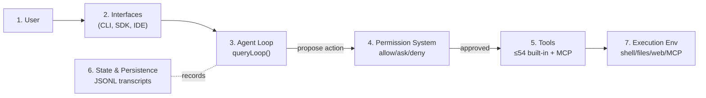

# The shape of the system

The paper organizes the entire architecture around **four recurring design questions** every production coding agent must answer. Learn these four and you have the skeleton:

| Design question | Claude Code's answer | A plausible alternative |
|---|---|---|
| **Where does reasoning live?** | The *model* reasons; the *harness* executes | Devin/LangGraph invest in scaffolding-side planning |
| **How many execution engines?** | One `queryLoop()` for every surface | mode-specific engines (separate IDE vs CLI paths) |
| **Default safety posture?** | Deny-first with human escalation, in parallel layers | container isolation (SWE-Agent); git rollback (Aider) |
| **The binding resource constraint?** | The context window | compute budget, or an explicit scratchpad |

## "Where does reasoning live?" — the thinnest possible brain

This is the paper's most striking finding. The model emits `tool_use` blocks; the harness parses, permission-checks, dispatches, and collects results. **The model never touches the filesystem, shell, or network directly.**

> "because reasoning and enforcement occupy separate code paths, a compromised or adversarially manipulated model cannot override the sandboxing, permission checks, or deny-first rules implemented in the harness." — *Section 3.1*

How thin is the brain? Community analysis of the extracted source estimates:

> only about **1.6%** of the codebase constitutes AI decision logic — the remaining **98.4%** is operational infrastructure. — *Section 3.1*

That 1.6 / 98.4 split *is* the "minimal scaffolding, maximal harness" principle as a number.

## The seven-component spine

The system decomposes into seven functional components on a left-to-right data spine (*Figure 1*):

> "All entry surfaces converge on the same agent loop." — *Figure 1*

That convergence is the answer to "how many execution engines?" — interactive CLI, headless `claude -p`, the Agent SDK, and IDE integrations all call the same `query()`. Only rendering varies. (Subtlety from *Section 3.4*: `QueryEngine` is a *conversation wrapper* for non-interactive surfaces — the shared code path is the `queryLoop()` function, not the engine class. The interactive CLI calls `query()` directly, bypassing `QueryEngine`.)

## The five-layer view

Zoom in and the seven components expand into five subsystem layers (*Figure 3*), each mapping to source directories:

| Layer | Holds | Source hint |
|---|---|---|
| **Surface** | entry points + terminal rendering (ink) | `src/entrypoints/`, `src/screens/` |
| **Core** | the agent loop + the 5-layer compaction pipeline | `query.ts` |
| **Safety / Action** | permissions, hook pipeline, extensibility, tools, sandbox, subagent spawning | `permissions.ts`, `tools.ts` |
| **State** | context assembly, runtime state, persistence, CLAUDE.md + memory, sidechains | `context.ts`, `sessionStorage.ts` |
| **Backend** | shell exec, remote exec, MCP transports, concrete tool logic | `BashTool.tsx`, `services/mcp/` |

## Context is the bottleneck — everywhere, not just compaction

The binding constraint is the **context window** (200K for older models, **1M** for the Claude 4.6 series). Beyond the five-layer compaction pipeline, four *other* design choices exist purely to conserve it:

- **CLAUDE.md lazy loading** — nested-directory instructions load only when the agent reads files there.
- **Deferred tool schemas** — with ToolSearch on, some tools expose only their *name*; full schema loads on demand.
- **Subagent summary-only return** — a subagent returns summary text, not its whole transcript.
- **Per-tool-result budget** — one verbose output can't hog the window.

Keep this lens: almost every clever subsystem in later modules is, at bottom, a way to spend the context budget more carefully.
