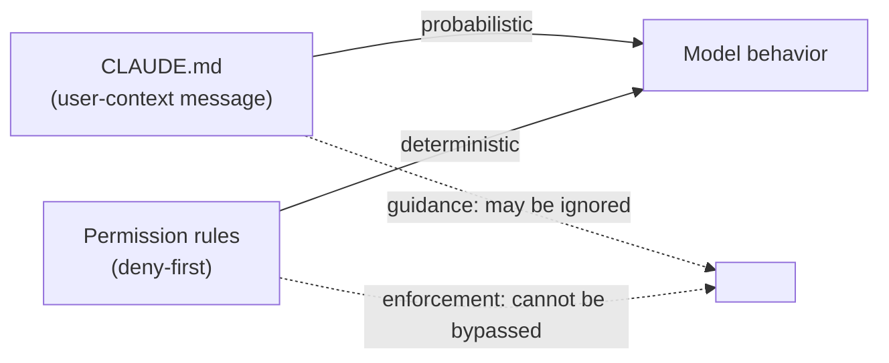

# Packing the bounded window

Context is the binding constraint (Module 2). This module is about the discipline that constraint forces: what goes into the window, in what order, and how it's compressed when it overflows. Two principles drive it — **context as scarce resource** and **transparent file-based memory**.

## Nine sources, sorted by mutability

The window is assembled from nine sources (*Figure 6*), and the ordering encodes a gradient: **read-only and stable at the top, mutable and runtime-generated at the bottom**.

| # | Source | Loaded |
|---|---|---|
| 1 | System prompt (+ output style, `--append-system-prompt`) | startup |
| 2 | Environment info (git status, via `getSystemContext()`) | startup, memoized |
| 3 | CLAUDE.md hierarchy (via `getUserContext()`) | startup, memoized |
| 4 | Path-scoped rules (`.claude/rules/*`) | **lazy** — when files in matching dirs are read |
| 5 | Auto memory (relevant entries) | prefetched async |
| 6 | Tool metadata (skill descriptions, MCP names, deferred schemas) | startup / on-demand |
| 7 | Conversation history | carried forward, compactable |
| 8 | Tool results (file reads, command output, subagent summaries) | per turn |
| 9 | Compact summaries (replace older history) | as needed |

> "The context window is therefore not static at assembly time but can grow during the turn." — *Section 7.1*

Late injections (memory prefetch, MCP instruction *deltas*, agent-listing deltas, background task notifications) arrive after the main window is built.

## The crucial split: guidance vs enforcement

A subtle, high-leverage architectural choice — **CLAUDE.md is delivered as a *user* message, not as system-prompt content**:

> "because CLAUDE.md content is delivered as conversational context rather than system-level instructions, model compliance with these instructions is **probabilistic** rather than guaranteed. Permission rules evaluated in deny-first order provide the deterministic enforcement layer." — *Section 7.2*

**This is why you never put a hard safety rule in CLAUDE.md.** Guidance is advisory and the model may not follow it; only the permission layer is deterministic. Keep "please prefer tabs" in CLAUDE.md; keep "never touch `/etc`" in a deny rule or PreToolUse hook.

## File-based memory, on purpose

Claude Code stores memory as plain Markdown the user can read, edit, version-control, and delete — trading expressiveness for **auditability**:

> "The system does not use embeddings or a vector similarity index for memory retrieval; instead it uses an **LLM-based scan of memory-file headers** to select up to **five** relevant files on demand, surfacing them at **file granularity** rather than entry granularity." — *Section 7.2*

| Approach | Selectivity | Inspectable? |
|---|---|---|
| **File-based (Claude Code)** | file granularity, ≤5 files | yes — readable, editable, committable |
| Embedding / RAG | entry granularity (finer) | no — can't see what retrieval picked |
| Database-backed | structured queries | opaque to version control |

The CLAUDE.md hierarchy has four memory types, discovered by walking from CWD up to root; files closer to CWD have **higher priority and load later** ("reverse order of priority" — later-loaded gets more attention):

1. **Managed** (`/etc/claude-code/CLAUDE.md`) — OS-level policy for all users
2. **User** (`~/.claude/CLAUDE.md`) — private global instructions
3. **Project** (`CLAUDE.md`, `.claude/rules/*.md`) — checked into the codebase
4. **Local** (`CLAUDE.local.md`) — gitignored, private to the project

Nested-directory rules load **lazily** as the agent explores — so the instruction set *evolves mid-conversation*. The `@include` directive (`@path`, `@./relative`, `@~/home`, `@/absolute`) modularizes files, with circular references prevented and missing files silently ignored.

## Compaction: lazy degradation, append-only

The five-layer pipeline (from Module 2) embodies a **lazy-degradation principle**: apply the least disruptive compression first, escalate only if cheaper layers don't suffice.

1. **Budget reduction** (always) → 2. **Snip** → 3. **Microcompact** → 4. **Context collapse** → 5. **Auto-compact** (default-on, user-disableable)

The cost is **predictability**: five interacting layers, several feature-gated, with some (context collapse) producing *no user-visible output*. Simpler single-pass truncation loses more information but is easier to reason about.

Critically, compaction is **mostly-append**:

> `buildPostCompactMessages()` returns `[boundaryMarker, ...summaryMessages, ...messagesToKeep, ...attachments, ...hookResults]` … "compaction never modifies or deletes previously written transcript lines; it only appends new boundary and summary events." — *Section 7.3*

The boundary marker records `headUuid`, `anchorUuid`, `tailUuid` for read-time chain patching — so the full history stays reconstructable even after the model only sees the summary.
