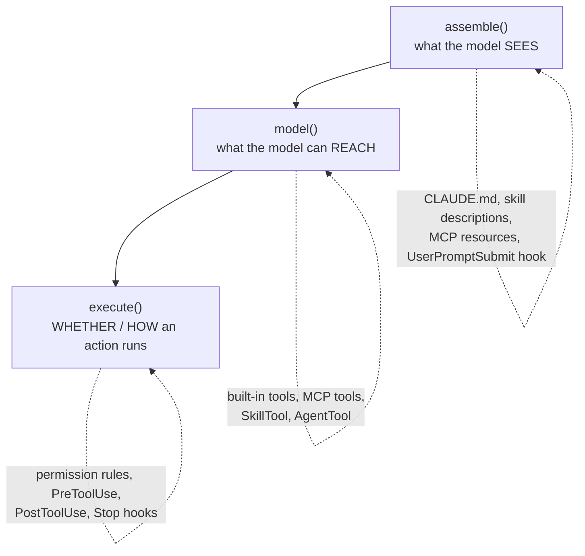

# Four mechanisms, three injection points

The permission system decides whether a tool runs. Extensibility decides **which tools exist in the first place**. The key insight from *Figure 5*: every agent loop has exactly **three places** you can plug in — and the four extension mechanisms map onto them.

| Injection point | Controls | Examples |
|---|---|---|
| **assemble()** | what the model sees | CLAUDE.md, skill descriptions, MCP resources/prompts, output style, `UserPromptSubmit`/`SessionStart` hooks |
| **model()** | what it can reach (one flat tool pool) | built-in tools, MCP tools, `SkillTool` (launch a skill), `AgentTool` (spawn a subagent) |
| **execute()** | whether/how an action runs | permission rules, `PreToolUse`, `PostToolUse`, `Stop`/`SubagentStop` hooks |

## The four mechanisms

| Mechanism | What it adds | Where it plugs in |
|---|---|---|
| **MCP servers** | external **tools** the model can call | `model()` |
| **Plugins** | a **package + distribution** bundle of components | all three (routes to registries) |
| **Skills** | domain-specific **instructions** — shapes *how* it thinks | `assemble()` (via `SkillTool`) |
| **Hooks** | **lifecycle interception** — block/rewrite/annotate | `execute()` (+ 27 event types) |

- **MCP servers** — the primary external tool path. Configured across project/user/local/enterprise scopes; transports include stdio, SSE, HTTP, WebSocket, SDK, IDE variants. Each server contributes `MCPTool` definitions.
- **Plugins** — both a packaging format *and* a distribution vehicle. One manifest can carry **ten** component types (commands, agents, skills, hooks, MCP servers, LSP servers, output styles, channels, settings, user config); the loader routes each to its registry. The primary way third parties ship extensions.
- **Skills** — a `SKILL.md` file with YAML frontmatter (15+ fields: allowed tools, argument hints, model overrides, `execution context: 'fork'` for isolation…). When invoked, `SkillTool` injects the skill's instructions into context. Crucially, only the **frontmatter description** sits in the prompt — not the full body.
- **Hooks** — **27** event types spanning tool authorization, session lifecycle, user interaction, subagent coordination, context management, workspace events, notifications. 15 carry rich output schemas. Four persistable command types: `command` (shell), `prompt` (LLM), `http`, `agent` (agentic verifier), plus non-persistable `callback` hooks.

## Tool pool assembly: the single source of truth

`assembleToolPool()` is documented as "the single source of truth for combining built-in tools with MCP tools." Five steps:

1. **Base enumeration** — up to **54** tools: **19 always** included (BashTool, FileReadTool, AgentTool, SkillTool…), **35 conditional** on feature flags, env vars, user type. (Internal users get extra tools; worktree mode adds Enter/ExitWorktree; embedded search omits Glob/Grep.)
2. **Mode filtering** — e.g. `CLAUDE_CODE_SIMPLE` exposes only Bash, Read, Edit; each tool's `isEnabled()` is checked.
3. **Deny-rule pre-filtering** — strip blanket-denied tools before the model sees them.
4. **MCP integration** — MCP tools filtered by deny rules, merged in.
5. **Deduplication** — by name, **built-in tools win over MCP tools**.

Both the REPL and `AgentTool` call this, so assembly is consistent everywhere. With ToolSearch on, **deferred tools** stay hidden until explicitly queried — another context-saving move.

## Why FOUR mechanisms and not one?

The natural objection: each mechanism is more surface area to learn. The answer is **context cost**:

> "a single mechanism cannot span the full range from zero-context lifecycle hooks to schema-heavy tool servers without forcing unnecessary trade-offs on extension authors." — *Section 6.3*

| Mechanism | Context cost | Buys you |
|---|---|---|
| **Hooks** | ~zero by default (can opt into injecting context) | cross-cutting lifecycle control |
| **Skills** | minimal — only frontmatter stays in the prompt | shapes *how* the agent thinks |
| **MCP servers** | higher — tool schemas consume budget | new callable tools at runtime |
| **Plugins** | varies — bundles any combination | packaging + distribution |

The mechanisms are **ordered by context cost**, and that ordering is the whole justification. It's the "composable multi-mechanism extensibility" principle: don't force a zero-context lifecycle hook and a schema-heavy tool server through the same API. (Agents are deliberately excluded here — they create *new isolated context windows* rather than extending the current one, so they live in the delegation module.)
