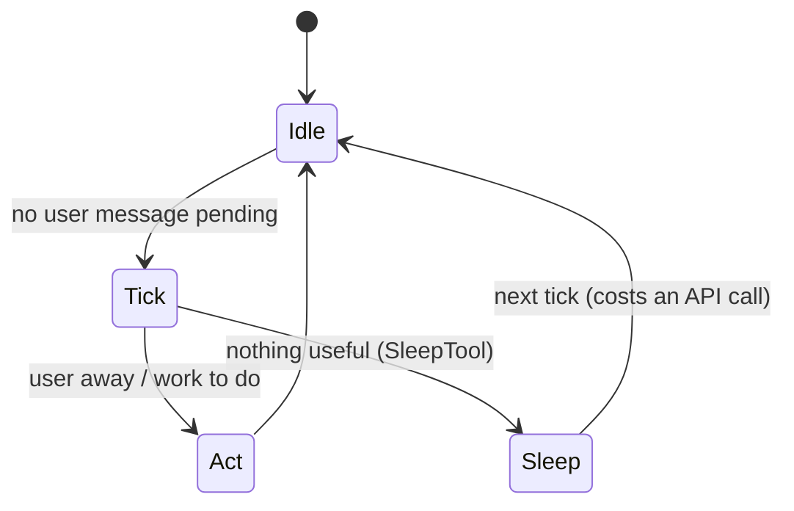

# Six open questions for the next harness

The architecture is "a snapshot of a co-evolving system rather than a fixed optimum." The paper closes with **six open directions**, each mapped to a value from Module 1, and each posed as *whether / how / which* — open by construction.

| # | Direction | Value it stresses | The open question |
|---|---|---|---|
| 1 | **Observability ↔ evaluation gap** | Safety | how to surface *silent* mistakes |
| 2 | **Cross-session persistence** | Reliability | what durable state lives between instruction and transcript |
| 3 | **Harness boundary evolution** | Capability | where/when/what/with-whom the agent acts |
| 4 | **Horizon scaling** | Reliable Execution | does session-scoped design survive week-long programs |
| 5 | **Governance at scale** | Authority | which external-audit interfaces to expose |
| 6 | **Long-term human capability** | (evaluative lens) | can the sustainability gap become a *design* target |

## 1. Silent failure is the dominant failure mode

The key reframing: deployed agents mostly fail by being *quietly wrong*, not by crashing.

> Bessemer's 2026 report estimates "**78% of AI failures are invisible**"; LangChain's survey finds quality (not cost) the top barrier, with a wide gap between observability (~89% adoption) and offline evaluation (52.4%). — *Section 11.6*

The open architectural question: does generator–evaluator separation (and sprint contracts, post-hoc checks) belong **inside** the harness — e.g. as new hook events alongside the 27 — or **outside** it as a separate evaluation layer? The paper locates this work at the *harness* layer, not the model: closing it "likely requires additional scaffolding … rather than model improvements alone."

## 2 & 4. Memory and the long horizon

Today there are two persistence layers: the **CLAUDE.md hierarchy / auto memory** (factual tier) and the **append-only transcript** (a single session). What belongs *between* them — durable state that's neither a static instruction nor one session's log — is open. The memory literature names an **experiential tier**: automatically curated playbooks of strategies learned across past sessions. The constraint: any such substrate must preserve CLAUDE.md's file-based transparency *without* reintroducing the resume-restoration risk that Module 5 deliberately closed.

Horizon scaling restates this at the scale of **weeks**: autonomous research pipelines and multi-day hypothesis systems already run across days, not turns. Does the turn/session/subagent unit survive when sessions compose into multi-session *programs*, or does that demand coordination primitives beyond session, subagent, and memory?

## 3. The harness boundary moves — it doesn't shrink

> "the space of interesting harness combinations doesn't shrink as models improve; it **moves**." — Rajasekaran (2026), *Section 11.6*

Four axes along which the boundary can move:

- **Where** — virtualizing session/harness/sandbox into independently replaceable interfaces (the OS analogy made literal — Managed Agents).
- **When** — proactivity (see KAIROS below).
- **What** — vision-language-action: physical actions, where reversibility-weighted risk faces a cost asymmetry the principle names but doesn't quantify.
- **With whom** — role-differentiated multi-agent systems, debate, graph workflows as alternatives to the parent/subagent pattern.

### KAIROS: proactivity bound to presence *and* economics

The feature-gated KAIROS illustrates the *when* axis — a persistent background agent with **tick-based heartbeats**: when no user message is pending, periodic `<tick>` prompts let the model decide to act or sleep. It resolves the proactivity tension (+12–18% tasks but preference drops at high frequency) two ways:

- **Terminal focus awareness** — act autonomously when the user is away, collaborate when present.
- **Economic throttling** via `SleepTool` — each wake-up costs an API call, and the prompt cache expires after **5 minutes** of inactivity, making sleep/wake an explicit cost optimization.

## 5. Governance: internally auditable ≠ externally auditable

The deny-first pipeline is auditable through session transcripts, but **not yet in the forms emerging frameworks contemplate** (EU AI Act fully applicable **August 2026**; only 13.3% of indexed agentic systems publish safety cards). Two open properties: deny-first evaluation is internally but not externally auditable; and whether *values-over-rules* admits the explicit rule articulation that compliance review may demand. Both live in the harness, not the model.

## 6. Could "don't atrophy the human" become a design goal?

The evaluative lens from Module 1, turned into a design question:

> "Future systems could treat that sustainability gap as a **first-class design problem, not a downstream evaluation metric**." — *Section 14 (via 12.6)*

Two sub-questions: (a) are comprehension/convention-drift effects even *measurable at session granularity*? The harness today exposes **no per-session signal** for comprehension drift. (b) *If* such measurements existed, can architecture respond — a generator–evaluator separation applied to the *human* loop, comprehension-preserving surfaces, or mechanisms not yet named? The paper takes no position, and notes the right locus might be the IDE, the organization, or the human development loop rather than the harness at all.

## The taxonomy this all sits in

Coding tools organized by degree of autonomous action (*Section 13.1*):

| Tier | Examples | Autonomy |
|---|---|---|
| **Inline completion** | GitHub Copilot | suggests fragments, no autonomous action |
| **Chat-integrated** | Cursor, Windsurf | conversational + multi-file edits, IDE-coupled |
| **Agentic CLI** | **Claude Code**, Codex CLI, Aider | autonomously runs shell, edits files, iterates |
| **Fully autonomous** | (e.g. Devin-class) | multi-step planning over long horizons |

Claude Code is the agentic-CLI exemplar — and the whole study is a snapshot of where that tier's design space sits *today*, on a boundary that is still moving.
