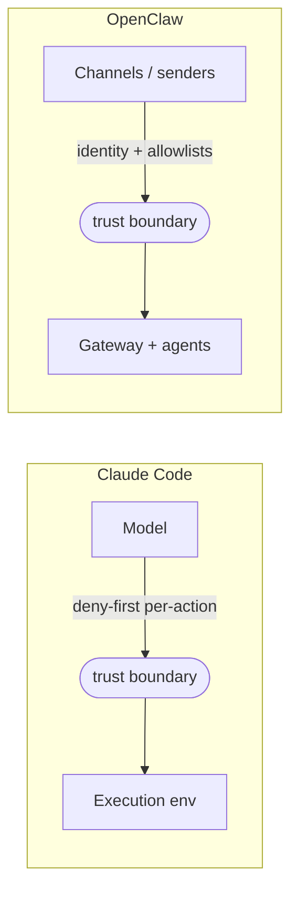

# The contrast that calibrates everything

To know whether Claude Code's choices are *necessary* or merely *one option*, the paper compares it to **OpenClaw** — an architecturally independent open-source agent that answers the same design questions from a different starting point.

> OpenClaw is "a local-first WebSocket gateway that connects roughly two dozen messaging surfaces (WhatsApp, Telegram, Slack, Discord, Signal…) to an embedded agent runtime." — *Section 10*

Where Claude Code is an **ephemeral CLI process bound to one repo**, OpenClaw is a **persistent daemon control plane** for multi-channel personal assistance. Same questions, different deployment → different answers.

## Six dimensions, side by side (Table 3)

| Dimension | Claude Code | OpenClaw |
|---|---|---|
| **System scope** | ephemeral CLI/IDE coding harness, per-session process | persistent WebSocket gateway daemon, multi-channel control plane |
| **Trust model** | deny-first **per-action** rule eval + ML classifier; 7 modes; graduated spectrum | single trusted operator; **perimeter** identity/access (DM pairing, allowlists); opt-in sandboxing |
| **Agent runtime** | `queryLoop()` IS the system center | Pi-agent runner embedded *inside* gateway RPC dispatch; per-session queues |
| **Extension arch** | 4 mechanisms by context cost (MCP, plugins, skills, hooks) — extend **one agent** | manifest-first plugins, 12 capability types, central registry — extend the **whole gateway** |
| **Memory & context** | 4-level CLAUDE.md + 5-layer compaction + LLM header scan | bootstrap files (AGENTS.md, SOUL.md…) + memory system (MEMORY.md, daily notes, DREAMS.md) + optional hybrid vector+keyword search |
| **Multi-agent** | task-delegating subagents, worktree isolation, summary-only return | (a) multi-agent **routing** (independent agents per channel) + (b) sub-agent delegation (nesting ≤5, default 1) |

## The single fact that determines all the others

> "This difference in system scope is the most fundamental architectural divergence: it determines how every other design question is framed." — *Section 10.1*

Once you fix *ephemeral CLI* vs *persistent gateway*, the rest follows. The clearest expression is **where the trust boundary sits**:

Claude Code places the boundary **between the model and the execution environment** (the model is untrusted, the machine is trusted). OpenClaw places it **at the gateway perimeter** (the operator is trusted; inbound channels are gated by identity). Per-action classification vs perimeter access control isn't arbitrary — it's downstream of the threat model.

## Three things the contrast reveals

1. **The questions are stable; the answers vary with context.** Where reasoning lives, safety posture, context management, extensibility — OpenClaw answers *all* of them too, just from a personal-assistant starting point.
2. **The systems make opposite bets.** Per-action safety vs perimeter access; loop-as-center vs gateway-as-center; extend-one-window vs extend-a-shared-surface. *"These inversions are not arbitrary: they follow from the different trust models and deployment topologies."*
3. **They compose, not compete.** OpenClaw can host Claude Code as an external coding harness via **ACP (Agent Client Protocol)**.

> "the design space of AI agents is not a flat taxonomy but a layered one, where gateway-level systems and task-level harnesses can compose." — *Section 10.2*

That's the payoff of the whole comparison: a *gateway* and a *harness* are different layers of one stack, not rival products. Notice too where they **agree** — both pick **transparent, user-editable file-based memory** over opaque databases. When two independently-designed systems converge, that convergence is a strong signal the choice is fundamental, not incidental.
