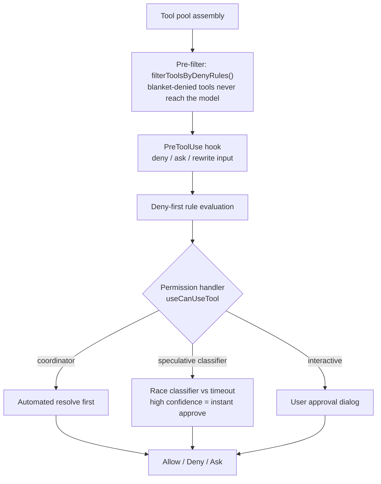

# The gate every tool passes through

The query loop decides *how* to act. The permission system decides *whether*. Its design starts from an uncomfortable fact about humans:

> Anthropic's auto-mode analysis found that users approve approximately **93%** of permission prompts, indicating that approval fatigue renders interactive confirmation behaviorally unreliable as a sole safety mechanism. — *Section 5*

So the system "must maintain safety independently of human vigilance." That single observation justifies deny-first defaults, blanket-deny pre-filtering, and sandboxing as layers that work *even when the user clicks "approve" without reading*.

## Seven permission modes (a graduated trust spectrum)

| Mode | Behavior | Position on spectrum |
|---|---|---|
| **plan** | model must produce a plan; execution waits for approval | most restrictive |
| **default** | standard interactive; most operations need approval | ↓ |
| **acceptEdits** | edits in working dir + some fs shell cmds (mkdir, rm, mv…) auto-approved; other shell still asks | ↓ |
| **auto** | ML classifier evaluates requests that fail fast-path checks (feature-gated) | ↓ |
| **dontAsk** | no prompting, but **deny rules still enforced** | ↓ |
| **bypassPermissions** | skips most prompts, but safety-critical + bypass-immune rules still apply | least restrictive |
| **bubble** | internal-only: subagent permission escalation to the parent terminal | (not user-facing) |

Only **5** are externally visible (`EXTERNAL_PERMISSION_MODES`); `auto` is conditional on a flag; `bubble` exists only in the type union. This gradient *is* the "graduated trust spectrum" principle — and notice even the loosest modes never fully disarm: deny rules and safety-critical checks survive `dontAsk` and `bypassPermissions`.

## Deny-first: a broad deny beats a narrow allow

> "a deny rule always takes precedence over an allow rule, even when the allow rule is more specific. A broad deny ('deny all shell commands') cannot be overridden by a narrow allow ('allow `npm test`')." — *Section 5.1*

This is the inverse of how CSS specificity or firewall rules often work — here, **safety wins ties, always**. Rules match at tool level (by name) and content level (e.g. `Bash(prefix:npm)`).

## The authorization pipeline

Note **pre-filtering happens at assembly time**: blanket-denied tools (including whole MCP servers via `mcp__server` prefix rules) are stripped from the model's view *before any call*, so the model never wastes a call trying them.

The handler branches into four runtime paths: **coordinator** (multi-agent, tries automated resolution first), **swarm worker**, **speculative classifier** (when `BASH_CLASSIFIER` is on, races a pre-started classification against a timeout — high confidence approves instantly), and **interactive** (the fallback dialog).

## Denial is a routing signal, not a wall

The most elegant idea here: a blocked action doesn't halt the agent.

> "the system treats the denial as a routing signal rather than a hard stop: the model receives the denial reason, revises its approach, and attempts a safer alternative in the next loop iteration." — *Section 5.2*

Permission enforcement *shapes* behavior instead of stopping it. The `PermissionDenied` hook lets external code observe and guide these retries.

## Classifier + the five permission hooks

The auto-mode classifier (`yoloClassifier.ts`) evaluates a proposed tool call against the conversation transcript + a permission template, producing **allow / deny / manual-approval**. Of the **27** hook events, **five** sit in the permission flow:

| Hook | Power |
|---|---|
| **PreToolUse** | return `permissionDecision` (deny/ask), `updatedInput` — but `allow` does *not* bypass later checks |
| **PostToolUse** | inject `additionalContext`; for MCP, rewrite output via `updatedMCPToolOutput` |
| **PostToolUseFailure** | inject error-specific guidance |
| **PermissionDenied** | provide retry guidance after auto-mode denials |
| **PermissionRequest** | return allow/deny; can resolve before or alongside the user dialog |

(For MCP tools the `tool_result` is held until *after* post-hooks run, so `updatedMCPToolOutput` can take effect; non-MCP tools emit the result first.)

## Sandboxing is a different axis — and defense-in-depth can crack

Shell sandboxing (`shouldUseSandbox.ts`) restricts filesystem + network **independently** of permissions:

> "A command can be permission-approved but still sandboxed, or permission-denied and never reach the sandbox check. The two systems operate on different axes: **authorization versus isolation**." — *Section 5.4*

But defense-in-depth has a failure mode worth memorizing — layers that *share a performance constraint* can collapse together:

> Researchers documented that commands with more than **50 subcommands** fall back to a single generic approval prompt instead of per-subcommand deny-rule checks, because per-subcommand parsing caused UI freezes. — *Section 5.4*

That's the lesson: independence is an *assumption*, and when two layers share a failure mode (here, parse-time cost), an attacker can push past the threshold to degrade them at once.
