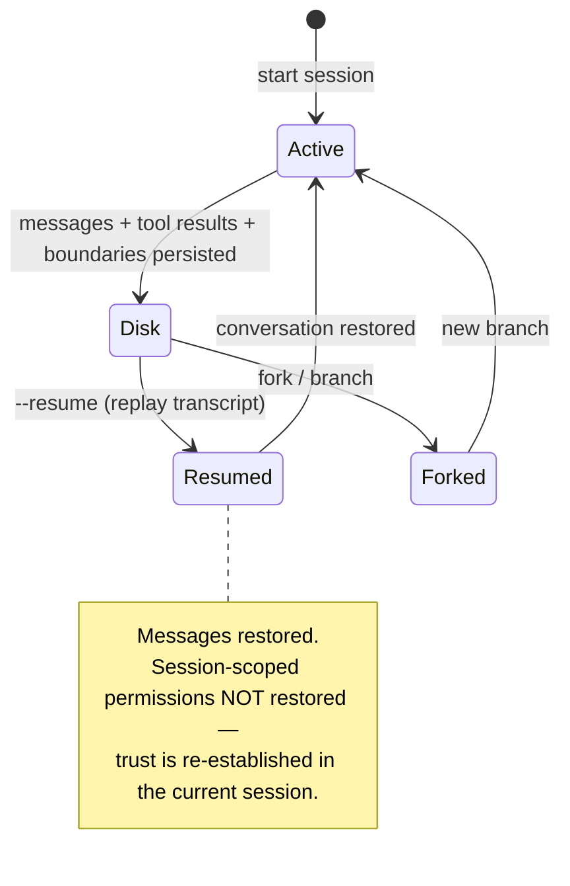

# State that outlives the context window

The context window is ephemeral; the *conversation* shouldn't be. Persistence implements the **append-only durable state** principle, organized around two ideas (*Figure 8*):

> **Conversations outlive context** — "A session's useful life cannot be capped by the model's context window. The transcript on disk records everything, so compaction can recycle the live view without ending the conversation."
>
> **Conversations outgrow a single path** — "The append-only transcript lets users rewind, resume, or fork into a new branch without losing prior work." — *Figure 8*

## Three independent persistence channels

| Channel | Holds | Scope |
|---|---|---|
| **Session transcripts** | user/assistant/attachment/system messages + compaction markers, file-history snapshots, content-replacement records | one `.jsonl` per session, project-scoped |
| **Global prompt history** | user prompts only (`history.jsonl`) — powers ↑ and ctrl+r | config home dir, reverse-read |
| **Subagent sidechains** | each subagent's full transcript (`.jsonl` + `.meta.json`) | one per subagent |

The format is **mostly-append JSONL** (explicit cleanup rewrites are the only exception):

> "a deliberate choice favoring auditability and simplicity over query power. Every event is human-readable, version-controllable, and reconstructable without specialized tooling." — *Section 9.1*

Sidechains are why delegation is cheap: a subagent's full history is preserved on disk for debugging but **never enters the parent's context** — only its final summary returns. (Even so, isolated-context agent *teams* cost ~**7×** the tokens of a plan-mode session, which is exactly why summary-only return matters.)

For multi-instance coordination, the harness uses **file locking**, not a message broker:

> "Tasks are claimed from a shared list via lock-file-based mutual exclusion … This trades throughput for two properties: **zero-dependency deployment** and **full debuggability** (any agent's state can be inspected by reading plain-text JSON files)." — *Section 8.3*

## The deliberate friction: resume does NOT restore permissions

`--resume` replays the transcript to rebuild the conversation; fork creates a new session from an existing one. But neither restores session-scoped permissions — and that's on purpose:

> "sessions are treated as **isolated trust domains**. Restoring previously granted permissions on resume would create a convenience benefit but risk carrying stale trust decisions into a changed context. The architecture opts for re-granting over implicit persistence." — *Section 9.2*

Session-scoped permissions live **in memory only**, never serialized. On resume, the permission context is rebuilt from CLI args + disk settings; anything the rebuilt context doesn't recognize falls back to **deny-first prompting**. The safety invariant — *trust is always established in the current session* — is worth the user friction.

## Persistence is co-designed with compaction

The `compact_boundary` marker records `headUuid`, `anchorUuid`, `tailUuid` so the loader can **patch the message chain at read time**: preserved messages keep their original `parentUuid`s on disk, and the boundary metadata links them. Because compaction only *appends* boundary + summary events, the durable history is never mutated — resume can rebuild the full chain while live turns see the compressed view.

(Note the vocabulary trap: the "checkpoints" in Claude Code are **file-history checkpoints** for `--rewind-files` at `~/.claude/file-history/<sessionId>/` — file-level snapshots for reverting filesystem changes, *not* a generic conversation checkpoint store.)
