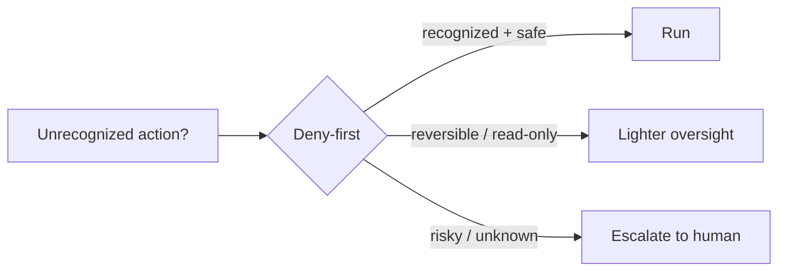

# From values to thirteen principles

Values are abstract. To build software you need **principles** — each one answering a concrete recurring question every coding agent must resolve. The paper names **thirteen**, mapping each to the values it serves and the design question it answers (*Table 1*).

## The thirteen design principles

| Principle | Serves | The question it answers |
|---|---|---|
| **Deny-first with human escalation** | Authority, Safety | Unrecognized action: allow, block, or escalate to the human? |
| **Graduated trust spectrum** | Authority, Adaptability | Fixed permission level, or a spectrum users traverse over time? |
| **Defense in depth (layered)** | Safety, Authority, Reliability | One safety boundary, or many overlapping ones using different techniques? |
| **Externalized programmable policy** | Safety, Authority, Adaptability | Hard-coded policy, or external configs with lifecycle hooks? |
| **Context as scarce resource** | Reliability, Capability | What's the binding constraint, and how to manage it — truncate or pipeline? |
| **Append-only durable state** | Reliability, Authority | Mutable state, checkpoint snapshots, or append-only logs? |
| **Minimal scaffolding, maximal harness** | Capability, Reliability | Invest in scaffolding-side reasoning, or operational infra so the model reasons freely? |
| **Values over rules** | Capability, Authority | Rigid procedures, or contextual judgment + deterministic guardrails? |
| **Composable multi-mechanism extensibility** | Capability, Adaptability | One unified extension API, or layered mechanisms at different context costs? |
| **Reversibility-weighted risk** | Capability, Safety | Same oversight for all actions, or lighter for reversible/read-only ones? |
| **Transparent file-based config & memory** | Adaptability, Authority | Opaque DB / embedding retrieval, or user-visible version-controllable files? |
| **Isolated subagent boundaries** | Reliability, Safety, Capability | Subagents share the parent's context/permissions, or run isolated? |
| **Graceful recovery & resilience** | Reliability, Capability | Fail hard, or silently recover and reserve human attention for the unrecoverable? |

Notice principles map to **multiple** values — they're not a 1:1 decomposition. "Deny-first" serves both Authority *and* Safety; "context as scarce resource" serves Reliability *and* Capability.

## What the architecture deliberately does NOT do

Reading the value→principle map backwards reveals three pointed *absences* — each a road not taken:

- It does **not** impose explicit planning graphs on the model's reasoning.
- It does **not** provide a single unified extension mechanism.
- It does **not** restore all session-scoped trust state across resume.

> "These absences are consistent with the principle set above." — *Section 2.3*

## Three rival design families (so you can place it)

Claude Code's principles are best understood against what others chose instead:

| Family | Example | Core bet | Claude Code's contrast |
|---|---|---|---|
| **Rule-based orchestration** | LangGraph | Decision logic as explicit typed state graphs | minimal scaffolding — let the model decide the path |
| **Container-isolated execution** | SWE-Agent, OpenHands | Docker isolation *is* the safety boundary | layered policy enforcement, not just a container |
| **Version-control-as-safety** | Aider | Git rollback is the primary safety net | deny-first evaluation *before* the action runs |

> Claude Code's principle set is distinctive in combining "minimal decision scaffolding with layered policy enforcement, values-based judgment with deny-first defaults, and progressive context management with composable extensibility." — *Section 2.2*

The diagram above is **two principles at once**: *deny-first with human escalation* sets the default to "ask", and *reversibility-weighted risk* carves out a fast path for actions that are cheap to undo. Keep this pairing in mind — Sections 5 and 8 are largely its implementation.
