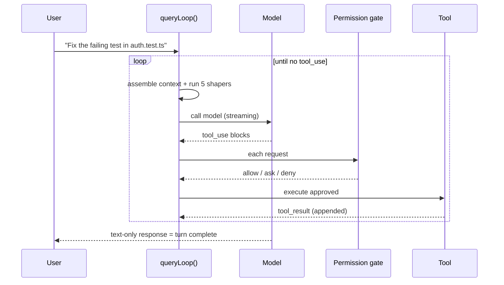

# One turn, end to end

> "The core of the system is a simple while-loop that calls the model, runs tools, and repeats." — *Abstract*

That's it. The headline architecture is a `while`-loop. Everything impressive is the subsystems *around* it. This loop follows the **ReAct pattern** (Yao et al., 2022): the model reasons + emits tool calls, the harness executes, results feed the next iteration. The trade is deliberate:

> "The reactive design trades search completeness for simplicity and latency: each turn commits to one action sequence without backtracking." — *Section 4.1*

Compare the alternatives it rejected: explicit **graph-based routing** (typed state machines) and **tree-search** (explore multiple trajectories before committing). Claude Code keeps the core loop reactive and uses the **orchestrator-workers** pattern only for subagent delegation.

## The nine-step query pipeline

Each turn runs a fixed sequence (`query.ts`):

1. **Settings resolution** — destructure immutable params (system prompt, user context, permission callback, model config).
2. **Mutable state init** — a single `State` object holds *all* mutable state; the loop's seven "continue sites" each overwrite it in one **whole-object assignment** rather than mutating fields.
3. **Context assembly** — `getMessagesAfterCompactBoundary()` pulls messages from the last compact boundary forward, so compacted content shows up as its *summary*.
4. **Pre-model context shapers** — five run in sequence (below).
5. **Model call** — a `for await` over `callModel()` streams the response.
6. **Tool-use dispatch** — `tool_use` blocks flow to orchestration.
7. **Permission gate** — every request passes the permission system (next module).
8. **Tool execution + result collection** — results appended as `tool_result` messages; loop continues.
9. **Stop condition** — response with *no* `tool_use` (text only) ends the turn.

The loop is an `AsyncGenerator` yielding stream events — that's how it streams to the UI while keeping a single synchronous control flow inside.

## The five pre-model shapers (cheap → costly)

Before *every* model call, five shapers run in order. The ordering is the whole point: **earlier, cheaper layers run before costlier ones**, and auto-compact (the expensive one) fires only if pressure remains.

| # | Shaper | What it does | When |
|---|---|---|---|
| 1 | **Budget reduction** | caps oversized *tool results*, swapping them for content references | every call |
| 2 | **Snip** | lightweight trim of older history segments | gated (`HISTORY_SNIP`) |
| 3 | **Microcompact** | fine-grained compression; cache-aware path defers boundaries to use real `cache_deleted_input_tokens` | every call (+ cached path) |
| 4 | **Context collapse** | a *read-time projection* — summaries live in a collapse store, full history untouched | gated (`CONTEXT_COLLAPSE`) |
| 5 | **Auto-compact** | a full model-generated summary (`compactConversation()`), the last resort | only if still over threshold |

A subtle bug-class the paper calls out: **snip's savings are invisible to the token counter** unless plumbed explicitly, because the counter reads `input_tokens` off the most recent assistant message — which survives snip with its *pre-snip* count attached.

## Graceful recovery, not hard failure

The loop embodies "graceful recovery and resilience." Recovery mechanisms:

- **Max-output-tokens escalation** — retry with a higher cap, up to **3** attempts per turn.
- **Reactive compaction** — near capacity, free just enough space; fires at most once per turn.
- **Prompt-too-long handling** — try context-collapse overflow recovery + reactive compaction *first*; only terminate if those fail.
- **Streaming fallback** and **fallback model** — retry with a different strategy or model.

Five conditions stop the loop: (1) **no tool use** (primary), (2) **max turns**, (3) **context overflow**, (4) a **PostToolUse hook** setting `hook_stopped_continuation`, (5) **explicit abort**.

## Concurrent reads, serial writes

When the response has multiple `tool_use` blocks, `StreamingToolExecutor` starts running them *as they stream in*. Tools are classified **concurrent-safe** (read-only → parallel) vs **exclusive** (state-modifying like shell → serialized). Two coordination tricks:

- **Sibling abort controller** — if any Bash tool errors, in-flight sibling subprocesses are killed immediately instead of running to completion.
- **Progress-available signal** — wakes the results consumer when new output is ready.

Crucially, results are **buffered and emitted in request order** even when run in parallel — the model expects tool results in the same order it asked. This "concurrent-read, serial-write" model sits between fully-serial dispatch and speculative approaches like PASTE (which pre-executes predicted future tool calls).
