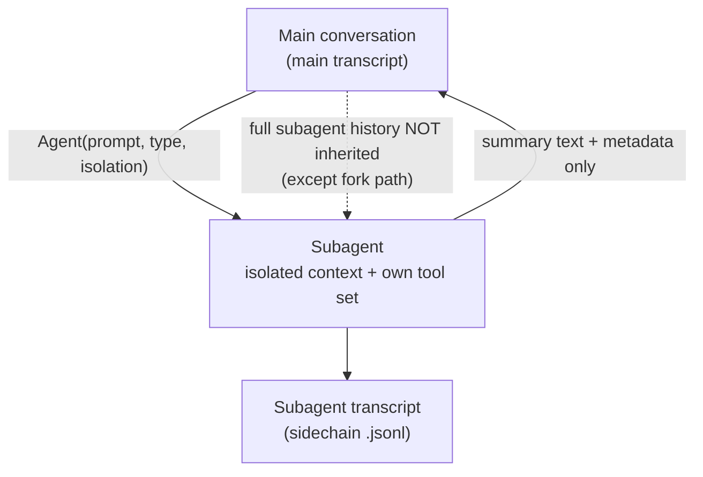

# Delegation without context explosion

When fixing `auth.test.ts` requires first *exploring* the auth module, Claude can hand that off to a **subagent**. The mechanism is the `Agent` tool (`Task` is a legacy alias). The governing principle is **isolated subagent boundaries** — and the reason it exists is, once again, the context window.

## SkillTool vs AgentTool — the one distinction to remember

Both are meta-tools sitting in the base pool. They look similar and do opposite things:

| | injects into… | result |
|---|---|---|
| **SkillTool** | the **current** context window | instructions appended to *this* conversation |
| **AgentTool** | a **new, isolated** context window | a separate transcript; only a **summary** returns |

> "SkillTool injects instructions into the current context window, while AgentTool spawns a new, isolated one." — *Section 8.1*

That summary-only return is the magic: a subagent can read 40 files and run 20 commands, and the parent's window only grows by a paragraph. This is how delegation *saves* context instead of exploding it.

The trade-off: because the default path **does not inherit the parent's conversation history**, most subagent invocations need a **self-contained prompt**. Conversation-based frameworks (e.g. AutoGen) share full transcripts and avoid this — but risk context explosion as agents multiply.

## Six built-in subagent types

| Type | Purpose | Note |
|---|---|---|
| **Explore** | read/search investigation | write & edit tools are **deny-listed** |
| **Plan** | structured plans | execution still goes through normal permissions |
| **General-purpose** | broadly capable | omitting the type may route to the *fork* path instead |
| **Claude Code Guide** | onboarding/docs help | has its own `permissionMode` override |
| **Verification** | runs tests, linting | separates generation from evaluation |
| **Statusline-setup** | terminal status line config | narrow specialist |

Custom agents come from `.claude/agents/*.md` (markdown body = system prompt; YAML frontmatter sets `tools`, `disallowedTools`, `model`, `permissionMode`, `mcpServers`, `hooks`, `maxTurns`, `memory`, isolation…). So a custom agent is "a fully configured, isolated sub-system with its own tools, model, permissions, hooks, memory scope, and isolation mode."

## Three isolation modes

| Mode | What it isolates | Cost |
|---|---|---|
| **In-process** (default) | conversation context only; shares filesystem | none |
| **Worktree** | a temporary git worktree — own copy of the repo | zero external deps (uses Git) |
| **Remote** (internal-only) | a remote Claude Code environment; always background | infra |

The paper's framing: worktree isolation gives **filesystem-level separation with zero external dependencies** — Git's built-in mechanism instead of container orchestration. Compare: SWE-Agent/OpenHands use containers (stronger boundaries, needs infra); AutoGen uses context-only isolation (shares filesystem).

## Permission override: explicit user decisions win

Subagents can declare a `permissionMode`, but the parent's mode can veto it:

> A subagent's `permissionMode` override is applied **unless the parent is already in `bypassPermissions`, `acceptEdits`, or `auto`** — "those modes always take precedence because they represent explicit user decisions about the safety/autonomy trade-off." — *Section 8.2*

For async agents, prompt suppression follows a cascade: explicit `canShowPermissionPrompts` → `bubble` mode (always show — it escalates to the parent terminal) → default (sync agents show prompts, async don't). Background agents that *can* prompt set `awaitAutomatedChecksBeforeDialog: true`, so the classifier and hooks resolve *before* interrupting the human.

There's also a two-tier permission scope: when `allowedTools` is passed explicitly to `runAgent()`, **SDK-level `--allowedTools` are preserved** (they apply to all agents) but **session-level rules are replaced** by the subagent's declared `allowedTools`. On the common path (no `allowedTools`), the parent's session rules are inherited unchanged.
