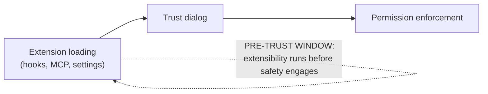

# Reading the architecture as one design point

When you read the six subsystems together, a single philosophy emerges:

> "the architecture … is overwhelmingly deterministic infrastructure (permission gates, tool routing, context management, recovery logic), with the LLM invoked as a stateless completion endpoint. An estimated **1.6%** of the codebase constitutes decision logic, the remaining **98.4%** is the operational harness. This ratio is not accidental." — *Section 11.1*

> "The engineering complexity exists not to constrain the model's decisions but to **enable** them." — *Section 11.1*

This raises the paper's central speculation — that coding agents are converging toward **OS-like abstractions**, where the core loop is the kernel and everything else is the OS. And it carries a thesis for builders:

> as frontier models converge in coding capability, "the quality of the surrounding operational harness becomes the principal differentiator" — investing in deterministic infrastructure "may yield greater reliability gains than adding planning scaffolding around increasingly capable models." — *Section 11.1*

## Five value tensions (Table 4)

Pursuing five values at once *guarantees* conflicts. These are structural consequences, not bugs:

| Value pair | The tension | Evidence |
|---|---|---|
| **Authority × Safety** | approval fatigue vs protection | 93% approval rate undermines vigilance → safety must compensate (classifier, sandbox) |
| **Safety × Capability** | performance vs defense depth | >50-subcommand fallback skips per-subcommand deny checks (parsing cost) |
| **Adaptability × Safety** | extensibility vs attack surface | multiple CVEs exploit pre-trust init of hooks/MCP servers |
| **Capability × Adaptability** | proactivity vs disruption | +12–18% tasks, but preference drops at high frequency |
| **Capability × Reliability** | velocity vs coherence | bounded context blocks full-codebase awareness; subagent isolation limits cross-agent consistency |

## The four concrete trade-offs

**1. Safety vs autonomy.** The permission modes form a *monotonically decreasing safety gradient*. But the gradient is navigated by **habituation, not deliberate choice** — auto-approve climbs 20%→40% over sessions. Sandboxing reduced prompt frequency by an estimated **84%**: the architectural answer to unreliable human approval is *to reduce the number of decisions humans must make.*

**2. The temporal hole in defense-in-depth.** Figure 4 shows the *spatial* ordering of checks but misses the *temporal* one. Two CVEs share a root cause:

> "code executing during project initialization (hooks, MCP server connections, settings resolution) runs **before** the interactive trust dialog … This pre-trust execution window falls outside the deny-first evaluation pipeline." — *Section 11.3*

So extensibility creates attack surface not only through combinatorial complexity but through **initialization ordering**. The right evaluation question isn't "can a layer be bypassed?" but "how many independent layers must fail *simultaneously*, and do they share failure modes?"

**3. Context efficiency vs transparency.** The five-layer pipeline manages context well, but compression is **largely invisible** — context collapse is "a read-time projection" with no user-visible output, and microcompact's cache-awareness adds further opacity. The user can't easily inspect what was lost.

**4. Simplicity vs extensibility.** Four mechanisms enable rich customization but create **combinatorial interactions**: a plugin's PreToolUse hook modifies inputs; the classifier reads cached CLAUDE.md; lazy path-scoped rules change classifier behavior *mid-conversation*. Emergent behaviors no single config file predicts.

## What the architecture predicts about code quality

A genuinely falsifiable claim from the design: bounded context + lossy compaction + subagent isolation should produce **more pattern duplication and convention violations** than full-codebase visibility would.

> "good local decisions can produce poor global outcomes when the model lacks global context." — *Section 11.4*

Early signals from *adjacent* tools (not Claude Code itself):

| Study | Finding |
|---|---|
| Cursor across 807 repos (He et al.) | code complexity **+40.7%**; velocity spike dissipates to baseline by month 3 — gains "self-cancelling" |
| 16-dev RCT (Becker et al.) | AI made devs **19% slower** despite a *perceived* 20% improvement |
| 304k AI-authored commits (Liu et al.) | ~¼ of AI-introduced issues persist; security issues persist at a higher rate |

Whether Claude Code's context pipeline is *sufficient* to overcome bounded-context limits is "a directly measurable empirical question that source-level analysis cannot resolve."

## Three commitments that recur everywhere

Reading the subsystems together, three cross-cutting choices appear in *every* component:

1. **Graduated layering over monolithic mechanisms** — 7 permission stages, 5 compaction layers, 4 extension mechanisms. Trades simplicity for defense-in-depth.
2. **Append-only designs favoring auditability over query power** — JSONL transcripts, non-restored permissions, read-time projections. Cost: rich queries need post-hoc reconstruction.
3. **Model judgment within a deterministic harness** — the 1.6% ratio quantifies it: the harness creates the *conditions* for good decisions; the model keeps full latitude over which tools to call.
