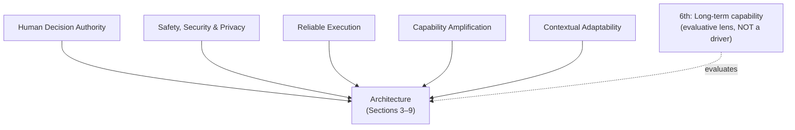

# Why values come first

Most "how an AI agent works" explanations start with the loop. This paper starts somewhere stranger: with **what humans want**. Its claim is that every architectural decision in Claude Code is downstream of five human values — and once you know the values, the weird-looking engineering choices stop looking weird.

> "Production coding agents are built by humans, for humans, and the architectural decisions they embed reflect what their creators believe matters." — *Section 2*

The tension the whole system has to resolve, quoted from Anthropic's safe-agents framework:

> "Agents must be able to work autonomously; their independent operation is exactly what makes them valuable. But humans should retain control over how their goals are pursued." — *Section 2*

## The five values

| Value | One-line definition | What it's about |
|---|---|---|
| **Human Decision Authority** | The human retains ultimate authority over what the system does | the human's *power to choose* |
| **Safety, Security & Privacy** | Protect the human, their code, data, and infra — even when the human is inattentive | the system's *obligation to protect* |
| **Reliable Execution** | Do what the human *meant*, stay coherent over time, verify before declaring success | single-turn correctness + long-horizon dependability |
| **Capability Amplification** | Materially increase what the human can accomplish per unit effort/cost | new workflows, not just faster old ones |
| **Contextual Adaptability** | Fit the user's project, tools, conventions, skill level — and improve over time | trust *trajectories*, not fixed states |

The paper is careful to separate the first two, which are easy to conflate:

> "where authority is about the human's *power to choose*, safety is about the system's *obligation to protect* even when that power lapses." — *Section 2.1*

## The numbers that drove the design

These aren't decorations — each statistic changed an architectural decision:

- **93%** of permission prompts get approved (Hughes, 2026). The response was *not* more warnings — it was to **restructure the problem**: define safe boundaries (sandboxing, auto-mode classifiers) the agent works freely inside, rather than per-action prompts users rubber-stamp once habituated.
- **~27%** of Claude-Code-assisted tasks were work "that would not have been attempted without the tool" — evidence the architecture enables *qualitatively new* workflows (Capability Amplification).
- Auto-approve rates climb from **~20%** (under 50 sessions) to **over 40%** (by 750 sessions) — autonomy is "co-constructed by the model, the user, and the product." This is why the system is built for **trust trajectories** (Contextual Adaptability).

## "Values over rules"

A recurring phrase. Claude's Constitution resolves the autonomy-vs-control tension not with rigid decision procedures but by cultivating:

> "good judgment and sound values that can be applied contextually." — *Section 2*

Architecturally, this becomes **minimal scaffolding** (don't hard-code planners or state graphs) backed by **deterministic guardrails** (sandboxing, permissions). Trust the model to reason; constrain only what's dangerous.

## The sixth concern: the evaluative lens

The paper adds one thing the architecture itself does *not* optimize for — and is honest that it doesn't:

> "whether the architecture preserves long-term human capability." — *Section 2.4*

This is real: Anthropic's own study documents a **"paradox of supervision"** — overreliance risks atrophying the very skills needed to supervise the agent — and independent work finds AI-assisted developers score **17% lower on comprehension tests**. But long-term capability is *not* a prominent design driver. So the paper treats it as a **cross-cutting evaluative lens**, not a co-equal value: a question asked *across* all five in the discussion.

The takeaway: when a later section shows you a seven-mode permission system or a five-layer compaction pipeline, ask *which value* it serves. The architecture is a values document written in TypeScript.
